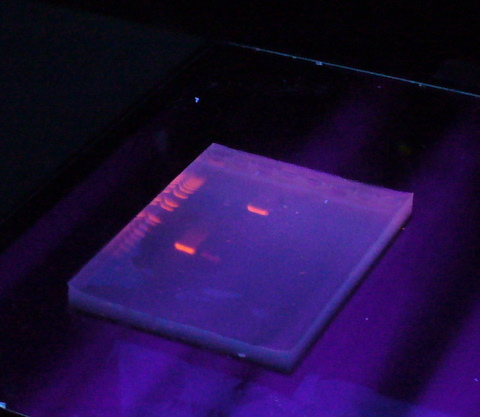



[Back to the main page](../index.md)

# Agarose Gel Electrophoresis

---

*Source: https://en.wikipedia.org/wiki/Agarose_gel_electrophoresis#/media/File:AgarosegelUV.jpg*

## Learning outcomes
- Pipetting in μl ranges
- Learning the principle of Restriction Analysis
- Agarose gel electrophoresis

---
## Preparation
Watch the [following video](https://www.youtube.com/watch?v=vq759wKCCUQ&t=2s) regarding the principle of agarose gel electrophoresis.

## Introduction
Agarose gel electrophoresis is a method to separate DNA in a matrix of agarose. The DNA is separated by charge and length in a suitable electrophoresis buffer. Larger DNA molecules migrate slower than shorter DNA in the electric field and, hence, they get seperated. 

The separated DNA may be viewed with a fluorescent stain under UV light.

## Protocol

**For creating a 1.5% agarose gel:**

- Seal the gel holder with painter's tape.
- Place a comb 1 to 2 cm from the top of the gel and 1 to 1.5 mm from the bottom of the gel holder.
- Prepare 400 ml of 1x TBE buffer to fill the electrophoresis tank with and to prepare a gel. The stock solution you will find in the lab is a 10x concentrate. So first of all, calculate how to prepare the 1X solution.

**The gel:**

- Add the right amount of agarose to 60 ml TBE to prepare a 1.5% (w/v) gel.
- Heat the solution to the boiling point in a microwave until all the agarose has dissolved.
- Allow the solution to cool down to a temperature of approximately 60°C. Add 3 µl Midori Green to the warm agarose solution.
- Pour the warm agarose solution into the gel holder. Make sure the gel is approximately 5 mm thick.
- After 30 minutes, carefully remove the comb and the painter's tape and place the gel into the electrophoresis tray.
- Fill the electrophoresis tray with 1x TBE buffer. Make sure the gel is completely submerged by the electrophoresis buffer before inserting the samples.

**Insering the samples:**

- Start with mixing 2 µl of the marker (1kb peqGOLD, VWR), 8µl sterile MQ and 2 µl of 6X-loading buffer in a microtube. 
- Transfer 10 µl of the PCR reaction mixture into a microtube containing 2 µl of 6X-loading buffer. 
- Make sure the sample and loading buffer are mixed properly. Mix them by aspirating the tip a few times.
- Now deposit the samples (as well as the marker) into separate slots with extreme care. To load the samples, insert the pipette deep into the slots, or the samples may float out of the slots. However, do not insert the pipette too deep into the slots, as this may perforate the gel.
- Run electrophoresis at 100-120 Volt. If you use a higher voltage, the gel may melt.

**Please Note:**

- Make sure you fill each slot halfway, since the sample may run over.
- Insert the pipette deep into the slots to load the samples, then slowly press the plunger downwards. Make sure the pipette does not emit any air bubbles. Make sure you do not damage the gel.
- Do not allow the blue agent to migrate too far as the Midori Green will migrate the opposite direction.
- View the gel under a UV source and take a picture of the gel with your mobile phone. Use this photo to determine the results in your logbook. Make sure that you have a clear photo that you can use to determine the results.

--- 

>Some  information on this page was adapted and modified from Wikipedia.org.

[Back to the main page](../index.md)

