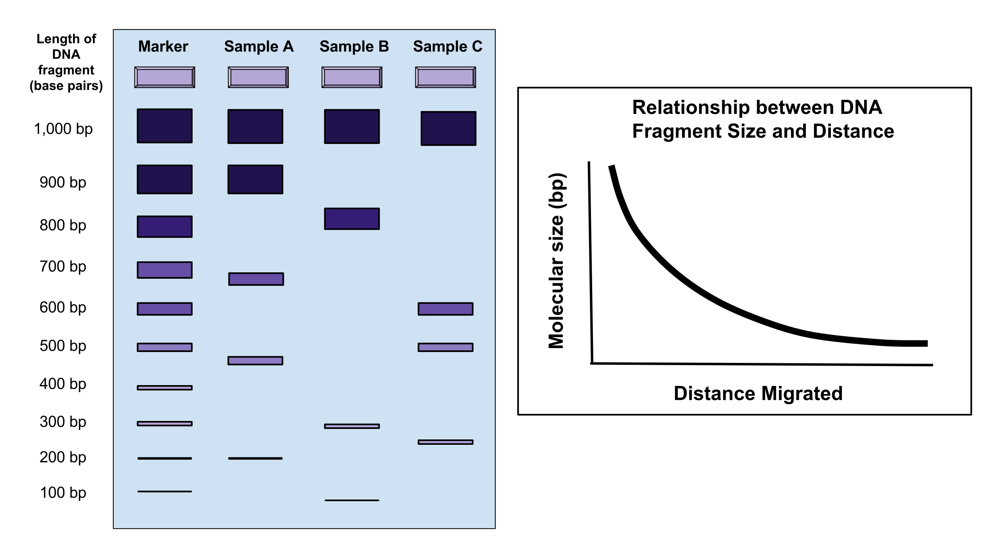



[Back to the main page](../index.md)

# Introduction Benchling

---

*Source: https://commons.wikimedia.org/wiki/File:Gel_Electrophoresis.svg*

## Learning outcomes
- Create a virtual digest using [Benchling](https://www.benchling.com/)
- Perform an *In Sillico* PCR using [Benchling](https://www.benchling.com/)

--- 

The lesson is in Dutch.
The document is divided in two parts:
- Part 1: **In Sillico** Restriction analysis of plasmid DNA
- Part 2: **In Sillico** PCR

---

An introduction PowerPoint (with voice recording) can be downloaded [here](./files/introduction_benchling.pptx)

## Use the following links for this lesson

- [Introduction Benchling](./files/introduction_benchling.pdf)
- [Solutions](./files/introduction_benchling_solutions.pdf)
- [Files Benchling](./files/files_benchling.zip)

---

>Some  information on this page was adapted and modified from Wikipedia.org.

[Back to the main page](../index.md)