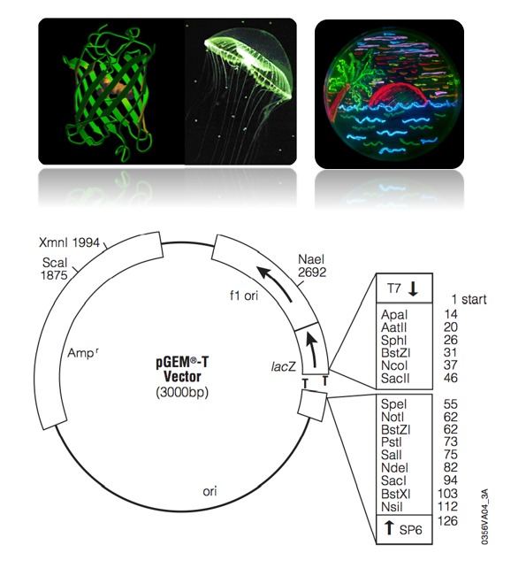

[Back to the main page](../index.md)

# Cloning

---

## Learning outcomes
- Pipetting in μl ranges
- Cutting DNA with restriction enzymes
- Ligation of DNA
- Creating competent *E. coli*
- Transformation of bacteria
- Selection of recombinant clones

---
## Protocol

--- 

[Back to the main page](../index.md)
