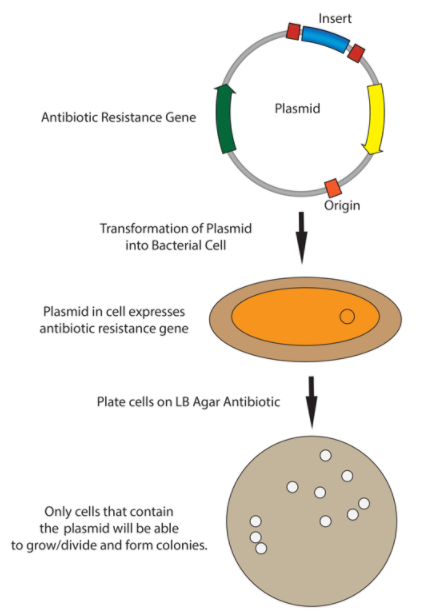

[Back to the main page](../index.md)

# Cloning

---

## Learning outcomes
- Pipetting in μl ranges
- Cutting DNA with restriction enzymes
- Ligation of DNA
- Creating competent *E. coli*
- Transformation of bacteria
- Selection of recombinant clones

---

>A considerable amount of text is copied, adapted and modified from Wikipedia.org.  
This is an open-access article distributed under the terms of the Creative Commons Attribution License which permits unrestricted use, distribution, and reproduction in any medium, provided the original author and source are credited.
Creative Commons License: CC BY-SA 4.0.

---

## Introduction
Molecular cloning refers to the process of making multiple ídentical copies of macromolecules such as DNA molecules. Gene cloning is used to amplify DNA fragments containing whole genes. It is used in a wide array of biological experiments such as large scale protein production and vaccin depelopment. 

In many cases, PCR cloning is used to clone a gene. For PCR cloning, primers are designed with 5'-prime extensions that contain restriction sites that match the restriction sites within the multiple cloning site of a particular cloning vector (figure 1). 

*Figure 1. Amplification of a gene using PCR. Note that the primers contain a 5'-overhang sequence that matches a restriction site. Source: Addgene.*

After PCR amplification of the target sequence, the PCR product is purified and digested with the restriction enzymes. 

In parallel, the cloning vector is digested with the same set of restriction enzymes as well. The restriction enzymes are thereafter inactivated and the fragments purified. Subsequently, the insert is ligated in the vector. Using two different restriction enzymes with different recognition sequences will facilitate directional cloning of the insert in the vector (figure 2).

*Figure 2. Ligation of the digested PCR product in the digested vector. Source: Addgene.*

The vector containing is transformed to a cell. Often, *E. coli* is used for efficient transformation. The plasmid contains an `origin of replication that facilitates replication in the host cell. Transformants can be selected using an antibiotic selection marker such as the ampicillin resistance gene. (figure 3) In this way, the desired DNA can be amplified to large amounts for downstream applications such as recombinant protein production.

*Figure 3. Transformation and selection of the recombinant vector. Source: Addgene.*

During this practical course, you will clone the eGFP gene that encodes the green fluorescent protein. The resulting transformants will be fluorescent under an UV light.

The procedure of cloning can be divided in the following steps:
1.	PCR of the DNA fragment (in this particular case, the GFP gene)
2.	Ligation of the PCR product (GFP-gene) in the desired plasmid (pGEM®-T Vector)
3.	Transformation of the vector with insert (pGEM®-T Vector + GFP-gene) in *E. coli* cells
4.	Screening and selection of *E. coli* cells which are tranformed with the plasmid DNA.

## Procedure

### PCR

- You will be offered the pGLO plasmid that contains the GFP gene.
- Setup a PCR reaction to amplify the GFP gene. Primers used are:
    - GFP F	5’- GTTTAACTTT AAGAAGGAGA TATACATATG G – 3’
    - GFP R	5’- TTATTTGTAG AGCTCATCCA TGCC – 3’

>Identify the two restriction sites in the primers.

The sequence of the pGLO vector can be found here:
https://www.addgene.org/vector-database/6569/

>Download the sequence in GeneBank format. Use benchling to simulate the PCR. What is the size of the amplicon (PCR product)?

The recipe for the PCR reaction (50 µl):

•	x μl 10×PCR reaction buffer, 
•	x μl 10 mM dNTP (dATP, dTTP, dCTP en dGTP; ratio 1:1:1:1),
•	x μl 50 mM $MgCl_2$,
•	x μl 25 pmol/μl primer GFP F,
•	x μl 25 pmol/μl primer GFP R,
•	x μl 5 U/μl Taq DNA polymerase,
•	10 ng pGLO plasmid DNA en (sterile) MilliQ up to 50 μl.

>Assignment
•	Fill in the missing fields of table 1. 
•	In order to end with enough PCR procuct, 3 reactions will be used. In addition, a negative control reaction will be used. What will you use as a negative control? 

|Reagentia |stock concentration|desired concentration|Volume for 50 µl reaction|number of reactions|
|----------|-------------------|---------------------|-------------------------|-------------------|
|H2O       |NA                 |NA                   |                         |                   |
|Taq-buffer|10x                |1x                   |                         |                   |
|dNTPs     |25 mM              |250 µM               |                         |                   |
|GFP F primer|25 pmol/µl       |25 pmol/50µl         |                         |                   |
|GFP R primer|25 pmol/µl       |25 pmol/50µl         |                         |                   |
|$MgCl_2$  |50 mM              |1.5 mM               |                         |                   |
|Taq Pol   |5 U/µl             |2 U/50 µl            |                         |                   |
|Template  |25 ng/µl           |100 ng/50µl          |                         |                   |

The PCR program is as follows:
- 1 min 95ºC denaturation
- 30 cycles of:
    - 1 min 95ºC denaturation
    - 1 min 55ºC annealing
    - 1 min 72ºC extension
- 7 min 72ºC extension

Prepare on ice.
Make use of the hot start option.
Transfer the tubes once the heating block reaches 95ºC.

Check 5 μl of the PCR product on a 1% agarose gel.
You can find the procedure for agarose electrophoresis [here](../pcr/pcr.html).

--- 

[Back to the main page](../index.md)

    
