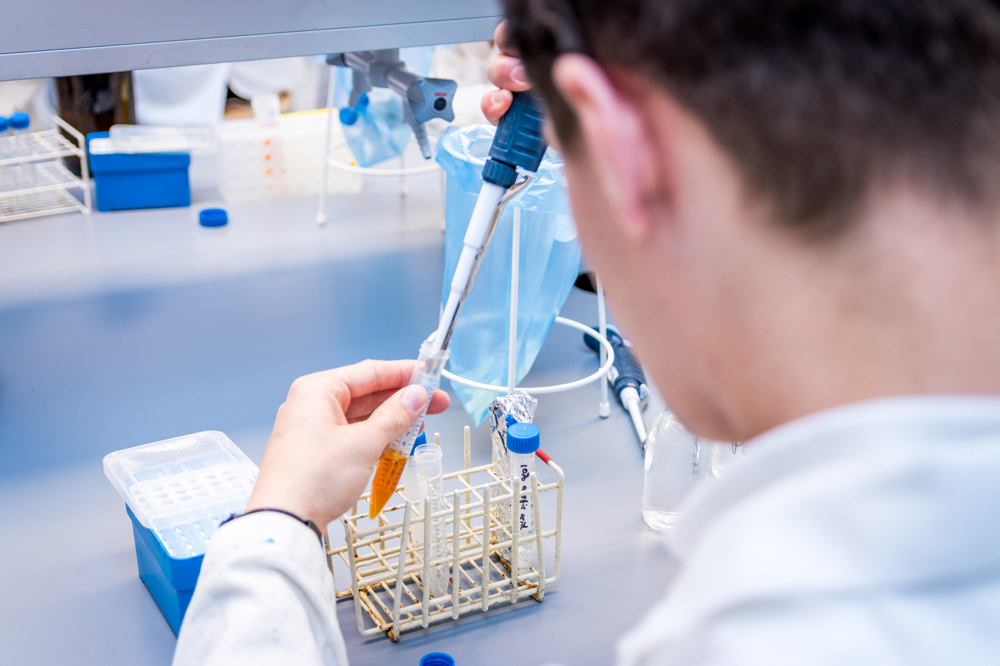



[Back to the home page](../index.md)

# Crash course basic laboratory skills

---

*Source: Hanzehogeschool*

## Introduction
See the following page for the Laboratory basics: 
[Laboratory basics](../labbasics/labbasics.md)

---

## Experiments

### Day 1
- [Pipetting fluids](../pipetting_fluids/pipetting_fluids.md)
- [Calibration curve copper sulphate and linear regression analysis](../calibration_curve_copper/calibration_curve_copper.md)
- [Gram-staining of *E.coli*](../gram_staining/gram_staining.md)

### Day 2
- [Preparation of buffers and growth of *E. coli* at different pH values](../buffers_growth/buffers_growth.md)

### Day 3
- [Measuring protein concentration using the Lowry method](../lowry/lowry.md)

---

[Back to the home page](../index.md)
