

[Back to the main page](../index.md)

# Crash Course

## Programma
Dag 1
1. Veiligheid
2. Wegen, glaswerk, pipeteren (CuSO~4~)

Dag 2
3. Microscopie en Gramkleuring
4. pH-meter en buffers

Dag 3
5. PCR: PTC bitter proeven

Extra informatie
Logboekinstructie

---

## 1.  Veiligheid

Veiligheidsvoorzieningen in het laboratorium

Op elk lab zijn meerdere veiligheidsvoorzieningen aanwezig. Het is van belang om te weten bij een calamiteit waar de afsluiters van gas, elektriciteit en water zich bevinden. Waar je de brandblusapparatuur en de EHBO-kist kunt vinden en hoe je deze apparatuur op een correcte wijze gebruikt.

### Opdracht 1:

• Maak foto's van de veiligheidsvoorzieningen in het lab waarin je je nu bevindt.

• Teken een plattegrond van de labzaal waarin je nu practicum hebt en voeg de foto's van de veiligheidsvoorzieningen op de juiste plek in, op de plattegrond

• Probeer een situatie te bedenken waarin je een veiligheidsvoorziening gebruikt.

• Beschrijf deze situatie en hoe je deze veiligheidsvoorziening gaat gebruiken.

Veiligheidsvoorzieningen in de plattegrond:

- Oogdouche
- Nooddouche
- Brandblusser
- Noodstop
- Vluchtweg
- etc.........................

## Veiligheidsaspecten van chemicaliën in het lab.

Op het lab gebruik je verschillende chemicaliën. Om veilig met deze chemicaliën te kunnen werken is het belangrijk om voor aanvang van een experiment de risico's uit te zoeken en uit te schrijven in een veiligheidstabel.

In groepsverband ga je voor een stof/oplossing/suspensie alle veiligheidsaspecten doornemen. De veiligheidsinformatie kun je verzamelen via de toxic database, een WIK (Werkplekinstructiekaart), chemiekaarten en zogenaamde MSDS-en (Material Safety Data Sheet). De gevonden informatie zet je vervolgens in een veiligheidstabel zoals hieronder. In een veiligheidstabel komt de volgende informatie te staan:

- Een volledige beschrijving van de stof/oplossing/suspensie. Denk hierbij bijvoorbeeld aan een structuurformule en de gebruikte concentratie.

- De afvalcategorie voor het afvoeren van de stoffen/middelen (denk hierbij ook aan glas, naalden etc.).

- De persoonlijke beschermingsmiddelen die je moet gebruiken om veilig met de stof of het voorwerp te kunnen werken.

- De voorzorgsmaatregelen die getroffen dienen te worden. Denk hierbij bijvoorbeeld aan masker, handschoenen enzovoorts. Dit vul je in onder het kopje "beperking".

## Opdracht 2:

Maak samen een veiligheidstabel waarbij je alle eerdergenoemde aspecten noteert. Verdeel de taken en zoek de veiligheidsaspecten uit en noteer op de juiste plaats in de tabel. Bekijk ook de overeenkomsten en verschillen tussen de verschillende bronnen en vergelijk ze met elkaar.

- 12,5M $NaOH$ (Natriumhydroxide)

- 18M $H_2_SO_4$ (Zwavelzuur)

- 100 mg/ml $CuSO_4$

- Vloeibare *Escherichia coli* cultuur

## 2.  Wegen, glaswerk, pipeteren ($CuSO_4$)

## Wegen 

Voor het afwegen van vaste stoffen worden de bovenweger of analytische balans gebruikt. In onderstaande figuur staan de twee typen weergegeven die op de labzalen te vinden zijn met daarbij aangegeven de range voor af te wegen hoeveelheden. Een balans en de weegtafel dienen na gebruik direct schoongemaakt te worden. Vaste stoffen trekken vocht uit de lucht aan waardoor de stof vastplakt aan de oppervlakte, dit bemoeilijkt het schoonmaken, het correct functioneren van de apparatuur (corrosie) of geeft een eventuele 'besmetting' van de af te wegen stof. Voor aanvang van het afwegen is het dus belangrijk om te controleren of de balans en weegtafel schoon is achtergelaten. Wanneer dat niet het geval is, maak je deze dus eerst schoon volgens de instructies.

Na het afwegen moeten de tafel en balans weer schoongemaakt en gecontroleerd worden.

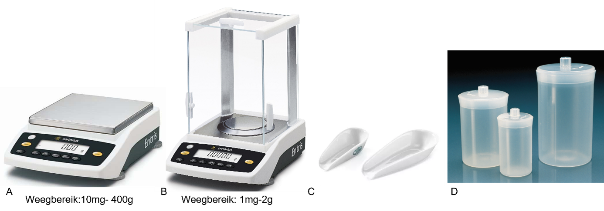
* Figuur 1: Type weegschalen en weegmiddelen. A. Bovenweger, B. Analytische balans, C. Weegschuitje, D. Weegflesje. *

Stappenplan voor het correct gebruiken van de balans:

1.  Kies een spatel/lepel en controleer of deze schoon is. Als dat niet het geval is, spoel de spatel/lepel schoon onder de kraan en droog die netjes af.

2.  Kies de juiste balans voor de hoeveelheid die je wil afwegen.

3.  Staat de balans op juiste tafel (gewone tafel/weegtafel)

4.  Is de balans schoon? Een balans hoort altijd schoon te worden achtergelaten!!!! Zo niet maak de balans eerst schoon (zie vanaf stap 16).

5.  Staat de balans waterpas? Verstel de pootjes van de weegschaal om deze waterpas te zetten. De luchtbel moet in het midden van de cirkel staan.

6.  Zet de balans aan.

7.  Is de balans gekalibreerd? Als de balans gekalibreerd moet wordenknippert CAL. Druk CAL op het touchscreen om de balans tekalibreren. Wacht tot de balans aangeeft dat deze is gekalibreerd.

8.  Plaats een weegschuitje/weegflesje op de balans

9.  Tarreer de weegschaal door op de "T" te drukken.

10. Haal het weegschuitje/weegflesje uit de balans. Maak de voorraadpot naast de balans open en schep een hoeveelheid stof op het weegschuitje en weeg het weegschuitje. Aan de hand van de gewogen hoeveelheid bepaal je hoeveel schepjes er ongeveer aan toegevoegd moeten worden voor de juiste hoeveelheid.

11. Weeg het weegschuitje/weegflesje nogmaals. Als je te veel stof hebt afgewogen, gooi je de restante stof in een afvalcontainer. Let op: Gooi nooit stof terug in de voorraadpot dit in verband met besmettingen.

12. Noteer de precies afgewogen hoeveelheid.

13. Breng de stof over in het glaswerk/plastic waarin je de oplossing wilt oplossen. Spoel de overgebleven stof van het weegschuitje/weegflesje af met een spuitfles met oplosmiddel. Let
op: Blijf onder het totaal volume dat je nodig hebt.

14. Los de stof eerst op met een kleine hoeveelheid oplosmiddel. In het geval dat de stof moeilijk is op te lossen maak je gebruik van een magneet-roerder eventueel met verwarmingselement.

15. Als de stof goed is opgelost, vul het aan met het gewenste eindvolume in een maatcilinder.

16. Maak de balans schoon:

17. Veeg eerst alle gemorste vaste stof met een kwast (hoort bij de balansen te liggen) van/uit de balans en weegtafel in de afvalcontainer.

18. Veeg vervolgens met een droge papieren doekje de overgebleven stof in de afvalcontainer.

19. Maak voorzichtig met een papieren doekje bevochtigd met demiwater de balans en weegtafel schoon.

20. Wacht tot alles opgedroogd is voor je verder gaat met afwegen.

21. Wanneer je de balans niet goed schoon krijgt met bovenstaande instructies, vraag dan de docent om te helpen de balans schoon te maken.

22. Zet de balans uit als deze niet meer wordt gebruikt.

23. Maak het weegschuitje/weegflesje en spatel/lepel schoon.

**Opdracht 2:**

Druk op T (van tarreren) van een bovenweger en wacht tot de balans 0.000 aangeeft. En druk dan voorzicht aan de zijkant van de tafels. Beschrijf wat je ziet bij de balans en geef aan of deze tafel geschikt is om nauwkeurig af te wegen.

Druk op T (van tarreren) van een analytische balans met de deurtjes dicht en wacht tot de balans 0.0000 aangeeft. Zet de deurtjes open en verplaats lucht door erlangs te lopen. Beschrijf wat je ziet bij de balans en geef aan waarop je moet letten om nauwkeurig af te wegen.

## Glaswerk

Een bekerglas en een maatcilinder zijn voorbeelden van laboratoriumglaswerk. Een bekerglas bestaat uit een cilindrische beker met een tuitje om het schenken van vloeistoffen mogelijk te maken. Doordat een bekerglas ongeveer even hoog als breed is, is hij zeer stabiel en makkelijk te hanteren. De belangrijkste toepassing van bekerglazen is als schenkwerktuig voor vloeistoffen. In veel gevallen hebben bekerglazen een volumeaanduiding die het mogelijk maakt om een schatting te maken van de aanwezige hoeveelheid vloeistof, maar het is maar een grove indicatie van het volume. Om nauwkeurig een volume te bepalen of af te meten moet geijkt glaswerk zoals een volumepipet of een maatcilinder gebruikt worden. Bekerglazen zijn daarvoor niet geschikt en ook niet bedoeld. Een maatcilinder gebruik je dus om een oplosmiddel nauwkeurig af te meten. Als je werkt met volumina boven de 10 ml maak je gebruik van een maatcilinder. Voor volumina onder de 10 ml maak je gebruik van een volume pipet of micropipet. De nauwkeurigheid van het afgemeten volume wordt bepaald door de breedte van de cilinder en de breedte van de gebruikte maatstrepen.

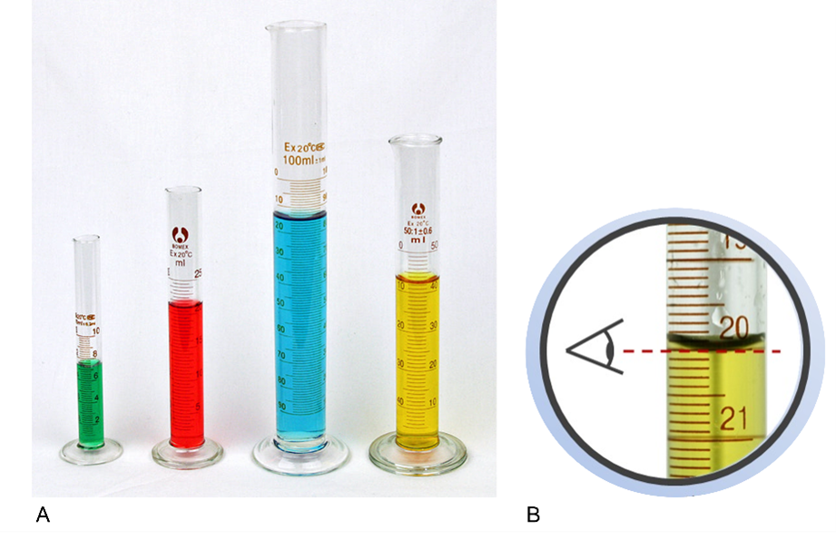

*Figuur 2: Maatcilinders van verschillende groottes en uitleg van het aflezen van volumina in een maatcilinder.*

Gebruik van een maatcilinder:

-   Vul de maatcilinder met een oplossing tot het gewenste volume.

-   Lees hiervoor de maatcilinder horizontaal af, aan de onderkant van het wateroppervlakte, de meniscus (zie fig.3).

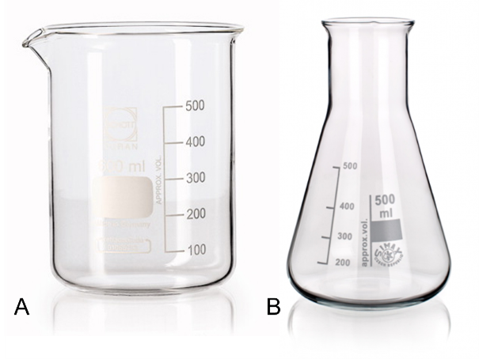

*Figuur 3: Verschillende type laboratorium glaswerk. Dit glaswerk wordt vaak van Pyrex gemaakt, maar kunststof is ook mogelijk. A. Bekerglas, B. Erlenmeyer. *

### Instructies glasgebruik

[Voorbereiding algemeen:]{.underline}

1.  Afhankelijk van de hoeveelheid stof (vloeistof) die je moet gaan wegen, kies je het juiste materiaal om de stof/vloeistof in te doen (weegpapier, bekerglas, erlenmeyer, fles). Ook moet je opletten of de stof/vloeistof veilig is om mee te werken. Daarvoor moet je altijd een chemiekaart van de bepaalde stof nalezen om te beslissen welke veiligheidsmaatregelen je moet treffen. Denk hierbij aan veiligheidsbril, mondkapje, handschoenen, vluchtige stoffen in de zuurkast wegen, enz.

2.  Bereken de hoeveelheid stof die je moet gaan wegen/ pipetteren.

3.  Kies een spatel/ pipet, en controleer of die schoon is. Als dat niet het geval is, spoel de spatel schoon onder de kraan en droog die netjes af.

4.  Kies een balans. Hierbij kunt je kiezen uit een bovenweger of een
    analytische balans. Let op de range waarin mag worden afgewogen.

Uitvoering algemeen:

1.  Controleer of de balans geijkt is en waterpas staat. Leg het weegpapier erop en dan op nul.

2.  Maak de voorraadpot naast de balans open en schep de juiste hoeveelheid stof op een weegpapier/ schuitje/ bekerglas. Als je er te veel stof hebt uitgeschept, gooi je de restante stof in een afvalcontainer. [Let op]{.underline}: Gooi nooit stof terug in de pot, dit in verband met besmettingen.

3.  Breng de stof van weegpapier over in het bekerglas of een maatcilinder. Zorg dat alles wordt overgebracht. Spoel de overgebleven stof van het papier af met een spuitfles met oplosmiddel.

4.  Los de stof eerst op met een kleine hoeveelheid oplosmiddel. In het geval dat de stof moeilijk is op te lossen maak je gebruik van een magneet-roerder en/of een verwarmingselement.

5.  Als de stof goed is opgelost, schenk je de oplossing over in een maatcilinder en vul je daarin aan tot het eindvolume.

6.  Schenk de oplossing terug in het bekerglas en homogeniseer/meng. De oplossing heeft nu de juiste concentratie.

7.  Aan het eind maak je alles schoon: balans, spatel, overige.

**Opdracht 3:**

Je gaat nu 50 ml van een kopersulfaat oplossing maken.

1.  Kies daarvoor eerst het juiste glaswerk en controleer of deze goed schoon is (wanneer dat niet het geval is; maak het glaswerk dan schoon volgens de instructies).

2.  Weeg nu 5 gram CuSO~4~ af volgens het stappenplan.

3.  Doe een laagje demiwater (minder dan het eindvolume) in het bekerglas en voeg daar de afgewogen CuSO~4~ aan toe. Als de stof niet goed oplost kan je een magneetroerder gebruiken*.*

4.  Als de CuSO~4~ is opgelost, giet het dan over in de maatcilinder en
vul aan tot 50 ml. Bedenk goed waarom je niet gelijk de stof oplost
in 50 ml demiwater. 

5.  Giet de oplossing weer over in het bekerglas. Je hebt nu een
    (stock)oplossing van x mg/ml, bewaar deze voor opdracht 9.

## Pipetteren 
Tijdens het werken op een laboratorium kom je veel in aanraking met het verplaatsen van volumes vloeistoffen van de ene plek naar de andere plek. Daarvoor wordt in de meeste gevallen, als het om kleine volumes gaat, een pipet gebruikt. Het is belangrijk om de pipet correct tegebruiken zodat de nauwkeurigheid het grootst is.

Er zijn veel verschillende type pipetten die in de praktijk gebruikt
worden:

-   Pasteurse pipet (a)

-   Volumetrische pipet (b))

-   Serologische pipet (c)

-   Druppel pipet (d)

-   Automatische pipet (e)

-   Multichannel pipet (f)
In deze handleiding wordt ingegaan op de automatische pipet en hetgebruik ervan. De meeste pipetten op onze labs zijn van de firma Gilson.De instructies zijn dan ook voornamelijk op deze pipetten gebaseerd;andere pipetten werken op vergelijkbare wijze.

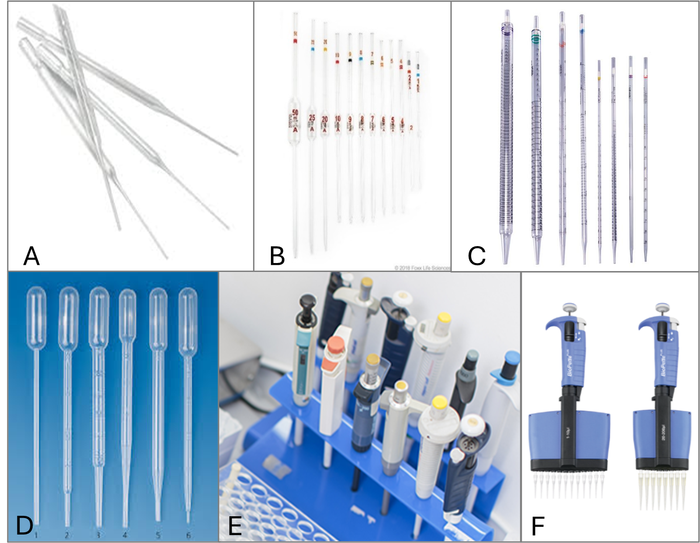

*Figuur 4. Verschillende typen pipetten.*

### Air-displacement pipet vs positive-displacement pipet
Binnen het type automatische pipetten zijn er 2 typen pipetten die verschillen in het principe van het aanzuigen van de vloeistof. Bij de air-displacement pipet wordt gebruik gemaakt van een luchtkolom tussen het vloeistofmonster en de zuiger. Deze pipet is zeer geschikt voor waterige en niet-viskeuze vloeistoffen. De temperatuur en de druk in de atmosfeer hebben invloed op de prestaties van de air-displacement pipet. Dit is het type pipet die standaard op het lab gebruikt wordt.

Bij de positive-displacement pipet wordt het volume dat gepipetteerd wordt niet beïnvloed door de eigenschappen van de te pipeteren vloeistof. Ook heeft de temperatuur geen invloed op het volume. Dat maakt deze pipet uitermate geschikt voor het pipeteren van viskeuze, koude of juist warme vloeistoffen.

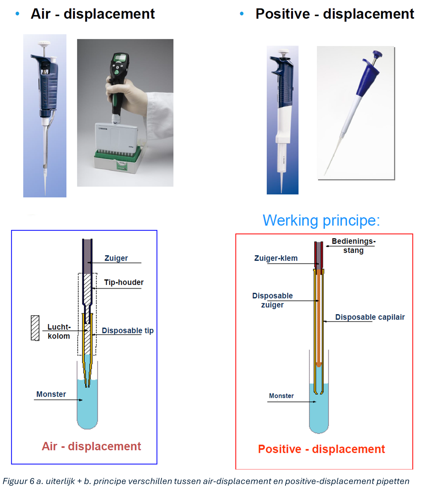!

*Figuur 5 a. uiterlijk + b. principe verschillen tussen air-displacement en positive-displacement pipetten *

### Bereik en nauwkeurigheid van de verschillende typen pipetten

In tabel 1 staat van elk type pipet van de reeks Pipetman Neo het bereik en de systematische en toevallige fout aangegeven. De systematische of accuratesse fout wordt veroorzaakt door de eigenschappen van de pipet zelf of door het gebruik van **niet goed passende** pipetpunten. De precisie of toevallige (random) fout wordt veroorzaakt door de techniek van de gebruiker of ook de pipetpunten.

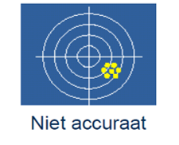

*Figuur 6: verschil tussen systematische/accuratesse fout en precisie/toevallige fout.*

Tabel 1: pipetman Neo specificaties

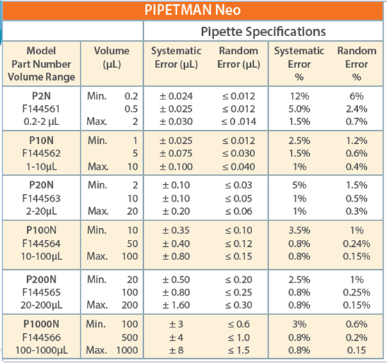

## Correct pipetteren stap voor stap

### Onderdelen pipet

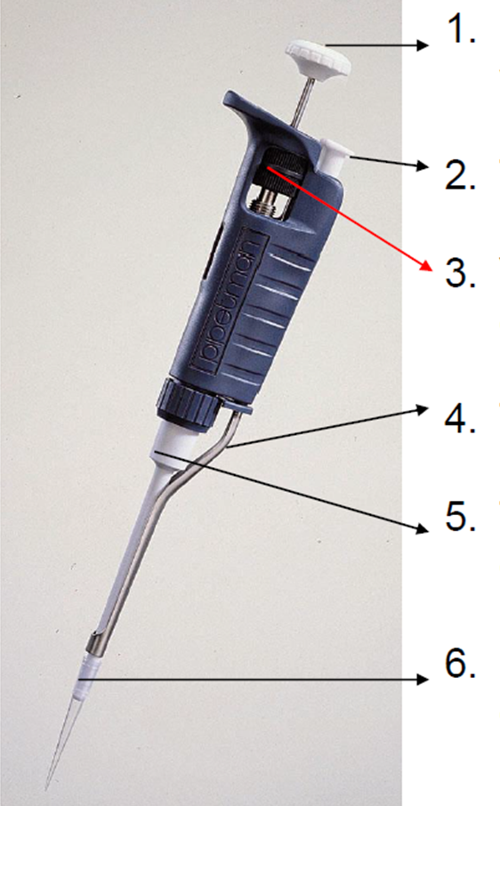

*Figuur 7: Pipetonderdelen.*

Een pipet bestaat altijd uit de volgende
onderdelen:
1) Drukknop: bediening pipet en instellen volume
2) Tip-ejector: afwerpen van de pipetpunten
3) Volume instelschroef: instellen van het gewenste volume
4) Tip-ejector arm: afwerpen van de tips
5) Tip-houder: luchtkolom en plaatsen van disposable tips
6) Disposable tips: werk altijd met een goed passende schone tip

### Volume instellen

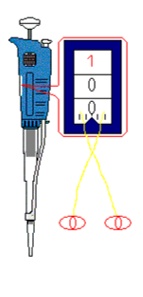 
*Figuur 8: instellen volume van de pipet in verticale stand geeft afwijking*

Het volume dient altijd met de klok mee te worden ingesteld. Dit betekent als daarbij het volume naar een lager volume moet worden afgesteld deze rustig, met de klok mee, naar het gewenste volume gedraaid kan worden. Als het volume groter moet worden, dient het mechanisme 1/3 verder gedraaid te worden dan het gewenste volume en vervolgens rustig teruggedraaid te worden naar het gewenste volume.

Bij het instellen van het juiste volume dient de pipet in horizontale positie te zijn. Op die manier krijg je geen scheef beeld, waardoor dan een afleesfout kan ontstaan.

Bij de Pipetman Neo kan het volume ingesteld worden met zowel de drukknop als de volume instelschroef. Voor oudere modellen geldt het instellen van het volume alleen met de volume instelschroef.

Het instellen van het volume moet binnen het volume-bereik van de pipet liggen (zie tabel 1).

>Let op: Voor alle pipetten geldt dat deze nooit naar een hoger volume gedraaid mogen worden dan het maximale volume.

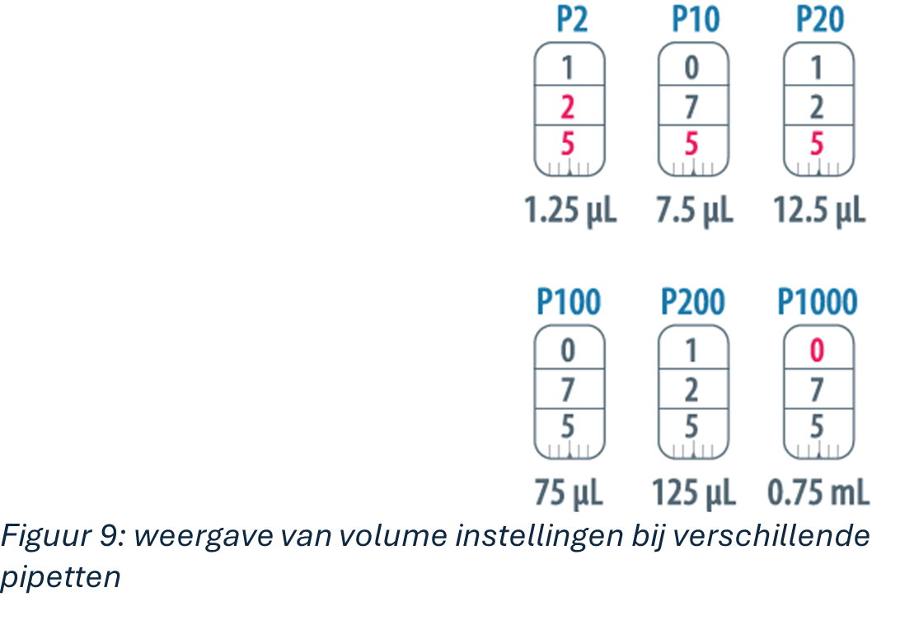

*Figuur 9: weergave van volume instellingen bij verschillende pipetten. *

### Tip plaatsen

Plaats de juiste tip van de juiste afmeting/kleur op de bijpassende
pipet.

*Tabel 2: kleur pipetpunt per type pipet*

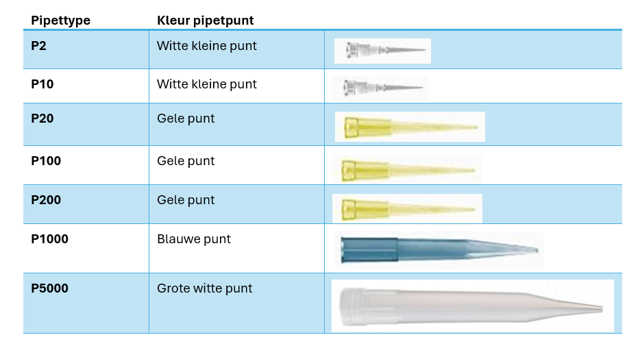

Je plaatst de pipetpunt door tijdens het aandrukken de pipet een kwartslag te draaien. Dan sluit de pipetpunt het beste aan op de tiphouder. Doe dit niet door meermaals achtereen te tikken met de tiphouder op de pipet.

### Voorspoelen

Voor elke pipeteerhandeling dient de pipetpunt voorgespoeld te worden met de vloeistof die gepipetteerd gaat worden. Dit zorgt er voor dat de temperatuur van de pipetpunt gelijk wordt aan de temperatuur van de te pipeteren vloeistof. Tevens voorkomt het verdamping. Kortom het zorgt voor een grotere uniformiteit en grotere accuratesse en precisie.

Het voorspoelen van een pipetpunt moet in de volgende gevallen:
- na het aanbrengen van een nieuwe pipetpunt
- na het instellen van een hoger volume
- wanneer een pipetpunt langer dan 1 minuut niet gebruikt is

Dit voorspoelen wordt uitgevoerd door het opzuigen en weer uitblazen van de vloeistof tot de eerste stop.

### Pipeteren (forward)

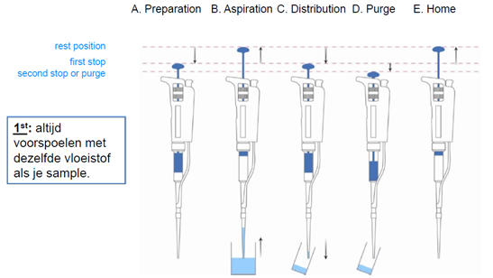

*Figuur 10: overzicht van de forward pipeteer techniek*

Het allerbelangrijkste bij het juist pipeteren is dat je **kijkt** wat er gebeurt in de pipetpunt gedurende de verschillende stappen van het pipeteren. Dan kun je eventuele onregelmatigheden, die kunnen optreden (hieronder besproken) waarnemen.

*Tabel 3 insteekdiepte pipetpunt bij opzuigen van verschillende volumes.*

| Volume (µl) | Immersie diepte (mm) |
| :--- | :--- |
| **0,1 – 1** | 1 |
| **1 - 100** | 2-3 |
| **101 - 1000** | 2-4 |
| **1001 – 10.000** | 3-6 |

In de meeste gevallen wordt de techniek van forward pipeteren gebruikt:

A.  Breng de drukknop met de duim tot de eerste stop

B.  Zuig de vloeistof op. Let daarbij op de opzuigsnelheid. Doe dit langzaam! En met constante snelheid. Te snel opzuigen kan het volgende veroorzaken:

-   spetters vloeistof in de pipetpunt
-   luchtbellen in het monster
-   het monster kan in de tiphouder komen en daarmee de pipet verontreinigen

> Hoe diep je de pipetpunt in de vloeistof brengt, hangt af van het te
> pipeteren volume, zie tabel 3.

> Na het opzuigen van de vloeistof altijd een paar tellen wachten totdat de vloeistof niet meer de pipet in beweegt.

> Trek de pipetpunt niet te snel uit de gepipetteerde vloeistof, dan kunnen er vloeistofdruppeltjes aan de buitenkant van de pipetpunt terecht komen.

C.  Om de vloeistof juist op de volgende bestemming te krijgen, breng je de pipetpunt tegen de wand van het bekerglas/cupje etc. aan onder een hoek van 10-45°. Hierbij houd je de pipet zo verticaal mogelijk. Je drukt de vloeistof uit tot door de drukknop tot de eerste stop te drukken.

D.  Daarna druk je krachtiger door tot de 2^e^ stop terwijl de pipetpunt langzaam naar boven geveegd wordt tegen de wand van het bekerglas/cupje etc.

E.  Breng de pipetpunt los van de zojuist gepipetteerde vloeistof en laat de drukknop volledig omhoog komen. Doe dit niet te snel voordat de tip los is van de vloeistof, anders zuig je die vloeistof weer op. Nu kan de pipetpunt met de ejector verwijderd worden. 

>Let op: Bij kleine volumes (1-5 µl) is het gebruikelijk om in de reeds aanwezige vloeistof uit te pipeteren, in plaats van tegen de wand!

### Pipeteren (reverse)

Voor het pipeteren van "lastige" vloeistoffen kan gebruik worden gemaakt van de reverse pipetetting- methode. Deze methode wordt gebruikt bij:

- viskeuze/stroperige vloeistoffen

- oplosmiddelen

- schuimende vloeistoffen

- repeterend pipetteren

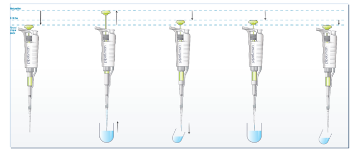

*Figuur 11: Overzicht van de reverse pipetteer techniek*

Deze techniek zal je niet vaak hoeven te gebruiken. Er wordt kort mee geoefend bij pipetteeropdracht 3 en 4.

Bij deze techniek veeg je de pipetpunt NIET langs de wand bij het uitpipeteren.

**Opdracht 4: Volume instellen**

1.  Neem tabel 4 over in je logboek en vul deze verder in. Welke pipet en instelling gebruik je voor de aangegeven volumes?

*Tabel 4. Pipetteertabel*

| Hoeveelheid | Range | P waarde | Instelling (+ kleur) |
| :--- | :--- | :--- | :--- |
| *Voorbeeld: 9,1 µl* | *1-10 µl* | *P10* | *0 – 9 – 1* |
| 1000 µl | | | |
| 973 µl | | | |
| 200 µl | | | |
| 72 µl | | | |
| 12,5 µl | | | |
| 2,1 µl | | | |
| 1,25 µl | | | |

2.  Kijk eens naar de rode getallen van de instelling. Wat geven deze getallen weer? Er is een uitzondering op die regel. Welk pipet is dat en wat geven de rode getallen aan bij die pipet?

**Opdracht 5: Fouten met invloed**

1.  Markeer drie 1,5 ml eppenorfcupjes met "1", "2" en "3".
2.  Weeg de cupjes (volgens het stappenplan wegen) en schrijf het precieze gewicht op (Tabel 5).
3.  Pipetteer 1 ml kamertemperatuur water van 3 mm diep in cupje 1 met de P1000.
4.  Pipetteer 5x 200 μl kamertemperatuur water van 3 mm diep in cupje 2 met een P200 pipet.
5.  Pipetteer 1 ml kamertemperatuur water van 2 cm diep in cupje 3 met de P1000.
6.  Weeg cupje 1, 2 en 3 opnieuw. Bereken de massa van het water in cupjes 1, 2 en 3.
7.  1 ml water op 21 graden celcius weegt 0,998 g. Welk cupje komt het dichtst bij dit getal?

* Tabel 5. Weegtabel gepipetteerd water.*

| Cupje nummer | Gewicht voor | Gewicht na | Gewicht water |
| :--- | :--- | :--- | :--- |
| 1 | | | |
| 2 | | | |
| 3 | | | |

**Opdracht 6: Vluchtige stoffen**

1.  Pipetteer 1 ml water met een geschikt pipet. Als het goed is zitten er geen luchtbellen in het water en blijft de vloeistof goed zitten. Is je pipet functioneel?
2.  Pipetteer 1 ml alcohol (70% en op kamertemperatuur) op met dezelfde pipet. Wacht nu enkele seconden met het pipetpuntje boven de alcohol. Wat gebeurt er met de vloeistof?
3.  Pipetteer 1 ml alcohol voorzichtig 3x op en neer. Pipetteer nu opnieuw 1 ml alcohol met hetzelfde puntje. Zie je een verschil?
4.  Pipetteer 1 ml alcohol met een nieuw pipetpuntje met de reverse pipetting techniek. Wat zie je nu?

**Opdracht 7: Dikke vloeistof**

1.  Pipetteer 1 ml glycerol op met een geschikt pipet en haal je pipetpunt gelijk uit de glycerol als de drukknop op de hoogste stand is. Pipetteer de glycerol uit in een eppendorf cupje van 1,5 ml. Denk je dat je nu 1 ml glycerol in je eppendorf cupje hebt zitten? Verklaar je antwoord.
2.  Pipetteer opnieuw 1 ml glycerol op met hetzelfde pipet. Wacht nu 3 seconden nadat de glycerol gestopt is met bewegen. Pipetteer de glycerol uit in een nieuw eppendorf cupje van 1,5 ml.
3.  Pipetteer ook 1ml glycerol met de reverse pipetting techniek.
4.  Vergelijk de cupjes van vraag A. B. en C. Wat is het verschil en waardoor ontstaat dit?

**Opdracht 8: Vervolg van opdracht 3 kopersulfaat**

1.  Pak nu 5 cupjes en label deze met je naam en de volgende concentraties: 100, 50, 25, 10 en 0 mg/ml. 
2.  Pipetteer nu in de cupjes de ijklijn volgens tabel 1. Vul het volume stock-oplossing in!

 
* Tabel 6, Pipetteerschema ijklijn CuSO~4~ *

  |  | Concentratie | CuSO₄ | | dH₂O | |
| :--- | :--- | :--- | :--- | :--- | :--- |
| 1 | 100mg/ml | X µl | Stock (100mg/ml) | 0 µl | Demi |
| 2 | 50 mg/ml | X µl | Stock (100mg/ml) | 500µl | Demi |
| 3 | 25 mg/ml | X µl | Stock (100mg/ml) | 750µl | Demi |
| 4 | 10 mg/ml | X µl | Stock (100mg/ml) | 900µl | Demi |
| 5 | 0 mg/ml | X µl | Stock (100mg/ml) | 1000µl | Demi |

3.  Pak nu een 96 wells plaat en stel de spectrofotometer in op 560 nm.  

4.  Vul in duplo de welletjes (dus vul twee welletjes) van de 96 wells plaat met 200µl van ieder punt van de ijklijn en de onbekende monsters meet de plaat door.

5.  Giet de plaat en de cupjes leeg in een bekerglas gelabeld "Afval CuSO~4~" en doe de plaat en de cupjes in het zwarte afvalvat.

6.  Kijk of de weegkamer/weegtafel weer netjes is achtergelaten. En ruim de gebruikte apparatuur op waar het hoort. 

7.  Bepaal met behulp van lineaire regressie de concentratie van de monsters. Hiervoor kun je Excel, R of Phyton gebruiken.

## 3.  Microscopie en Gramkleuring

**De microscoop **

Het scheidend vermogen van het oog beschrijft het vermogen om twee naast elkaar gelegen objecten afzonderlijk van elkaar waar te nemen. Het gaat hier om de minimale afstand tussen de voorwerpen waarop we ze nog als afzonderlijke voorwerpen kunnen waarnemen. Bijvoorbeeld, als je de millimeterstreepjes op een liniaal bekijkt zijn deze als aparte streepjes te zien. Gaan we op grotere afstand van de liniaal staan dan lopen de streepjes in elkaar over en zien we ze niet meer als afzonderlijk.  

Het beeld dat het oog binnenkomt valt op de cellen in het netvlies. Het signaal wordt via zenuwcellen overgebracht naar de hersenen, waar het omgezet wordt tot een beeld dat we waarnemen. Dit beeld kan pas gevormd worden wanneer meerdere netvliescellen een signaal doorgeven. Bijvoorbeeld, wanneer we een boek lezen kunnen we de letters als afzonderlijk ervaren. Wanneer we te ver van het boek afstaan vallen de letters niet meer op verschillende cellen in het netvlies. Door de grote afstand worden de letters zo klein dat meerdere letters op 1 netvliescel vallen. Hierdoor worden ze niet meer als afzonderlijk geregistreerd, maar als 1 zwart geheel. Om dezelfde reden is een bacterie niet met het blote oog te zien. Ten eerste is een bacterie zo klein dat deze onvoldoende licht weerkaatst om op het netvlies te projecteren. Maar ook als de bacterie voldoende licht zou weerkaatsen zou deze door zijn grootte slechts op 1 netvliescel geprojecteerd worden en daardoor niet geregistreerd worden. 

In theorie is de minimale gezichtshoek (α) van het oog 1 boogminuut (1/60 graad). Als we dit weten en met het blote oog kijken naar twee objecten op een afstand van 25 cm, dan moeten deze objecten tenminste 0.07 mm (70µm) uit elkaar liggen om deze als afzonderlijk te kunnen onderscheiden (Figuur 1). In dat geval zal het beeld van de objecten op verschillende netvliescellen vallen en als afzonderlijk geregistreerd worden. In de praktijk is deze afstand vaak groter (1 tot 2 mm), omdat ook de grootte en de vorm van de lens in het oog invloed heeft op de minimale gezichtshoek.   

 

 ​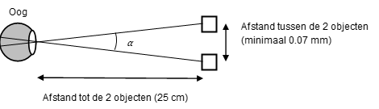 

 
*Figuur 1: Effect van afstand tot en tussen de objecten op het onderscheidend vermogen van het oog. Als de afstand tussen de objecten te klein wordt of de afstand tot de objecten te groot, neemt de gezichtshoek af (α < 1 boogminuut). Hierdoor wordt het beeld op een te klein deel van het netvlies geprojecteerd om het als twee afzonderlijke objecten waar te nemen.*
 
Om twee punten die dichter bij elkaar liggen dan 0,07 mm toch van elkaar te onderscheiden kunnen we gebruik maken van een microscoop. De microscoop verspreid het beeld met zo min mogelijk detailverlies over een groter aantal netvliescellen, oftewel onder een grotere gezichtshoek. Dit vergroten van het beeld wordt bewerkstelligd door het lenzenstelsel van de microscoop. Met een gewone lichtmicroscoop kan het scheidend vermogen van 70 µm (blote oog) terug gebracht worden tot ongeveer 0,3 µm. Dat is ongeveer 300x nauwkeuriger dan met het blote oog. Op deze manier kunnen biologische preparaten, die vaak maar enkele millimeters groot zijn, toch bestudeerd worden. 

Om goed met een microscoop te kunnen werken is het noodzakelijk om de bouw van een microscoop en de functies van de verschillende onderdelen te kennen. Bij Microscopie Theorie leer je de theoretische achtergrond van de werking van de microscoop.

**Bouw van de microscoop **

 ​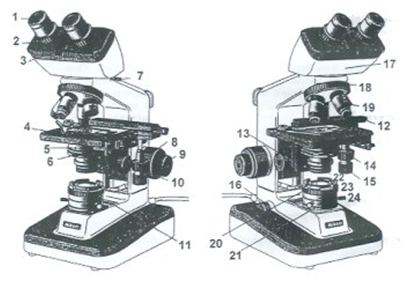 

*Figuur 2: Lichtmicroscoop. (Adapted
from:http://faculty.scf.edu/keirlem/BSC_1007_eText_UNIT_3/TEXT\_
Cellular_Structures/TEXT_Cellular_Structures_print.html)*

1. oculairen
2. dioptrie ring voor het instellen van de brilsterkte 
3. instelschaal voor de interpupillaire afstand (afstand tussen de ogen) 
4.  preparaattafel 
5.  condensor 
6.  diafragma van de condensor 
7.  schroef om oculairen vast te zetten 
8. grove scherpstelschroef 
9.  fijne scherpstelschroef 
12. kruistafel 
13. instelknop condensor  
14/15.  schroef om kruistafel te bewegen (voor/achter en links/rechts) 
16.  lichtschakelaar 
17. binoculaire tubuskop 
18.  revolver met objectieven 
19.  objectief 
21.  houder met lens en velddiafragma 
22.  plaats voor (daglicht)filter 
23.  ring om velddiafragma open en dicht te draaien 
24. centreerschroeven voor het velddiafragma 

**Opdracht 1:** 
Gebruik de onderstaande tekst en figuur 2 om de onderdelen van je eigen microscoop te benoemen. Maak een foto van beide hoeken van de microscoop en geef in de foto de namen van alle onderdelen weer.

In het bovenste deel of **tubus** zit een prismastelsel dat de enkelvoudige projectie van het object uitsplitst over de beide **oculairen**  De oculairen zijn onderling verstelbaar in horizontale richting **(interpupillaire afstand).** De tubus is draaibaar op **het statief**  Hieronder is een draaibare **objectiefhouder** geschroefd, de revolver. In de revolver kunnen vier **objectieven** een plaats vinden. Regel is dat de objectieven in een oplopende sterkte in de revolver geschroefd worden, bijvoorbeeld 4x, 10x, 40x en 100x. 

Het object (voorwerp) ligt op een objectglas en is soms afgedekt door een dekglas. Het objectglas ligt op de **objecttafel** en kan horizontaal bewogen worden met de **objectgeleider** met behulp van **twee co-axiale stelschroeven** (links/rechts en voor/achter). 

Verticaal wordt de objecttafel ingesteld met de grote instelschroef **(macrometer)** en later nauwkeurig geregeld met de kleine instelschroef **(micrometer).** Het licht door het object is afkomstig van de **lichtbron**. Het divergerende (uiteenwijkende) lamplicht wordt gebundeld tot een intensieve straal door de **condensor.** 

De condensor is verticaal verstelbaar met de **condensorknop** en is uitgerust met een **diafragma** waarmee de hoeveelheid doorgelaten licht kan worden geregeld. De apertuur (wijdte van de opening) bepaalt ook de hoeveelheid randstralen die worden weggenomen. Randstralen veroorzaken een onscherp beeld. Het lamplicht wordt op de condensor gericht met de gemonteerde spiegel met een vlakke of een holle zijde. 

 
 **Het gebruik van de microscoop**
 
Bij het microscopiseren moet je er voor zorgen dat het beeld zo homogeen mogelijk verlicht wordt. Dit betekent dat de lichtbundel vanuit de lamp zo optimaal mogelijk door de lenzenstelsels gaat. Dit noemt men Köhleren, naar de uitvinder van de methode; Köhler.   Onderin de microscoop bevindt zich de lichtbron die het preparaat verlicht en via het lenzenstelsel zorgt voor een beeld van het preparaat. Via een spiegel wordt het licht door het preparaat naar de lenzen gestuurd. De grootte van het verlichte veld kan met behulp van het velddiafragma geregeld worden. Door het velddiafragma zo in te stellen dat net het hele gezichtsveld gevuld is, wordt voorkomen dat verstorend strooilicht door het preparaat valt (zie stappenplan Köhleren). Vervolgens wordt het licht vanuit het velddiafragma door de condensor gebundeld op het preparaat geprojecteerd. Het brandpunt van de condensor moet zo ingesteld zijn dat de rand van het velddiafragma precies in het vlak van het scherpgestelde preparaat valt. Ook moet het velddiafragma in het midden van het gezichtsveld vallen, zodat de belichting egaal is (zie stappenplan Köhleren). Als aan deze voorwaarden is voldaan is de microscoop geköhlerd. Deze instellingen voorkomen dat je overbelichte regio's, schaduwen en afwijkingen (artefacten) in het preparaat ziet. Tevens vergroten deze instellingen het contrast in het preparaat. Deze instellingen maken dus dat je je preparaat optimaal kunt bestuderen! 

 
 

**Stappenplan Köhleren:** 

1.  Controleer of het 4x objectief de gebruikslens is en leg het preparaat op de objecttafel  
2.  Stel de oculairen in: zowel de horizontale afstand als eventueel de dioptrie instelling 
3.  Stel via de 4x en daarna met de 10x objectief je preparaat scherp 
4.  Zet de condensor in de hoogste stand en sluit het velddiafragma zodat je een kleine lichte vlek ziet Dit is de afbeelding van het velddiafragma 
5.  De randen van het velddiafragma scherp stellen door de condensor langzaam omlaag te draaien m.b.v. de condensorschroef. 
6.  De condensor centreren met de centreerschroeven (zitten vaak aan de voorzijde van de condensor). Het centreren is gemakkelijk als je het velddiafragma zover opent dat de randen van je beeldveld en velddiafragma bijna samenvallen 
7.  Velddiafragma verder openen totdat het net niet meer in het gezichtsveld zichtbaar is. 
8.  Pas eventueel je condensordiafragma daarna aan, bij kleinere vergroting is deze meer gesloten. De waarde van het condensordiafragma ofwel apertuurdiafragma, staat meestal op het objectief. 

**Algemene regels bij microscoopgebruik, instellen van een optimaal
beeld **

9.  Leg het preparaat altijd onder de kleinste vergroting (objectief 4x) in het midden van de preparaattafel, waarbij de objecten juist boven de opening van de preparaattafel en de condensorlens komen te liggen 
10. Bij de kleinste vergroting kan je de preparaattafel in de hoogste stand draaien zonder dat de lens het objectglas raakt. 
11. Nu kan je met de macrometerschroef al kijkend in de microscoop de preparaattafel langzaam naar beneden draaien tot zich een scherp beeld van het object heeft gevormd.  
12. Breng het beste object (dat wat je bij een grotere vergroting wilt zien) in het midden van het gezichtsveld. 
13. Nu kan je ongehinderd doordraaien naar objectief 10x. Scherpstellen met de micrometerschroef. Bij deze vergroting ga je eventueel Köhleren (stap 1-7). 
14. Vervolgens kan je, nadat je het onderdeel dat je verder uitvergroot wilt bekijken in het midden van het gezichtsveld hebt gelegd, weer doordraaien naar de volgende vergroting (objectief 40x). 
15. Scherpstellen van het beeld gebeurt ook nu weer alleen met de micrometerschroef. Eventueel het diafragma van de condensor bijstellen. 
16. **Het vervangen of het verwijderen van een preparaat gebeurt altijd onder het kleinste objectief.** 
17. Lenzen worden in normale gevallen schoongemaakt met een droge tissue. Bij erg vieze lenzen kan je deze schoonmaken met een tissue met xyleen of lenzencleaner. Dit alleen na toestemming van de docent. 
18. Alvorens de microscoop weggezet wordt, wordt de revolver teruggedraaid naar objectief 4x (kleinste vergroting), het preparaat verwijderd en de lenzen schoongemaakt. De microscoop wordt in de kast gezet, afgedekt met een hoes. 

**Opdracht 2: ** 

> Stel je microscoop zo optimaal mogelijk in door de microscoop die je vandaag gebruikt te Köhleren. 
 
**Oculairmicrometer **

Als je cellen of weefsels met de microscoop bestudeert wil je weten hoe groot de cellen, organismen of weefselcomponenten nu in werkelijkheid zijn. En hoe ze zich ten opzichte van elkaar verhouden. In publicaties, en ook in je biologieboek, zie je bij microscopische foto's altijd een maatstreepje of "bar" in de foto staan. Voor nauwkeurige metingen van objecten en delen van objecten, die met een microscoop worden bekeken, maak je gebruik van een zogenaamde oculairmicrometer. Dit is een glasplaatje voorzien van een schaalverdeling. Bij de Olympus microscopen zit deze standaard in je oculair, bij de Leica microscopen is er een apart oculair met micrometer. Deze vind je boven in de microscopenkast. 

De oculairmicrometer ijk je met een objectmicrometer waarvan bekend is hoe groot 1 schaaldeel is. Meestal is de schaalverdeling 1 mm, onderverdeeld in 100 delen, zodat één schaaldeel 0,01 mm (= 10 µm) is. 

​Nu wordt scherp gesteld op de objectmicrometer. Er zijn dan twee schaalverdelingen te zien; van de oculairmicrometer en van de objectmicrometer. Door draaien van het oculair worden de beide schaalverdelingen evenwijdig gelegd. Zoals je kan zien komen de streepjes van het oculair en van het objectmicrometer niet overal overeen. Verschuif de objectmicrometer zodat de streepjes op 2 punten wel overeenkomen (zie figuur 3). Zorg dat er een redelijke afstand van deze beide streepjes ligt.  

Nu zijn er een aantal schaaldelen van de oculairmicrometer (a) gelijk aan een aantal schaaldelen van de objectmicrometer (b).  

In figuur 3 komen 13 schaaldelen van de oculairmicrometer overeen met 50 schaaldelen van de objectmicrometer.  

1 schaaldeel van de objectmicrometer is 0,01 mm = 10 µm. Dus 50 schaaldelen zijn samen 500 µm. Dan is 1 schaaldeel van de oculairmicrometer 500/13= 38,50 µm. 

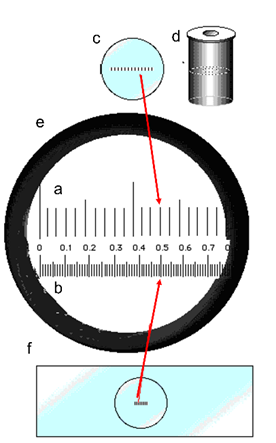
*Figuur 3: Kalibreren oculairmicrometer. a. schaalverdeling oculairmicrometer, b. schaalverdeling objectmicrometer, c. oculairmicrometer, d. oculair, e. gezichtsveld, f. objectmicrometer.*

Uitgezet in een formule is dit: 

$\frac{b}{a} \cdot 10 (µm) = µm$ 

**Opdracht 3:** 

Bepaal voor de 4x, 10x en 40x objectief de waarde van een schaaldeel van de oculairmicrometer. Per lens bepaal je 3 keer de waarde van de schaaldelen, waarbij tussen de metingen de objectmicrometer iets verschoven wordt. Op deze wijze minimaliseer je de meetfout door de gemiddelde waarde van de drie metingen te nemen. Noteer deze waarden overzichtelijk in een tabel met een duidelijk bovenschrift! Deze waarden kun je bij het gebruik van deze microscoop gebruiken om de grootte van cel(onderdelen) te bepalen door een schaalverdeling in de microscopische foto te plaatsen.

---

**Gramkleuring**

Om micro-organismen in te delen in een groep wordt vaak gebruik gemaakt van de Gramkleuring. Door middel van deze kleuring worden bacteriën verdeeld in Grampositieve en Gramnegatieve bacteriën.

De cellen worden gekleurd met een kristalviolet-jodium complex, ontkleurd met alcohol en nagekleurd met waterige fuchsine of safranine.
Bij Grampositieve bacteriën wordt het kristalviolet-jodium complex niet weggewassen door de alcohol; deze cellen kleuren blauw-paars.
Gram-negatieve cellen verliezen deze kleurstof door de alcohol; door het nakleuren met [safranine](http://nl.wikipedia.org/w/index.php?title=Fuchsine&action=edit) kleuren ze rood/roze. Het verschil tussen Grampositieve en Gram-negatieve bacteriën is gelegen in de samenstelling van de celwand.

In de Grampositieve celwand worden heel veel lagen peptidoglycaan gevonden met erg veel peptide-dwarsverbindingen. In de Grampositieve celwand liggen teichonzuren ingebed (Figuur 1).

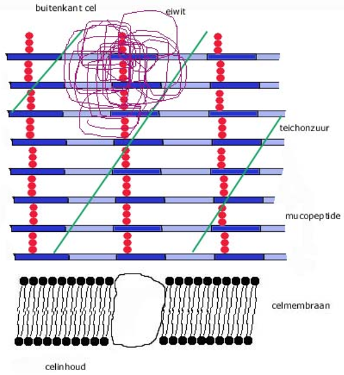

*Figuur 1. Grampositieve celwand. Na Gramkleuring kleuren Grampositieve bacteriën blauw/paars.*

In de Gramnegatieve celwand ligt slechts één laag peptidoglycaan met weinig dwarsverbindingen erin (Figuur 2). De celwand van een Gramnegatieve cel is dan ook kwetsbaarder dan die van een Grampositieve cel. Aan de buitenkant van het mucopeptide ligt een zogenaamde buitenmembraan een laag bestaande uit fosfolipiden, eiwitten en lipopolysaccharide. Het lipopolysaccharide-deel is giftig en wordt ook wel endotoxine genoemd. Het veroorzaakt koorts en hoofdpijn. Het endotoxine is zeer hittestabiel, het kan beter tegen verhitten dan de bacterie zelf en kan dan ook in gesteriliseerd glaswerk voorkomen. Door de aanwezigheid van de buitenmembraan zijn Gram-negatieve bacteriën minder gevoelig voor penicilline dan Grampositieve bacteriën.

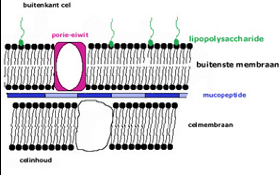

*Figuur 2. Gramnegatieve celwand. Na Gramkleuring kleuren Gram-negatieve bacteriën rood/roze. *

**Benodigdheden**

-   Gramkleuring vloeistoffen
-   8 glazen preparaat kleurbakjes
-   Objectglazen
-   Strekplaat
-   Fysiologisch zout (bij het resuspenderen van een kolonie)
-   Filtreerpapier
-   Entoog
-   Bunsenbrander
-   Microscoop
-   Immersie olie

**Uitvoering:**

Afhankelijk van het uitgangsmateriaal worden de bacteriën op een vetvrij
object glas gebracht en gefixeerd.

a. Koloniemateriaal wordt met een entoog op een vetvrij objectglaasje in een druppel 10% formaline gebracht of een druppel fysiologisch zout.

- het koloniemateriaal suspenderen in de formaline over een oppervlakte van ongeveer een euromuntstuk; de suspensie dient niet te dik te zijn, maar licht troebel

- droog het preparaat aan de lucht, eventueel op een strekplaat met een maximale temperatuur van 50°C.

b. Een cultuur in vloeibaar medium wordt direct uitgestreken op een vetvrij objectglaasje

- breng een kleine druppel op het objectglaasje

- verdeel de cultuur over het glaasje door het uit te strijken over een oppervlakte van ongeveer een euromuntstuk
- droog het preparaat aan de lucht, eventueel op een strekplaat met een maximale temperatuur van 50°C.

Het gedroogde preparaat wordt door de Gramreeks gehaald.

Bakje 1: 5 minuten fixeren in ethanol 96%

Bakje 2: 1 minuut in gefilterde waterige kristal-violetoplossing

Bakje 3 kraanwater, spoel het preparaat goed, en laat afdruipen (anders wordt de jodium-oplossing verdund!)

Bakje 4: 1 minuut in jodiumoplossing (Lugol)

Bakje 5: 1 minuut ethanol 99%

Bakje 6 kraanwater, spoel het preparaat goed, en laat afdruipen (anders wordt de basische fuchsine verdund!)

Bakje 7: 1 minuut basische fuchsine oplossing

Bakje 8: kraanwater: goed naspoelen

- Droog het preparaat tussen filtreerpapier

- Bekijk het preparaat met het 100x objectief (=olie-immersie lens)

Kwaliteitscontrole GRAM-reeks:

-   Lugol: papier stukje in oplossing dopen: Blauw/zwart = in orde

> Lichtblauw/geel = lugol vervangen

-   Kristalviolet: vloeistof langs rand bakje bewegen: Stroperig/viskeus = in orde

> Vloeibaar = vervangen

-   Spoelvloeistoffen: als deze te veel kleur bevatten, vervangen!

**Opdracht 4**
Maak van een aantal aangegeven bacteriestammen een Gram-preparaat en bekijk deze onder een correct ingestelde microscoop. Beoordeel het Gram-karakter. Maak een foto van het microscopisch beeld en geef daarin de schaalverdeling weer. Bekijk ook de yoghurt. Welk type bacteriën zijn daarin aanwezig?

---

## 4.  pH-meter en buffers

**Algemene theorie**

**De kracht van waterstofatoom**

De pH-waarde is een negatief logaritme van de concentratie waterstofionen. De letters 'p' en 'H' staat voor kracht en het waterstofatoom. De pH-waarde is verbonden met de pH-schaal.

De zuurgraad van een oplossing wordt bepaald door de concentratie H~3~O^+^. Hoe meer H~3~O ^+^in een oplossing, des te zuurder de oplossing. Omgekeerd wordt de 'basiseenheid' van een oplossing bepaald door de concentratie OH- ionen. Het product van de concentratie H~3~O ^+^ en OH^-^ is altijd 10^-14^.

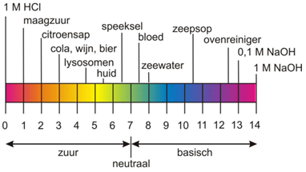
* Figuur 1 - pH schaal – pH schaal en indicaties van de zuurgraad van een aantal stoffen *

Dat betekent dat als er meer H~3~O ^+^ in een oplossing zit, er minder OH- in de oplossing aanwezig zal zijn.

De pH heeft een logaritmische schaal. Dat betekent dat elke pH-eenheid een factor 10 verschil in de concentratie H~3~O ^+^ inhoud. 

Een verschil van 2 pH eenheden betekent een verschil van 100x in zuurgraad, 3 pH eenheden een verschil van 1000x. Een oplossing met een pH van 3 bevat 10x meer H~3~O ^+^ dan een oplossing met een pH van 4.

$pH = -\log[H_3O^+]$

$[H_3O^+] = 10^{-pH}$

De Henderson Hasselbalch-vergelijking is een formule om de verhouding tussen een zuur en een base bij een bepaalde pH te berekenen zonder dat je de exacte concentraties hoeft te weten. De Henderson Hasselbalch vergelijking is afgeleid van de evenwichtsvoorwaarde (Zie Bijlage: Informatieblad, 5.4)

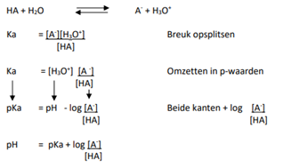

**Veilig werken met sterke zuren en basen op het lab**

Sterke zuren en basen zijn bijtend en kunnen brandwonden veroorzaken bij contact met de huid of inademing. In hoge concentraties moeten zuren en basen uitsluitend in de zuurkast worden gebruikt. Hiervoor zijn extra dikke handschoenen beschikbaar. Bij lage concentraties mag je met kleine hoeveelheden natronloog en zoutzuur op de labtafel werken, zoals concentraties van minder dan 4 mol/L (M). Werk voorzichtig en schrijf goed op elk bekerglas wat erin zit. Draag altijd handschoenen en een veiligheidsbril wanneer je werkt met zuren en basen.

Wanneer je een sterk zuur verdunt met water, kan dit leiden tot een heftige reactie. Je oplossing wordt heet en er kan zuur in het rond gaan spatten. Hierdoor kunnen omstanders brandwonden oplopen. Het is daarom belangrijk om altijd het zuur aan het water toe te voegen, en nooit water in zuur te gieten. Zuur bij water, pret voor later. Water bij zuur, bloed aan de muur.

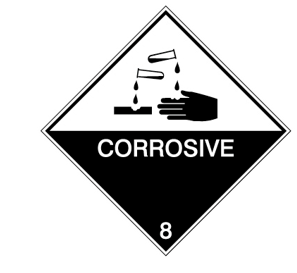

*Figuur 2 – ADR label 8 - Gevaren symbool voor corrosie*

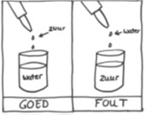

*Figuur 3  – Druppelen – Water bij zuur staat je duur*

Chemicaliën of oplossingen worden afgevoerd in afvalvaten. Je kunt niet zomaar alle chemicaliën bij elkaar in een afvalvat gooien, want dan kunnen er heftige chemische reacties ontstaan of bijvoorbeeld giftige dampen.

Voor geconcentreerde zure of basische waterige oplossingen zijn er afvalvaten: Anorganisch zuur, anorganische base, organisch zuur en organische base

**Zuurgraad bepalen**

Het is belangrijk om te kunnen bepalen met welke zuurgraad je te maken hebt. Voor oplossingen kan er gebruik worden gemaakt van verschillende methoden. Voor de kwantitatieve meting van pH zijn er pH-indicatoren beschikbaar. Een pH-indicator is een chemische stof die een bepaalde kleuromslag kan vertonen op basis van de omgeving. De kleur blijft constant na een ontwikkelde reactie. Veel gebruikte pH-indicatoren zijn onder andere broomthymolblauw, methylrood en fenolftaleïne. Verder is het mogelijk om i.p.v. kleurstoffen pH-indicator papier toe te passen. pH-indicator papier heeft bijvoorbeeld een universele bereik van pH 1 t/m 14, en dat kan gebruikt worden door een strookje af te nemen en te dompelen in meetoplossing.

Een meer nauwkeurige meting van de pH wordt gemeten met een pH-meter (Figuur 4). Voor de meting met een pH wordt de gecombineerde glaselectrode gebruikt. De gecombineerde glaselectrode bestaat zilverchloride-electrode (Ag/AgCl) en een verzadigde calomel electrode (Hg/Hg~2~Cl~2~). Rondom de binnenste zilverchloride-electrode zit de calomel electrode en ze dienen als referentie-electrodes. Aan het eind van de glaselektrode zit het pH gevoelige glasmembraan. Dit is een speciaal type glas met een glasmembraan. Voor het goed functioneren van de pH-meter is het belangrijk dat dit glasmembraan gehydrateerd is en de buitenste elektrode contact heeft met de meetoplossing via een zoutbrug.

De stroomkring loopt dus van de buitenste elektrode via de meetoplossing en het pH-gevoelige glasmembraan naar de binnenste elektrode. De potentiaal over het glasmembraan (Em) hangt af van de concentratie H+ in de meetoplossing en de concentratie H+ in de glaselektrode. De concentratie H+ in de glaselektrode is constant (pH=7). De volgende vergelijking geldt:

$Em = 0,4144 - 0,0592 \cdot pH$

De potentiaal over het membraan wordt gemeten met spanningsmeter van de pH-meter. De pH meter heeft een gevoeligheid van ongeveer 59,2 mV per pH eenheid (bij 25°C).

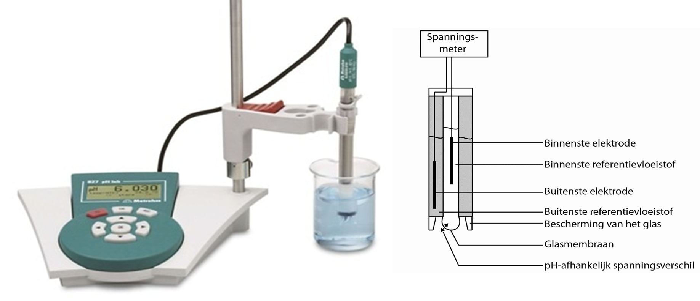

*Figuur 4  – pH meter*

**Het toepassen van een pH-meter**

**Regels pH-electrode**

Het hanteren van de pH-electrode dient volgens onderstaande regels te
verlopen:

-   De pH-electrode **niet** op de kop houden, de vloeistof in de pH meter mag niet naar boven lopen.

-   De pH-electrode **niet** stoten en de roervlo mag niet tegen de electrode aankomen tijdens het gebruik van magneetroerder.

-   De pH-electrode **altijd** in een oplossing houden, de bewaarvloeistof (3M KCl) of meetoplossing.

-   De pH-electrode mag **niet** uitdrogen.

-   De pH-electrode **niet** opslaan in demiwater of schoonmaakvloeistof.

-   De pH-electrode controleren op vloeistof in de buitenste wand, geen
    vloeistof dan **niet** meten.

-   De pH-electrode **niet** in een bekerglas plaatsen zonder houder, het mag niet tegen de wand leunen of tegen de bodem aan komen.

**Gebruik van pH-electrode bij elke meting**

Onderstaande procedure beschrijft de handeling voor elke pH-meting:

-   Alle te gebruiken oplossingen van te voren op kamertemperatuur brengen.

-   Meng/roer de meetoplossing.

-   Controleer de huls van de pH-electrode op bewaarvloeistof en haal de electrode uit de huls.

-   Spoel de electrode af met demiwater boven een bekerglas.

-   Dep de pH-electrode voorzichtig af met een schone tissue, niet afdrogen.

-   Meet de meetoplossing door de pH-electrode in de houder te plaatsen terwijl de electrode in contact is met de meetoplossing.

-   Spoel de pH-electrode na elke meting altijd af met demiwater en dep voorzichtig met een schone tissue.

-   (Optioneel: Na metingen met kleurstoffen de pH-electrode afspoelen met ethanol, vervolgens met demiwater en dep voorzichtig met een schone tissue)

-   Plaats de electrode vervolgens in de houder met bewaarvloeistof, vul aan indien nodig.

**Uitvoering pH-meter kalibreren**

-   Houdt de regels en gebruik van de pH-meter in acht.

-   Breng de kalibratiebuffers op kamertemperatuur. Een kleinere volume vanuit de stockoplossing overbrengen in een bekerglas.

-   Maak een goede opstelling met een pH-meter, magneetroerder, roervlo, bekerglas met oplossingen, bekerglas voor meetoplossing, spuitfles demi-water en afvalbekerglas.

-   Gebruik 2 kalibratiebuffers, maak een keuze en geef argument waarom je deze hebt uitgekozen. Gekozen vanwege meetoplossing pH 1-7 of pH 7-14?

-   Zoek het voorschrift dat hoort bij jouw merk en type pH-elektrode en volg dit voorschrift.

Algemeen protocol kalibreren:

-   Zorg voor goede opstelling.

-   Druk op \<CAL\> knop.

-   Doe de electrode in de 1^e^ meetoplossing/kalibratiebuffer en druk op \<OK\> bij type 827.

-   Verwijder electrode van buffer, spoel de pH-electrode met dH~2~O en plaats het in de 2^e^ meetoplossing/kalibratiebuffer.

-   Druk op \<OK\> bij 827.

-   Resultaat wordt getoond op het display.

Rond de kalibratie af, druk op \<OK\> of \<QUIT\> bij 827.

**Bufferoplossing maken en pH bepalen**

In het algemeen bestaat een bufferoplossing uit een zwak zuur en zijn (zwakke) geconjugeerde base, samen opgelost in water. Een zwak zuur en geconjugeerde base wordt ook wel een zuur/base koppel genoemd. Afhankelijk van de gewenste pH wordt voor een bepaald zuur/base koppel gekozen. Voor een goede bufferoplossing moet de gewenste pH van de bufferoplossing dicht bij de pKa van je zuur/base koppel liggen.

Een buffer kan op verschillende manieren worden gemaakt. Het is gebruikelijk om van het zuur en van de base aparte oplossingen te maken. Deze oplossingen worden dan in een bepaalde verhouding gemengd om zo de gewenste pH te krijgen. Voor het berekenen van de juiste verhouding wordt gebruik gemaakt van de Henderson-Hasselbalch vergelijking.

Veel gebruikte buffers in een biomedisch laboratorium zijn:

- Fosfaat ($HPO_4^{2-}$/$H_2PO_4^-$)-buffer (pH-range: 5,7 - 8,0)

- Azijnzuur/acetaatbuffer (pH-range: 3,6 - 5,6)

- Tris/HCl buffer (pH-range: 7,3 -- 8,6)

Veel analisten gebruiken tabellen uit Lab FAQS-boek om buffers te maken. Met behulp van deze tabellen worden betrouwbare buffers gemaakt. Tijdens komend experiment wordt er een buffer gemaakt aan de hand van Lab-FAQS: Find a quick solution, 4th ed., 2011, Roche Applied Science.

Er wordt een fosfaat buffer gemaakt van 200 ml met eindconcentratie van 0.1 M. Hiervoor worden er eerst twee fosfaatzouten bereid van 200 ml 0.2M, een mono-zout en di-zout oplossing. Voorbeeld van mono zout is
NaH~2~PO~4~ en van di zout is Na~2~HPO~4~.

### Uitvoering bufferoplossing maken en pH bepalen

-   Vraag aan de docent de gewenste pH waarde voor de buffer.

-   Bereken en weeg af hoeveel stof je moet afwegen voor 200 ml 0.2 M oplossing van de mono-zout en di-zout oplossing.

-   Maak van beide fosfaatzouten een 200 ml 0.2 M oplossing door de afgewogen massa op te lossen in 150 ml en aan te vullen tot 200 ml met demiwater.

-   Gebruik de tabel om de juiste mengverhouding toe te passen en maak een 100 ml 0.2 M oplossing door beide zoutoplossingen te mengen.

-   Voeg aan de 100 ml 0.2 M vervolgens 100 ml dH~2~O toe voor een 200 ml 0.1 M fosfaatbuffer.

-   Bewaar de 0.2 M oplossingen voor de volgende experimenten.

-   Maak vanuit een deel van de 0.1 M fosfaatbuffer een 1 mM fosfaatbuffer door middel van verdunnen.

-   Controleer de pH met de pH-meter van de 0.1 M en 1 mM fosfaatbuffer.

-   Noteer de resultaten.

**Buffercapaciteit testen**

Naar aanleiding van het maken van fosfaatbuffers gaan we het effect van het toevoegen van zuur en base aan verschillende oplossingen testen. We testen het effect op toevoegen van zuur en base op de pH van demiwater. Vervolgens het effect op toevoegen van zuur en base op de pH van de twee gemaakte buffers. Zo wordt er onderzocht of de concentratie van de buffer een effect heeft op de buffercapaciteit van de buffer.

Er wordt gebruik gemaakt van 1 M HCl-oplossing als zuur en 1 M NaOH-oplossing als base. Beide oplossingen worden druppelsgewijs toegevoegd aan demiwater, 0,1 M fosfaatbuffer en 1 mM fosfaatbuffer. Met behulp van pH-indicatoren en een gekalibreerde pH-meter wordt de verandering in pH onderzocht.

**Uitvoering buffercapaciteit testen**

-   Voeg aan 100 ml dH~2~O, meetoplossing 1 druppel (0,05 ml) 1 M HCl-oplossing toe en meet na mengen de pH met pH-meter.

-   Voeg nogmaals 1 druppel 1 M HCl-oplossing toe en meet na mengen de pH met pH-meter.

-   Neem 1 stukje pH papier en meet de pH.

-   Noteer de resultaten van pH-indicatoren en de pH-meter.

-   Herhaal bovenstaande met nieuwe 100 ml dH~2~O en 1 M NaOH-oplossing en een andere pH-indicator kleurstof.

-   Noteer de resultaten van pH-indicatoren en de pH-meter

-   Voeg aan 100 ml 0,1 M fosfaatbuffer 1 druppel (0,05 ml) 1 M HCl-oplossing toe en meet na mengen de pH met pH-meter.

-   Voeg nogmaals 1 druppel 1 M HCl-oplossing toe en meet na mengen de pH met pH-meter.

-   Neem 1 stukje pH papier en meet de pH.

-   Noteer de resultaten van pH-icatoren en de pH-meter.

-   Herhaal bovenstaande met nieuwe 100 ml 0,1 M fosfaatbuffer en 1M NaOH-oplossing.

-   Noteer de resultaten van pH-indicatoren en de pH-meter.

-   Voeg aan 100 ml 1 mM fosfaatbuffer 1 druppel (0,05 ml) 1 M HCl-oplossing toe en meet na mengen de pH met pH-meter.

-   Voeg nogmaals 1 druppel 1 M HCl-oplossing toe en meet na mengen de pH met pH-meter.

-   Neem 1 stukje pH papier en meet de pH.

-   Noteer de resultaten van pH-indicatoren en de pH-meter.

-   Herhaal bovenstaande met nieuwe 100 ml 1 mM fosfaatbuffer en 1M NaOH-oplossing.

-   Noteer de resultaten van pH-indicatoren en de pH-meter.

-   Maak een tabel met alle meetresultaten. Trek een conclusie over de bufferwerking (=buffercapaciteit) van de verschillende meetoplossingen

## 5. PCR: PTC bitter proeven

**Erfelijkheid en DNA**

Veel van de eigenschappen van de mens zijn erfelijk en liggen vastgelegd in het DNA. In het DNA ligt alle erfelijke informatie opgeslagen. DNA bestaat uit lange strengen nucleotiden die een code vormen. Zo'n streng DNA is te verdelen in kleine stukjes genaamd genen. Een gen kan worden afgeschreven tot mRNA en vervolgens kan op basis van het mRNA een eiwit gemaakt worden. De productie van eiwitten leidt uiteindelijk tot de eigenschappen die zichtbaar zijn. De informatie in het DNA wordt het **genotype** genoemd. De uiteindelijke eigenschappen (bijvoorbeeld je haarkleur en oogkleur) worden het **fenotype** genoemd.

$$\text{DNA (genotype)} \rightarrow \text{mRNA} \rightarrow \text{eiwitten} \rightarrow \text{eigenschappen (fenotype)}$$

Van bijna alle genen heb je twee versies: één van je vader en één van je moeder. Wanneer een gen dat je geërfd hebt van je vader en je moeder dezelfde code bevatten, noemen we dat **homozygoot**. Wanneer het gen dat je geërfd hebt van je vader een andere code bevat dan het gen van je moeder, noemen we dat **heterozygoot**.

**Bittertasting\
**Zoogdieren kunnen vijf basissmaken van elkaar onderscheiden: zoet, zuur, bitter, zout en umami ('hartigheid', de smaak van natriumglutamaat). Een wetenschapper genaamd Arthur Fox maakte de stof fenylthiocarmide (PTC), maar knoeide toen hij de stof overbracht in een fles. Labgenoot Noller klaagde dat het stof bitter smaakte, terwijl Fox niets proefde, zelfs niet toen Fox hele kristallen probeerde te proeven. Het bleek dat sommige mensen deze stof heel goed kunnen proeven, en anderen niet. Het wel of niet kunnen proeven van PTC is erfelijk. De bittere smaak wordt herkend door receptoreiwitten op het celoppervlak van smaakcellen. Er zijn ongeveer 30 genen voor verschillende bitter smaak-receptoren in zoogdieren. Het gen dat verantwoordelijk is voor het proeven van PTC is TAS2R38. Er blijken in dit gen drie single nucleotide polymorfismen (SNPs) voor te komen. Dat betekent dat er op drie verschillende plekken in het gen een klein verschil bestaat in de code. Eén van deze SNPs blijkt een sterke correlatie te hebben met het proeven van PTC. Er zijn drie situaties mogelijk:

1)  Als je zowel van je vader als van je moeder het gen TAS2R38 met die mutatie krijgt proef je PTC niet als een bittere stof. Je bent dan **homozygoot non-taster**.

2)  Als je van één van beide ouders het gen TAS2R38 zonder deze mutatie erft smaakt PTC wel bitter. Je bent dan **heterozygoot**.

3)  Wanneer je van beide ouders het gen TAS2R38 zonder mutatie krijgt proef je de bittere smaak van het PTC heel sterk. Je bent dan **homozygoot taster**.

**Het experiment**

In dit experiment gaan we zowel het fenotype als het genotype bepalen voor het proeven van PTC. Het bepalen van het fenotype wordt gedaan door oplossingen met een verschillende concentratie PTC te proeven. Daarnaast ga je van je eigen DNA het genotype bepalen, oftewel of je homozygoot non-taster, heterozygoot of homozygoot taster bent. Voor het bepalen van het genotype gaan we DNA uit wangslijmvliescellen isoleren. Vervolgens gaan we met behulp van een polymerase chain reaction (PCR) het gen voor *TAS2R38* vermeerderen. Je krijgt dan een stukje DNA van 220 baseparen lang.

Het genproduct gaan we vervolgens knippen met het restrictie-enzym *HaeIII*. Het enzym *HaeIII* herkent de DNA-sequentie (restrictiesite) 5'-GGCC-3'. Wanneer het enzym zo'n DNA sequentie tegenkomt, dan knipt het enzym daar het DNA doormidden. In het gen *TAS2R38* zit er een SNP. Door de keuze van de primers ontstaat de restrictiesite voor *HaeIII*, maar bij één basepaar verschil ontstaat deze knipsite niet in het PCR product. Dat betekent dat sommige mensen wel een PCR product krijgen dat geknipt kan worden door *HaeIII*, terwijl andere mensen een PCR product krijgen dat niet geknipt kan worden. Wanneer je het gen voor taster hebt, wordt het DNA in twee stukken geknipt van 176 en 44 baseparen lang. Wanneer je een gen met de mutatie voor een non-taster hebt, wordt het DNA niet geknipt en blijft het DNA 220 baseparen lang.

Concreet betekent dit dat na het knippen van het PCR product je het volgende resultaat krijgt:

-   Homozygoot taster: beide allelen (via van je vader én je moeder) worden geknipt. Je krijgt daardoor DNA van 176 baseparen lang en DNA van 44 baseparen lang.

-   Homozygoot non-taster: beide allelen worden niet geknipt. Je krijgt daardoor alleen DNA van 220 baseparen lang.

-   Heterozygoot: je hebt één allel voor taster, deze wordt geknipt. Je hebt ook één allel voor non-taster, deze wordt niet geknipt. Dus je hebt na het knippen DNA van 220 baseparen lang, maar ook DNA van 176 en 44 baseparen lang.

Om te bepalen hoe lang het DNA is dat je hebt verkregen na het knippen, wordt gebruik gemaakt van gel-elektroforese. De PCR-techniek, werking van restrictie-enzymen en gel-elektroforese worden hieronder uitgelegd.

**De Polymerase Chain Reactie (PCR)**

Vaak bevatten monsters te kleine hoeveelheden DNA om direct mee te werken. Dankzij de PCR-techniek kunnen we nu het DNA in een monster vermenigvuldigen. Het PCR-apparaat is eigenlijk niets meer dan een heel nauwkeurig verwarmings- en koelapparaat met daarin de buisjes met het DNA-monster en andere ingrediënten die noodzakelijk zijn voor de reactie. Deze ingrediënten zijn:

-   Losse nucleotiden (A, T, C en G),

-   Korte enkelstrengs DNA moleculen, oligonucleotiden, de zogenaamde **primers.**

-   Een enzym met de naam ***Thermus aquaticus polymerase*** (**Taq polymerase**). Taq polymerase is afkomstig van bacteriën die leven in hete bronnen en in het bezit zijn van enzymen die bij zeer hoge temperaturen werkzaam zijn.

-   De PCR buffer bevat zouten en een buffer om te zorgen dat de Taq polymerase functioneel is.

De PCR reactie bestaat uit drie stappen, elk bij een specifieke
temperatuur (figuur 1):

-   **Denaturatie**: het proces begint met het verwarmen van het monster tot een temperatuur van ca 90-95°C, waardoor elke dubbele streng DNA zich splitst in twee enkele strengen. (Oorzaak: de waterstofbruggen die de complementaire strengen "bij elkaar houden" zijn veel zwakker dan de covalente bindingen tussen de nucleotiden binnen een keten. Het verhitten verbreekt de waterstofbinding waardoor de dubbele streng uit elkaar gaat terwijl de covalente (keten)bindingen onaangetast blijven.

-   **Annealing** (aanhechting): vervolgens wordt de temperatuur iets verlaagd, wat de DNA-primers in staat stelt zich aan de gescheiden ketens te binden. De primers binden zich omdat ze complementair zijn aan bepaalde (specifieke) volgordes vanelke streng die naast het DNA-stuk liggen dat moet wordengerepliceerd. Tijdens de annealing stap is de temperatuur meestal tussen 50en 60 °C.

-   **Elongation** (verlenging): Zodra de primer zich gehecht heeft gaat het Taq polymerase het DNA verlengen (bij 72ºC), waarbij de losse nucleotiden (A, T, C en G) gebruikt worden. Het uiteindelijke resultaat is een complementaire keten op elk oorspronkelijke enkele keten.

> Deze drie stappen zijn gezamenlijk één cyclus. In deze eerste cyclus is het oorspronkelijk aanwezige DNA verdubbeld. In de volgende cyclus wordt opnieuw verhit en afgekoeld waardoor de nieuwe dubbele strengen gescheiden worden en elk afzonderlijk gekopieerd door het Taq polymerase. In elke cyclus, wordt het aantal strengen van het gewenste stuk DNA verdubbeld. Na ongeveer 40 cycli (wat enkele uren duurt), zijn er genoeg DNA kopieën voor verder onderzoek aanwezig.

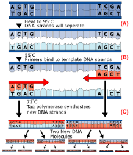

*Figuur 1: PCR reactie. A. Denaturatie stap, het dubbelstrengs DNA wordt gedenatureerd tot enkelstrengs DNA. B. Annealing stap: De forward en reversed primers binden aan het DNA. C. Elongatie stap: Taq polymerase zorgt voor de synthese van een nieuwe DNA molecuul.*

In [dit YouTube filmpje](http://www.youtube.com/watch?v=DkT6XHWne6E) wordt de PCR uitgelegd en geïllustreerd:

**Restrictie-enzymen**

Restrictie-enzymen zijn enzymen die DNA kunnen knippen. Sommige restrictie-enzymen knippen het DNA willekeurig in allemaal kleine stukjes. Er zijn echter ook heel veel restrictie-enzymen die DNA alleen knippen op plaatsen waar een bepaalde code (sequentie) staat. Als deze specifieke sequentie niet voorkomt in het stuk DNA dat je wilt knippen, dan wordt het DNA niet geknipt.

In dit experiment gaan we het DNA knippen met het enzym HaeIII. Dit enzym knipt alleen DNA als de volgorde 5'-GGCC-3' erin staat. Deze sequentie komt wel voor in het PCR product van de taster. In de sequentie van de non-taster zit een mutatie, waardoor deze sequentie is veranderd in 5'-GGGC-3'. In het PCR-product van de non-taster zal het HaeIII-enzym dus niet knippen.

Restrictie-enzymen moet je altijd voorzichtig behandelen. Ze zijn namelijk duur en als ze niet onder de goede omstandigheden blijven, werkt het enzym niet meer. De volgende punten zijn daarom erg belangrijk.

-   Draag een handschoen aan de hand waarmee je het cupje met restrictie-enzym open en dicht doet.

-   Het cupje met restrictie-enzym moet koud blijven. Daarom wordt het bewaard in de vriezer en als het cupje uit de vriezer wordt gehaald, wordt het bewaard in een bak met ijs. Wanneer je klaar bent met het restrictie-enzym, wordt deze weer terug in de vriezer geplaatst.

-   Zorg dat je alleen met schone pipetpuntjes en schone pipetten pipetteert (dit moet altijd, niet alleen als je met restrictie-enzymen werkt).

-   Pipeteer nooit enzym weer terug in het cupje.

**DNA gelelektroforese**

DNA gelelektroforese is een techniek om DNA te analyseren. Eerst wordt het DNA op grootte gescheiden en vervolgens kan met UV-licht gekeken worden of er PCR producten zijn gemaakt en zo ja, hoe groot de PCR producten staan.

Bij DNA gel elektroforese wordt een agarosegel gemaakt (zie <http://www.youtube.com/watch?v=KKmiKKMDDhY>). De gel bestaat uit buffer met agarose en Midori green. In deze gel zitten kleine gaatjes (slotjes) waarin het DNA gepipetteerd wordt. Om te zorgen dat het DNA goed in de bodem van de slotjes zakt wordt het DNA éérst gemengd met 'loading dye'. Deze loading dye maakt het DNA zwaar en kleurt het blauw. Door de blauwe kleur kun je goed zien hoe het DNA in het slotje zakt.

Vervolgens wordt er stroom op de gel gezet (= elektroforese) (zie <http://www.youtube.com/watch?v=vq759wKCCUQ>). DNA heeft een negatieve lading en zal hierdoor aangetrokken worden naar de + pool. Grotere stukken DNA hebben meer moeite om door de gel richting de + pool te komen, terwijl kleinere fragmenten veel gemakkelijk richting de + pool gaan. Daardoor gaan de kleine DNA fragmenten veel sneller door de gel, terwijl de grotere DNA fragmenten steeds verder achterblijven. Wanneer het DNA een eind door de gel is gekomen, wordt de elektroforese gestopt.

Om het DNA in de gel zichtbaar te maken, is Midori green toegevoegd aan de gel. Midori green bindt aan het DNA en fluoresceert bij UV-licht. De gel wordt daarom na de elektroforese met UV-licht bekeken. Hierdoor kan bekeken worden of er DNA aanwezig is, en zo ja, hoe groot de DNA fragmenten zijn.

**De marker**

Om zeker te weten hoe groot de DNA fragmenten zijn, wordt in één slotje van de gel een marker gepipetteerd. De marker bevat DNA-fragmenten van bekende grootte. Door de bandjes van de PCR producten te vergelijken met de bandjes van de marker kan de grootte van de PCR producten geschat worden (zie de marker in figuur 3 ter illustratie). De marker die in dit experiment gebruikt wordt is de Low MW DNA Marker (New England Biolabs). Van elk bandje van de marker is precies bekend hoe groot het DNA fragment is. De grootte van DNA wordt uitgedrukt in baseparen (bp). In deze marker is meer DNA aanwezig van 200 bp dan de andere groottes, daarom is het bandje van 200 bp lichter gekleurd is dan de andere bandjes. Dit bandje kun je dus gemakkelijk herkennen op de gel.

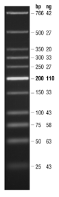

*Figuur 2: De bandjes van de Low MW DNA Marker en de bijbehorende grootte in bp. Ook is weergegeven hoeveel DNA (ng DNA per 1 μl Marker) er van elk bandje aanwezig is in de marker.*

***Het resultaat**

Na het uitvoeren van de PCR ga je niet al het DNA knippen. Je bewaart een deel van het PCR-product als controle. Na het knippen breng je zowel het geknipte DNA als het ongeknipte DNA op gel:

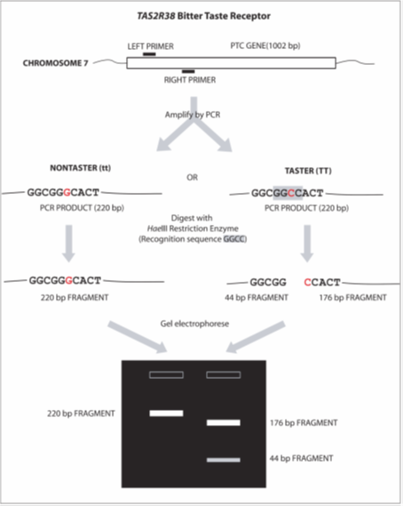

*Figuur 3: Samenvatting van de genotype bepaling. Vanaf het geïsoleerde DNA wordt een stukje van het PTC gen met behulp van PCR vermeerderd. Het DNA van nontasters wordt niet geknipt door *Hae*III, het DNA van tasters wel. Met behulp van gel electroforese is de lengte van de DNA fragmenten vervolgens te zien.*

**Praktische uitvoering**

Het experiment bevat de volgende stappen:

1.  DNA-isolatie uit wangslijmvliescellen

2.  PCR Tas2R38 gen

3.  Restrictie met *HaeIII*

4.  Agarose gel elektroforese

5.  Bitter proeven (dit kan tijdens één van de wachtstappen)

**DNA-isolatie uit wangslijmcellen**

-   Als er onlangs voedsel of gedronken is, wordt aangeraden om de mond eerst te spoelen met water voordat het monster genomen wordt.

-   Open de verpakking van de OmniSwab aan de ejectorzijde (figuur 4) en verwijder het voorzichtig, raak daarbij het opvangkussentje niet aan.

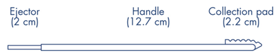
*Figuur 4: OmniSwab van Qiagen.*

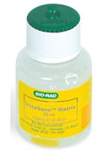
*Figuur 5: Instagene matrix van Biorad. *

-   Houd het uiteinde van de handgreep van de OmniSwab vast en schraap het opvangkussentje stevig tegen de binnenkant van de wang 5-6 keer (ongeveer 10 seconden) en zorg ervoor dat het opvangkussentje niet uitgewerpt wordt.

-   Druk op de ejector om het opvangkussentje uit te werpen in een 15ml Greiner buis.

-   Voeg 5 ml PBS toe aan de 15 ml Greiner buis (=celsuspensie).

-   Mix door tegen de buis te tikken.

-   Breng 1 ml celsuspensie over in een 1,5 ml cupje.

-   Centrifugeer gedurende 1 minuut bij 10.000-12.000 rpm.

-   Giet supernatant af en resuspendeer de cellen in 50 µl milipore water.

-   Pipetteer 200 µl Instagene Matrix (figuur 5) in een nieuw Eppendorfcupje (1,5 ml).

**NB**.: InstaGene matrix moet constant met een magneetroerder op matige snelheid worden geroerd om de matrix in suspensie te houden. De pipet punt moet een grote opening hebben zoals een 1000 µl pipet punt.

-   Voeg 20 µl van de celsuspensie toe aan deze 200 µl van InstaGene matrix.

-   Incubeer bij 56°C gedurende 20 minuten in een hitteblok

-   Vortex gedurende 10 seconden. Prik een gaatje in het dekseltje van het cupje. Plaats het cupje in een 100°C kokend waterbad of hitteblok gedurende 8 minuten.

-   Vortex 10 seconden. Centrifugeer bij 10,000--12,000 rpm gedurende 2 minuten

-   Pipeteer direct 20 µl van het supernatant in een schoon eppendorf cupje en bewaar op ijs

-   Gebruik 5 µl van het supernatant per 25 µl PCR reactie

**PCR Tas2R38 gen**

1.  Neem een PCR cupje en label deze met een watervaste stift op de zijkant van het cupje. Tekst op de bovenkant van het cupje is vaak niet meer zichtbaar na afloop van de PCR.

2.  De mastermix is al door de docenten voorbereid volgens onderstaand schema:

| Component | Beginconcentratie | Volume in de mastermix | Eindconcentratie (inclusief DNA) |
| :--- | :--- | :--- | :--- |
| PCR reactiebuffer 10 x | 10 x geconcentreerd | x µl | 1x geconcentreerd |
| MgCl2 | 50 mM | x µl | 4 mM |
| Forward primer *TAS2R38* | 25 µM | x µl | 1 µM |
| Reverse primer *TAS2R38* | 25 µM | x µl | 1 µM |
| dNTPs | 20 mM | x µl | 0,8 mM |
| Taq polymerase | 5 U/µl | x µl | 0,08 U/µl |
| Millipore water | | x µl | |
| **Totaal volume** | | **20 µl** | |

De sequentie van de primers is:

| Naam van de primer | Sequentie |
| :--- | :--- |
| Forward primer *TAS2R38* | 5’-CCTTCGTTTTCTTGGTGAATTTTTGGGATGTAGTGAAGAGGCGG-3’ |
| Reverse primer *TAS2R38* | 5'-AGGTTGGCTTGGTTTGCAATCATC-3' |

3.  Pipetteer met een schone pipetpunt 20 μl van de mastermix in het PCR cupje. Zorg dat de mastermix mooi onder in het cupje zit. Als dat niet zo is, tik dan voorzichtig met het cupje op de tafel totdat de mastermix naar beneden is gezakt.

4.  Voeg 5 μl van het geïsoleerde DNA toe aan het PCR cupje. Let erop dat het DNA in de mastermix komt en niet aan de zijwand van het cupje blijft hangen. Let er ook op dat er geen vloeistof achterblijft in de pipetpunt.

5.  Voeg ook Blanco reactie toe, waarbij het template DNA wordt vervangen door Millipore water (dit is een apart PCR-cupje)

6.  Als je voor het inzetten van de PCR moet wachten, bewaar dan je cupje op ijs.

7.  Plaats de PCR cupje in het PCR apparaat. Stel het volgende programma in:

| Stap | Temperatuur | Tijd | Aantal cycli |
| :--- | :--- | :--- | :--- |
| Denaturatie | 94 °C | 5 minuten | |
| Denaturatie | 94 °C | 30 seconden | 35 x |
| Annealing | 68 °C | 30 seconden | |
| Elongatie | 72 °C | 30 seconden | |
| Laatste verlengstap | 72 °C | 5 minuten | |
| Koelen | 4 °C | 5 minuten | |

**Restrictie met *HaeIII***

1.  Markeer één cupje voor het PCR dat ongeknipt blijft en een cupje met PCR product geknipt met HaeIII

2.  Neem 2x 10 μl van het PCR product pipetteer dat in de 2 gelabelde cupjes

3.  Voeg aan de rest van het PCR product 1 μl van het restrictie enzym HaeIII toe + 2 μl CutSmart buffer en 7 μl millipore water. Bij de ongeknipte controle wordt de 1 μl restrictie enzym vervangen door 1 μl millipore water extra.

4.  Zorg ervoor dat het enzym goed gemengd wordt met het PCR product, door het cupje kort af te draaien in een mini centrifuge

5.  Incubeer beide cupjes bij 37 graden Celsius gedurende minstens 1 uur. Begin tijdens het wachten alvast met de volgende stappen.

**DNA gel elektroforese**

Gieten van de gel

(zie dit filmpje: <http://www.youtube.com/watch?v=KKmiKKMDDhY>)

1.  Overleg met de docent welk bakje met welk kammetje gebruikt kan worden, en hoeveel kammetjes er gebruikt worden.

2.  Maak 500 ml 1x TBE buffer door 10x TBE buffer te verdunnen met demiwater .

3.  Meng de 1x TBE buffer goed op een magneetroerder.

4.  Plak een gel elektroforesebakje af met schildertape.

5.  Bereken hoeveel agarose je nodig hebt om 50 ml 2% agarose oplossing te maken.

6.  Weeg de benodigde agarose af en doe deze in een voldoende grote Erlenmeyer (minstens 150 ml).

7.  Voeg 50 ml 1x TBE buffer toe aan de erlenmeyer met agarose.

8.  Verwarm de agarose oplossing tot het kookpunt in de magnetron.

9.  Meng de agarose goed en verhit deze nog een keer in de magnetron tot kookpunt.

10. Laat de agaroseoplossing in de zuurkast afkoelen tot je de buitenkant goed met blote handen aan kunt pakken.

11. Voeg 5 μl Midori green (10 mg/ml) toe aan de agaroseoplossing (belangrijk: draag een blauwe handschoen!).

12. Meng de agaroseoplossing goed en giet deze in het afgeplakte bakje.

13. Plaats één of twee kammetjes voor 8 slotjes in de gel (overleg vooraf met de docent).

14. Laat de gel stollen in de zuurkast (duurt ongeveer 30 minuten).

15. Verwijder het schilderstape en plaats de gel in een elektroforese-opstelling (draag ook hier blauwe handschoenen).

16. Controleer of de gel in de goede richting in het bakje ligt (kammetje moet aan de '-' pool zitten).

17. Giet de 1x TBE buffer bij de gel tot de gel net 'onder water' staat.

18. Verwijder voorzichtig het kammetje uit de gel.

Het laden van de gel

(zie dit filmpje: <http://www.youtube.com/watch?v=vq759wKCCUQ>)

1.  Neem 10 μl geknipt en ongeknipt PCR product en meng dit met 2 μl Loading Dye (6x)

2.  Bereid de marker - 2 μl Low MW DNA marker (New England Biolabs)

- 8 μl millipore water
- 2 μl loading dye (6x)

3.  Pipetteer 12 μl van elk sample en de marker in de slotjes van de gel:

4.  Noteer goed welk monster in welk slotje is gepipetteerd.

5.  Pipetteer 7 μl Midori green (10 mg/ml) in de buffer aan de '+' pool van de elektroforese-opstelling (denk om de blauwe handschoenen).

6.  Doe de deksel op het bakje en sluit de opstelling aan op de voedingsbron.

**Gel elektroforese en analyse**

1.  Start de gel elektroforese op 100 V.

2.  Druk op de 'run' knop .

3.  Stop de gel elektroforese als het blauwe front 2/3 van de gel doorlopen heeft.

4.  Haal de gel voorzichtig uit het bakje (met blauwe handschoenen).

5.  Leg de gel in de Gel Analyzer. Dit is een apparaat met een lichtbak voor UV-licht, waarop je de gel legt. Bovenin het apparaat zit een camera, waarmee de gel via de computer bekeken kan worden.

6.  Bekijk met UV-licht of er bandjes zichtbaar zijn en maak een foto. Je kunt deze foto ook digitaal opslaan op een USB-stick.

7.  Gooi de gel weg bij het chemisch verontreinigd laboratorium afval.

**5. Bitter proeven (dit kan tijdens één van de wachtstappen)**

Er zijn vier oplossingen met verschillende concentraties PTC (A t/m D). Om er zeker van te zijn dat je echt wat proeft, is het aan te raden deze blind te testen. Noteer de resultaten van het proeven van alle vier oplossingen.

-   Maak een tabel met daarin de resultaten van het proeven van de PTC-oplossingen.

-   Beschrijf of de resultaten van de twee bepalingen (fenotype vs. genotype) met elkaar overeenkomen, of waar ze van elkaar afwijken.

---