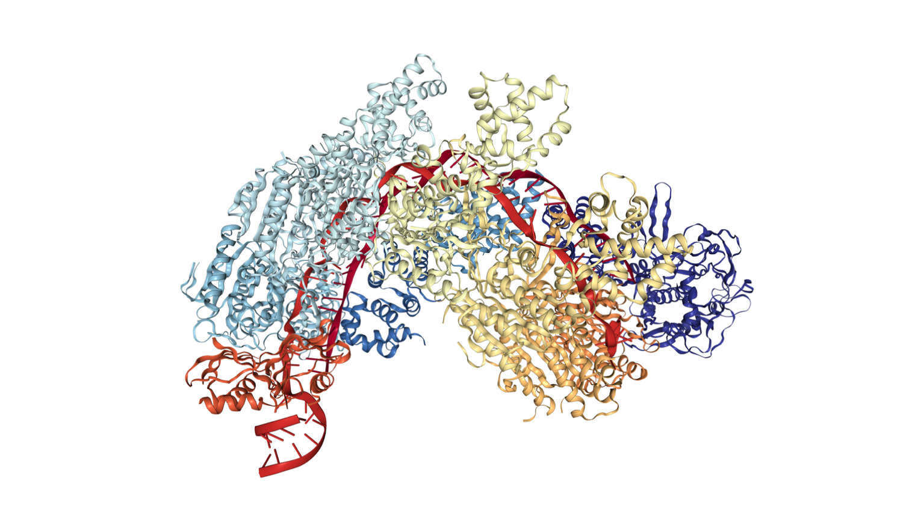
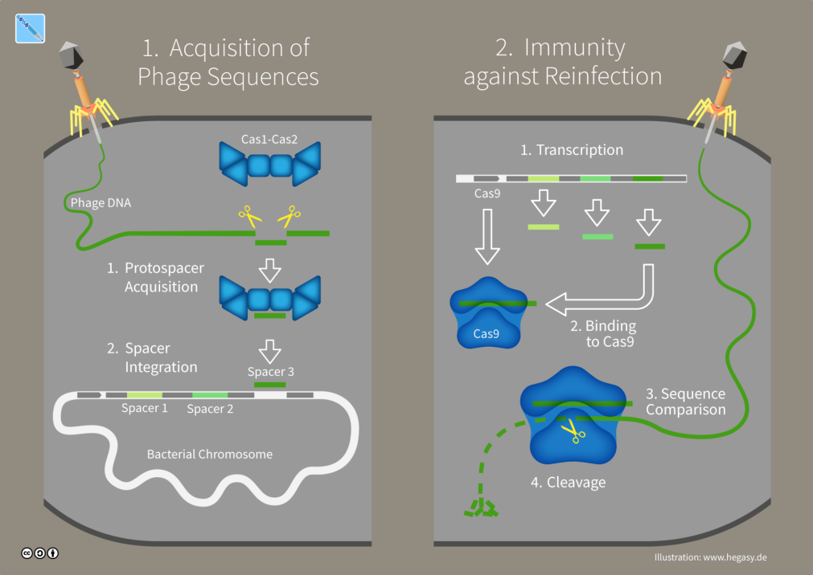
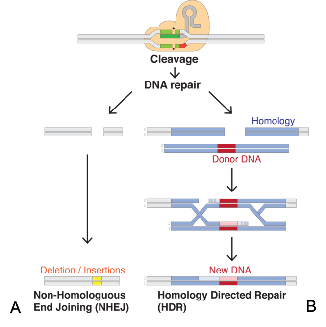
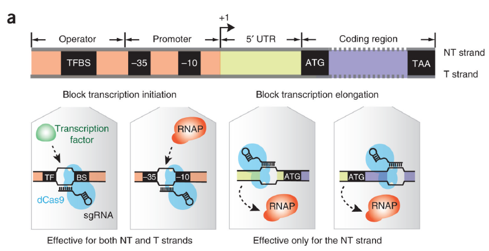
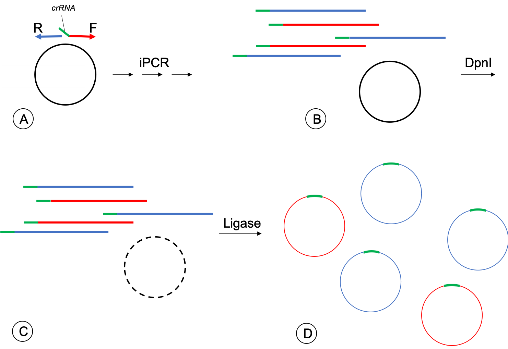

[Back to the main page](../index.md)

# CRISPRi-dCas9
## Repression of sunI gene expression in *Bacillus subtilis*

---

*Crystal structure of a CRISPR RNA-guided surveillance complex, Cascade, bound to a ssDNA target. Source: RCSB PDB (structure ID: 4QYZ)
*

## Learning outcomes
- Pipetting in μl ranges
- Design of a CRISPR system in bacteria
- Using CRISPR to supress the erxpression of a gene in bacteria
- Transformation of bacteria
- Selection of recombinant clones
- Use qPCR to confirm knock-down of gene

---

## Introduction

### CRISPR-Cas – a defense mechanism in prokaryotes
CRISPR (**c**lustered **r**egularly **i**nterspaced **s**hort **p**alindromic **r**epeats) are DNA sequences found in prokaryotic genomes. These sequences are acquired from viral infections that have infected the cells in the past and are used to combat subsequent infections with the same viruses (1). CRISPR-associated proteins (Cas-proteins) are necessary for acquisition of the viral sequences and to insert these sequences in the host genome (Figure 1). These sequences are not random: a Protospacer Adjacent Motif (PAM) is recognized in the viral DNA and the Cas-proteins cleave the viral DNA next to this motif. The viral sequences (without PAM) are then inserted in the host genome. When the same virus attacks the cell again, the CRISPR sequences are transcribed and bind to the Cas9-protein. This enzyme uses these CRISPR sequences to identify invading viral DNA and cleaves the DNA that is complementary to the CRISPR sequence. Therefore, the CRISPR-Cas system can be regarded as an adaptive prokaryotic immune system that provides acquired immunity.

*Figure 1. The CRISPR immune system in prokaryotic cells. Source: Wikipedia*

## CRISPR-Cas – a new DNA-editing tool
The protein that cuts double stranded DNA is the Cas9-protein and is widely used as the editing tool. Other Cas-proteins are being developed for specific modifications of DNA in the cell, but this will not be considered here. The Cas9-protein needs a guide to target a specific DNA sequence. This guide consists of two separate RNA molecules: trans-activated CRISPR RNA (tracRNA) and CRISPR RNA (crRNA). The crRNA contains the target sequence where the Cas-protein should bind the DNA and this crRNA forms an active complex with the tracRNA and Cas9-protein. The crRNA sequence is usually around 20 bp and is presided by the PAM sequence and is necessary for recognition by the Cas-protein complex. Depending on the Cas9-protein, this sequence consists of a specific 3-6 bp sequence. In order to simplify the CRISPR system for routine laboratory use, researchers have engineered a Cas9-protein that accepts a single guide RNA (sgRNA) molecule consisting of the crRNA and tracRNA fused together and recognizes the PAM sequence 5’-NGG-3’ (2).
Gene editing using the CRISPR-Cas system can be done in several ways. The Cas9-protein makes a double strand break in the DNA and repair of the DNA can be achieved in different ways. Non-homologous end joining often results in random deletions or insertions at the site where the DNA was cut (Figure 2A). However, directed editing such as point mutations and complete removal of the gene can be achieved by Homology Directed Repair (Figure 2B). A repair fragment (donor DNA) is provided that contains homologous regions and the mutation or insertion.

*Figure 2. Genome editing using CRISPR-Cas9. A double strand break introduced by the Cas9-protein complex can be repaired either by Non-homologous End Joining (A) or Homology Directed Repair (B). Source: Wikipedia*

The Cas9-protein of *S. pyogenes* has been modified to operate in different systems and different target cells (prokaryotic or eukaryotic cells).

## CRISPRi-dCas9 – repression of transcription
A modified technique of CRISPR-Cas is CRISPR interference (CRISPRi) in which the Cas9-protein complex interferes with gene expression on transcriptional level. The technique uses a catalytically inactive (dead) Cas9-protein (dCas9). Critical amino acids in the active center of the Cas9-protein that are essential for making the double strand break are replaced by other amino acids. The resulting dCas9-protein can still bind DNA using the sgRNA, but the protein is not able to cleave the DNA. Because of binding the DNA at that particular spot, the transcription of the gene is blocked (Figure 3) and RNA Polymerase cannot bind or continue transcription. Transcription can be blocked either by blocking transcription initiation (binding of dCas9 on the promoter sequences or transcription factor binding site) or elongation (binding of dCas9 on exon sequences or 5’-untranslated region). It has been suggested that binding of the sgRNA to the non-template (coding) strand is more effective than binding to the template strand (3). 

*Figure 3. Figure 3. Target sites for CRISPRi-dCas9. The dCas9-protein complex can either interfere with transcription initiation or transcription elongation (5).*

CRISPRi is a ‘knockdown’ system in which gene expression can be regulated by an inducible expression system. With CRISPRi, gene expression is not completely abolished, in contrast to CRISPR-Cas where the expression of a gene is completely eliminated (‘knockout’) or the gene product is changed (mutation/insertion/deletion). In addition, whereas the knockout using the traditional CRISPR system is permanent, knockdown by CRISPRi is conditional (can be switched on and off). CRISPRi gene knockdown has been studied in model organisms such as Escherichia coli (3) and *Bacillus subtilis* (4) and protocols for using CRISPRi in these organisms have been defined (5).

In this experiment, you will use CRISPRi to ‘knockdown’ the expression of the gene encoding an immunity protein, SunI. *B. subtilis* produces the antimicrobial peptide Sublancin 168 (SunA) that has activity against several Gram-positive bacteria, such as *Staphylococcus aureus* and *Bacillus licheniformis* (6). Because *B. subtilis* produces this peptide, it has to protect itself to the antimicrobial action of this peptide. The SunI protein gives this immunity to the action of SunA (7). Cells that do not produce the SunI protein are therefore sensitive to the action of Sublancin 168.

---

## Materials & Methods
The publications of Larson *et al*. (5) and Peters *et al*. (4) will be the basis of the practical course. For information on *sunI* and the sublancin sensitivity assay, the publication of Dubois *et al*. (7) is also required. Download these publications as a pdf-file and save the files in a folder on your computer. The publication of Peters *et al*. also contains a link to supplemental data. Follow the link and download supplemental Document S8, which contains an extended version of the materials and methods used in the study. Read the introduction and material and methods from the articles and answer the following questions:

1.	What is an essential gene?
2.	Why is it useful to use CRISPRi to study essential genes? In other words: why can you not use the regular CRISPR-Cas system to delete or disrupt essential genes?
3.	Which plasmids are necessary for the CRISPRi-dCas9 system in *B. subtilis*?
4.	The plasmids used in the experiments will integrate at specific locations (loci) in the genome and are available at Addgene (www.addgene.org). At which genes do the plasmids integrate (and therefore disrupt the gene)?
5.	Figure out which plasmid you can use for targeting the *sunI* gene.
6.	Which plasmid contains the gene for dCas9?
7.	Which elements that are necessary for the CRISPRi-dCas9 system are already present on this plasmid (from question 7)?
8.	Which antibiotic(s) will be used for cloning in *E. coli*? Which concentration(s)?
9.	Which antibiotic(s) will be used for cloning in B. subtilis? Which concentration(s)?
10.	Why do you have to add xylose to the medium in the sublancin sensitivity assay?
11.	What is the reason to use phosphorylated primers?
12.	Why do you have to digest your PCR-product with DpnI?
13.	With the publication of Dubois *et al*., try to set up an assay that will determine whether your CRISPRi-dCas9 systems works and the gene expression of sunI is repressed.
HINT: think about which strain should be used as background strain and which should be spotted.

Prepare in eLabjournal before the first day of the practical course a list of media and buffers that you need to make yourself and calculate for each medium or buffer how much you need. Check the list with your teacher before you start preparing the media and buffers. Remember to label your bottles well, so you can find them back after sterilization and after the breaks in between the practical days.
Antibiotics, buffers and enzymes of enzymatic reactions are present (Tables 1 and 2) and experiments with a kit have ready-made buffers and solutions. Some of the reagents will be handed out to you in a bag (Table 1) which you are responsible for during the practical course. Other (more expensive) reagents will provided by your teacher (Table 2). 

*Table 1. Reagents present for student*

|Reagent|Amount|Concentration|Company|
|-------|------|-------------|-------|
|sunI-F |Forward Primer|10 µl|100 µM|Invitrogen|
|sunI-R |Reverse Primer|10 µl|100 µM|Invitrogen|
|pJMP1-F|Forward Primer|20 µl|10 µM|Invitrogen|
|pJMP1-R|Reverse Primer|20 µl|10 µM|Invitrogen|
|pJMP3-F|Forward Primer|20 µl|10 µM|Invitrogen|
|pJMP3-R|Reverse Primer|20 µl|10 µM|Invitrogen|
|Loading Dye|50 µl|6x|New England Biolabs|
|dATP|5 µl|100 mM|VWR|
|dCTP|5 µl|100 mM|VWR|
|dGTP|5 µl|100 mM|VWR|
|dTTP|5 µl|100 mM|VWR|
|Key (Taq Polymerase) Buffer|100 µl|10x|VWR|
|TEMPase Hot Start Taq Polymerase|10 µl|5 U/µl|VWR|
|T4 DNA Ligase Buffer|10 µl|10x|New England Biolabs|

*Table 2. . Reagents provided by teacher*

|Reagent|Amount|Concentration|Company|
|-------|------|-------------|-------|
|RNase|100 µl|10 mg/ml|Roche|
|T4 Polynucleotide Kinase|10 µl|10 U/µl|NEB|
|Phusion HF Buffer|150 µl|5x|ThermoFisher Scientific|
|Phusion DNA Polymerase|10 µl|2 U/µl|ThermoFisher Scientific|
|1 kb peqGOLD ladder|30 µl|500 ng/µl|nvitrogen|
|Low molecular weight ladder|60 µl|500 ng/µl|New England Biolabs|
|Tango Buffer|50 µl|10x|ThermoFisher Scientific|
|DpnI|10 µl|10 U/µl|ThermoFisher Scientific|
|T4 DNA Ligase|10 µl|400 U/µl|New England Biolabs|
|Ampicilline|1.5 ml|100 mg/ml|Sigma Aldrich|
|Kanamycine|2.0 ml|20 mg/ml|Sigma Aldrich|
|Erythromycine|1.5 ml|1 mg/ml|Sigma Aldrich|
|Spectinomycine|1.5 ml|100 mg/ml|Alfa Aesar|

### Organization practical course
-	The practical course starts at 8:30 and finishes at 17:00. The teachers will start with a short introduction before you can start the practical work. 
-	An overview of student couples will be made available at Blackboard.
-	Your labjournal will be up to date as much as possible. At the end of the day, all that you have done that day will be in the labjournal. Keep in mind the WHO-rule: **W**hat have you done, **H**ow did you do this and what is the **Outcome**? For example: you will start a transformation of competent *E. coli* cells with your circularized iPCR-product to obtain colonies that contain your plasmid. Then you will write down what you have done experimentally (steps of transformation, incubation time, etc.) and this will be followed by the results (a table with the amounts of colonies on each plate).
-	Your grade is based on several competences. These competences can be found on the competence form that is available on Blackboard.
-	You will write a scientific report based on the template that is available on Blackboard. There will be only one version that you will hand in. 
-	On the first day, you will have to prepare media that you will use throughout the practical course. Make a list of media that you will need to prepare and how much you will need of each. Check the list with your teacher before you start preparing the media. Label your bottles clearly (Name, content, concentration and date). Antibiotics and enzymes will be available, so you do not have to prepare these solutions yourself.

An overview of the experiments on the first three days is given in Table 3. 

*Table 3. Schedule practical course day 1-3 Theme 9*

|Day|Experiment|
|---|----------|
|1|- Introduction,  - prepare media. - Isolation pJMP1 and pJMP3 from *E. coli* DH5α. - Bioinformatics: design primers|
|2|- Phosphorylation primers pJMP3.  - iPCR target + check on gel. - Purification of iPCR-product|
|3|- Digestion of purified PCR-product with DpnI. - Ligation + Transformation of *E. coli* DH5α with ligation product|

After the first three days you will make a planning for the remaining six days, which will be discussed with your teacher on day 4 and again on day 7. Think carefully about your planning and how much you can do on one day. For example: a PCR of 2 hours and running the gel (1 hour) with the products takes more time than the 3 hours waiting time. You will have to prepare your PCR samples, prepare the gel, etc. Also think what you can already prepare for the next experiment, while you are waiting for an experiment (PCR, restriction,…) to finish. 
After the transformation of E. coli DH5α with your construct (day 3), you will have to check the colonies if they contain the correct plasmid. If you have a correct colony, you will have to isolate this plasmid from E. coli and try to get it in B. subtilis. Finally, you will have to check of the B. subtilis colonies contain the correct plasmid and check if this colony shows repression of the sunI gene. Try to fit these experiments in the last six days. Make sure that you also reserve time for cleaning the lab on the last day.

### Construction of plasmid containing target sequence
The experimental design in the publication of Larson *et al.* (5) is used for the construction of the plasmid containing the target sequence. In this publication you will find the work flow of the experiment from choosing the target sequence for the tracRNA to the transformation of *E. coli* with the plasmid containing the sgRNA. Adjustments to the protocol are given below.

### Isolation of template plasmid pJMP1 and pJMP3
For introducing the sgRNA in *B. subtilis*, the pJMP3 plasmid is used. The *E. coli* DH5α strain containing the ‘empty’ plasmid will be grown for you. The isolation of plasmid will be according the Birnboim method. In addition, you will isolate the pJMP1 plasmid. You will need this plasmid later in the course as a template in the colony PCR of *B. subtilis*.

## Design your target sequence
To start the experiment, you will need to determine the crRNA sequence that is necessary for the dCas9-protein to recognize the target sequence. Design of the primers will be done on day 1. Using your Bioinformatic skills, design your primers according to these steps:
-	Download the mRNA-sequence of sunI from *B. subtilis 168* from NCBI.
-	Download the Genbank file for the pJMP1 and pJMP3 plasmid from the Addgene website (www.addgene.org), which you can import in the online program Benchling (www.benchling.com).
-	Accurately annotate in Benchling the following regions in the plasmids:
    - pJMP1: homologous regions for DNA integration, antibiotic resistance gene(s), and origin of replication (ORI).
    - pJMP3: homologous regions for DNA integration, antibiotic resistance gene(s), ORI, sgRNA scaffold, promoter (-35 and -10 box), dCAS9 handle, *S. pyogenes* terminator and rrnB T1 terminator.
-	Use CRISPOR version 4.92 (http://crispor.tefor.net) (8) to design your crRNA: 
    - Genome: choose Bacillus subtilis 168.
    - Protospacer Adjacent Motif: choose 20 bp-NGG-Sp Cas9.
    - Choose what you think is the best crRNA; think about position, forward or reverse sequence (coding/template strand) and other factors that might influence the result of binding by dCas9 and design your forward primer .
-	Think where the reverse primer should bind on the pJMP3 plasmid (see also Figure 4) and design the reverse primer. 
-	Note the sequence of the forward and reverse primer for the iPCR (5’ &rarr; 3’) in your labjournal.
-	In Benchling, create the primer pair (manual) you have designed and save them in a folder.
-	In Benchling, simulate the iPCR with the primers that you designed. After the simulation, create the PCR-product and circularize the product (Information (icon with `i`) &rarr; Topology &rarr; Circular). 
-	You can save the plasmid map as a pdf-file (‘PDF’ at top right of the plasmid map) and use it for your report and lab journal.

To introduce the crRNA in the plasmid, an ‘inversed PCR’ (iPCR) is used. In this iPCR, the phosphorylated primers bind next to each other on the plasmid and start elongating in the opposite direction (Figure 4A). The forward primer contains the crRNA sequence (green).

*Figure 4. Construction of the plasmid containing the sgRNA. Phosphorylated primers F (with crRNA sequence; green) and R are used in an iPCR to multiply the linear plasmid (A). The iPCR mixture contains linear PCR products (red and blue) and the template (black) (C). The mixture is then treated with DpnI to remove the template (C). The linear plasmids are circularized using T4 DNA Ligase (D).*

Linear copies of the plasmids are formed in this iPCR (Figure 4B). The mixture still contains the template plasmid, which does not contain the crRNA. To remove these unwanted template plasmids, the mixture is treated with DpnI, which will cut only the template, not the PCR products (Figure 4C). Finally, the linear form of the plasmids containing the sgRNA is circularized with T4 DNA Ligase and is used to transform competent E. coli cells (Figure 4D).

### Phosphorylation of primers
Follow the protocol of Peters et al. However, use the T4 DNA Ligase Buffer instead of the buffer that is provided with the Polynucleotide Kinase. The Ligase buffer contains the ATP that is necessary for adding the phosphate group to the 5’-ends of the primers.

### iPCR introducing crRNA in the plasmid
This is a normal PCR, but the elongation time in the publication of Peters et al. is based on a smaller plasmid. Suggest an elongation time (check the website of the manufacturer, ThermoFischer Scientific, for the speed of Phusion polymerase), check with your teacher and adjust this in the PCR-program. Use 200 ng of template DNA (pJMP3), 5x Phusion HF Buffer and 0.24 mM dNTPs (stock 20 mM) in a final volume of 25 µl. Use the recommended amount of the High-Fidelity Phusion polymerase (ThermoFischer Scientific). Check the PCR-product on an agarose gel. Suggest a percentage of agarose and discuss with your teacher. Also, think of which DNA ladder you should use. There will be two ladders available: 1 kb peqGOLD DNA ladder (VWR) or the low molecular weight ladder (New England Biolabs).

### Purification of the iPCR-products
The PCR-product is purified using the GeneJet PCR purification kit. Follow the instructions and elute in 30 µl Elution Buffer.

### DpnI digestion
Digest 5 µl of purified plasmid with 10 U of DpnI (ThermoFischer Scientific) to remove parental empty plasmid in a 15 µl reaction.

### Self-ligation of the PCR-product
Use 5 µl of the digestion mixture and add 400 U of T4 DNA Ligase (NEB) for self-ligation of the PCR-product in a 20 µl reaction. Incubate for 3 hours at room temperature. Alternatively, incubate overnight at room temperature. 

### Transformation of E. coli with pJMP3-construct
Now that you have the circular pJMP3 plasmid containing the crRNA, *E. coli* competent cells can be transformed with the plasmid. It is more convenient to store the plasmid in *E. coli* cells, because it is easier to isolate the plasmid from *E. coli* than from other bacteria.

### Protocol transformation of E. coli:
*E. coli* DH5α cells will be transformed with the circularized PCR-product (pJMP3 with crRNA) and the protocol can be found at the manufacturer website (ThermoFisher Scientific,  Subcloning EfficiencyTM DH5αTM Competent Cells). Use the following adjustments to the protocol in your experiment:
-	Use 50 µl of competent cells for each transformation
-	Use 5 µl of your ligation mixture to add to the cells
-	Heat shock: 45 seconds at 42˚C (use a heating block)
-	Add 250 µl LB to the cells after the heat shock
-	Plate 50 and 150 µl on LB-agar plates containing antibiotic(s)
Discuss with your teacher which control reactions you do. If you have small colonies on the plates in the morning after incubation at 37˚C, let the plates incubate a bit longer at 37˚C to make sure you have enough material for the colony-PCR and incubation in LB from the same colony. Store the plates in the cold room.

Colony-PCR on colonies from transformation of E. coli DH5α
In Benchling, check with the following primers the size of your PCR-product so you know what product size to expect on gel:
pJMP3-F:	5’- CGGATCCTAGAAGCTTATCG -3'
pJMP3-R:	5’- ACGGCGCTATTCAGATCCTC -3'

Pick three colonies with a sterile white tip from the plate for colony-PCR and plasmid isolation. For the plasmid isolation pick part of the colony (do not pick the complete colony) with a white tip and use it to inoculate 3 ml LB medium with antibiotic(s). Incubate overnight at 37˚C (200-225 rpm). For a single PCR, calculate the amount of each reagent that has to be added to the water to get the final concentration given in Table 4.

--- 

[Back to the main page](../index.md)

    
