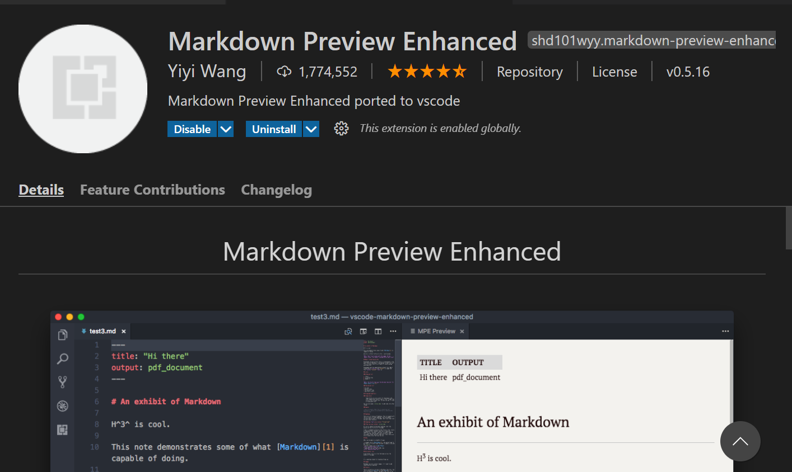
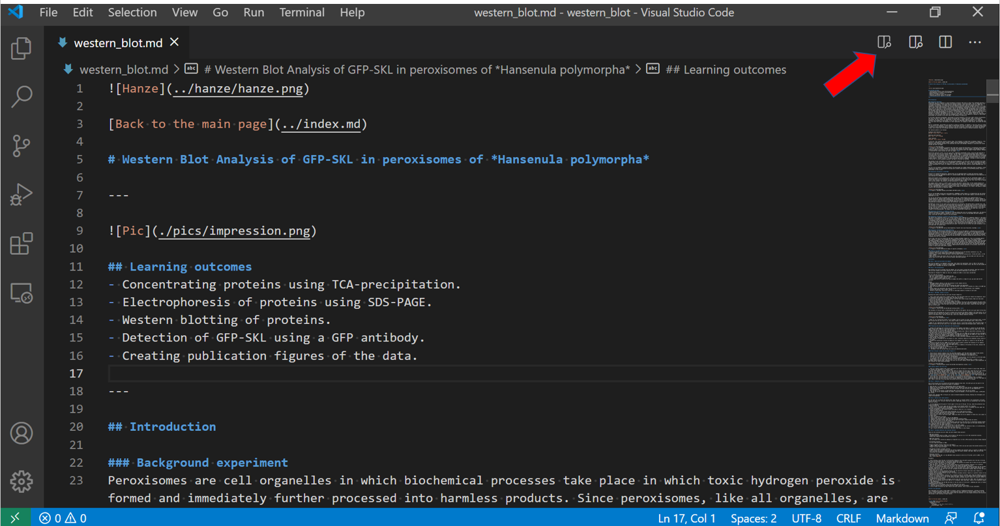

# Aanpassen web pagina

## Stap 1:

- Installeer Microsoft Visual Code:
    - Op een laptop met installatierechten:
    [klik hier](https://code.visualstudio.com/download)
    - Op een Hanze laptop:
    [klik hier](https://code.visualstudio.com/docs/setup/windows)
    Download de zip file van deze pagina en pak deze uit.
    [Directe link naar de zip](https://code.visualstudio.com/docs/?dv=winzip)

## Stap 2:

Installeer de Markdown preview enhanced plugin. Je hoeft dit slechts eenmaal te doen:
- In Visual code ga naar: `View > Extensions:`
- In het zoekvak type je: `Markdown preview enhanced`
Bij mij staat deze al geinstalleerd maar klik op install:

## Stap 3:

- Pak de zip file uit met de bestanden. 
- Open de Markdown file (met de `md` extensie) vanuit Visual Studio code via `File > Open File`. Ik gebruik de Western blot als voorbeeld:
- Klik op het icoon om de `Markdown Preview Enhanced` plugin te activeren.

Je ziet nu twee schermen. Links is de Markdown code, rechts de preview:

> Het duurt even voordat de plugin geactiveerd is nadat je Visual Code hebt opgestart. Als je te snel na het opstarten al de plugin activeert (door op de knop bij rode pijl te klikken) dan wordt de achtergrond zwart in plaats van wit. Sluit dan het preview scherm en klik opnieuw op de preview knop. 

## Stap 4

- Je kan nu het document aanpassen aan de linkerkant. Aan de rechterkant zie je de aanpassingen. 
- Markdown is een zeer simpele opmaaktaal. [Deze cheatsheet](https://github.com/adam-p/markdown-here/wiki/Markdown-Cheatsheet) laat je zien hoe het werkt. Let wel goed op de tekens zoals een spatie na een `#` voor een `heading 1` etc. Een nieuwe regel forceer je (hard return) door twee spaties na een zin aan te brengen. 
- Als je klaar bent met de aanpassingen dan stuur je mij de aangepaste Mardown file. Indien je ook foto's hebt aangepast dan zip je de folder en stuur je mij de aangepaste folder.

---

