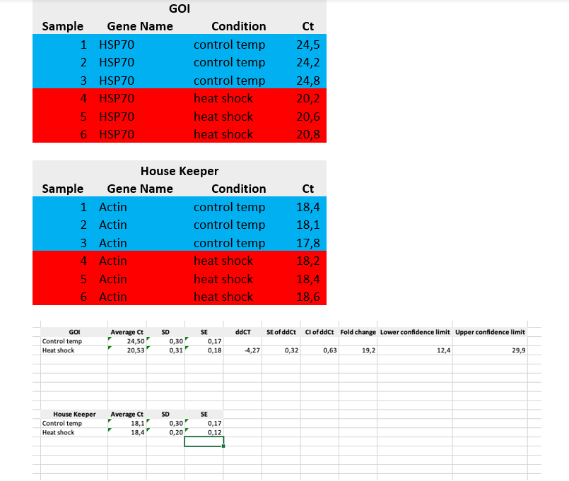

[Back to the main page](../index.md)

# Induction of heat shock mRNA in *Caenorhabditis elegans* by heat shock

---

## Learning outcomes
- Isolation of total RNA uising Trizol.
- Synthesis of cDNA.
- Performing qPCR analysis.

---

## Introduction

### *Caenorhabditis elegans* biology and life cycle
*Caenorhabditis elegans* is a well-studied, non-parasitic transparent nematode. *C. elegans* is often mischaracterized as a soil nematode but can most easily be isolated from rotting vegetable matter, which contains an ample supply of their bacterial food source. *C. elegans* can be easily grown in the laboratory using *E. coli* strain OP50 as a food source. 

Newly hatched larvae are 0.25 millimeters long and adults are 1 millimeter long. Their small size means that the animals are usually observed with dissecting microscopes up to 100X magnification. See figure 1 for an overview of *C. elegans* morphology.

*C. elegans* has a rapid life cycle (3 days at 25° from egg to egg-laying adult) and exists primarily as a self-fertilizing hermaphrodite, although males arise at a frequency of <0.2%. These features have helped to make *C. elegans* a powerful model of choice for eukaryotic genetic studies. In addition, because the animal has an precisely defined number of somatic cells, researchers have been able to track the fate of every cell between fertilization and adulthood in live animals and to generate a complete cell lineage. The male *C. elegans*, for example, has 1031 cells, a number which does not change after the end of the larval period. 

As mentioned above, wild-type *C. elegans* has two sexual forms: self-fertilizing hermaphrodites and males. The gonad of hermaphrodites forms an ovotestis that first produces haploid amoeboid sperm that are stored in the spermathecal.  Subsequently, the germ line switches fate to produce oocytes. Essentially hermaphrodites are females whose gonads temporarily produce sperm before they produce oocytes. Hermaphrodites can produce up to 300 self-progeny that are fertilized by the stored sperm. If mated with males, hermaphrodites are capable of producing ~1000 offspring, indicating that hermaphrodite-produced sperm is a limiting factor in self-fertilization. Both sexes are diploid for the five autosomal chromosomes. The sexes differ in that hermaphrodites have two X chromosomes and males have a single X chromosome — *C. elegans* has no Y chromosome — and the genotype of males is referred to as XO. Sex is determined by the X to autosome (X:A) ratio. The majority of offspring produced by self-fertilization are hermaphrodites; only 0.1-0.2% of the progeny are males due to rare meiotic non-disjunction of the X chromosome. 

*Figure 1. Observing *C. elegans*. (A) Petri dishes sitting on the base of a dissecting stereomicroscope. Bacterial lawns are visible on the surface of the agar inside the dishes but the C. elegans are too small to be seen in this view. (B) C. elegans viewed through the dissecting microscope. The two adults are moving in this view. Tracks in the plate indicate where animals have traveled on the bacterial lawn. (C) An adult hermaphrodite is viewed in a compound microscope. In all pictures, anterior is to the left and ventral is on the bottom. C. elegans moves on either its left or right side; in this image the surface facing the viewer is the left side. Because the animals are transparent, one can see, from left to right on the ventral side, developing oocytes in the gonad (rectangular cells with a clear, circular nucleus inside) followed by the spermatheca (where oocytes are fertilized), and multiple embryos in the uterus. (D) Fluorescent image showing the nervous system labeled with a GFP reporter (sto-6::gfp). Photo credits: (C) Original (modified here): B. Goldstein; (D) J. Kratz. Source: http://www.wormbook.org/chapters/www_celegansintro/celegansintro.html*

Under environmental conditions which are favourable for reproduction, hatched larvae develop through four stages, designated as L1 to L4. *C. elegans* embryogenesis takes approximately 16 hours at 20°C. A virtually impermeable eggshell is made after fertilization, allowing the embryo to develop completely independent of the mother. However, embryos are usually retained within the hermaphrodite until the 24-cell stage at which time they are laid. The hermaphrodite embryo hatches and becomes a first stage (L1) larva. The animals begin to eat and develop through four larval stages (L1-L4). The L1 stage is ~16 hr long; the other stages are ~12 hr long. Each stage ends with a sleep-like period of inactivity called lethargus in which a new cuticle (outer collagenous layer) is made. Lethargus ends with the molting of the old cuticle. Approximately 12 hr after the L4 stage, adult hermaphrodites begin producing progeny for a period of 2-3 days until they have utilized all of their self-produced sperm; additional progeny can be generated if the sperm-depleted hermaphrodite mates with a male. After the reproductive period, hermaphrodites can live several more weeks before dying due to senescence. See figure 2 for an overview of *C. elegans* life cycle.

*Figure 2. Life Cycle of C. elegans. Animals increase in size throughout the four larval stages, but individual sexes are not easily distinguished until the L4 stage. At the L4 stage, hermaphrodites have a tapered tail and the developing vulva (white arrowhead) can be seen as a clear half circle in the center of the ventral side. The males have a wider tail (black arrowhead) but no discernable fan at this stage. In adults, the two sexes can be distinguished by the wider girth and tapered tail of the hermaphrodite and slimmer girth and fan-shaped tail (black arrowhead) of the male. Oocytes can be fertilized by sperm from the hermaphrodite or sperm obtained from males through mating. The dauer larvae are skinnier than all of the other larval stages. Photographs were taken on Petri dishes (note the bacterial lawns in all but the dauer images). Bar 0.1 mm. Source: http://www.wormatlas.org/ver1/handbook/anatomyintro/anatomyintro.htm*

When bacteria are depleted and the animals are crowded, L2 larvae activate an alternative life cycle and moult into an alternative L3 larval stage called the “dauer” larva (“dauer” in German means “lasting"). The dauer larva show enhanced resistance to starvation conditions and chemicals. Dauer larvae can survive for many months and are the dispersal form most commonly encountered in the wild. When the dauer larvae are transferred onto plates with bacteria, they continue their development. 

### *Caenorhabditis elegans* anatomy

Figure 3 shows a cartoon of the anatomy of *C. elegans*. *C. elegans* lacks a respiratory and a circulatory system. However, the animal contains an epidermis, muscles and a digestive tract. The outer epithelial layer, the epidermis, of the embryo undergoes a series of cell fusions to make large multinucleate, or syncytial, epidermal cells. These cells secrete the cuticle, a protective layer of specialized extracellular matrix (ECM). The cuticle determines the shape of the body and, through connection from the epidermis to muscle, provides anchoring points for muscle contraction. Just interior and connected to the epidermis are four quadrants of body-wall muscles that run along the length of the body. The regular contraction and relaxation of the muscle cells leads to the “elegant” sinusoidal movement of the animal. In addition to the body-wall muscle, *C. elegans* has muscles that control eating (pharyngeal muscles), egg-laying (vulval and uterine muscles and the contractile gonad sheath), mating (male-specific tail muscles), and defecation (enteric muscles). Food (bacteria) enters the anterior of the animals and passes through the pharynx, a two-lobed neuromuscular pump that grinds the food before it is passed on to the intestine for digestion. The *C. elegans* intestine is attached to the posterior pharynx and consists of 20 large, polyploid epithelial cells arranged in pairs that form a tube running the length of the animal. The nervous system of the adult hermaphrodite has 302 neurons and that of the adult male has 383 neurons. *C. elegans* neurons make more than 7000 chemical synapses and gap junction connections. Although small, the nervous system of *C. elegans* is still relatively complex.

*Figure 3. C. elegans anatomy. Major anatomical features of a hermaphrodite (A) and male (B) viewed laterally. (A) The dorsal nerve cord (DNC) and ventral nerve cord (VNC) run along the entire length of the animal from the nerve ring. Two of the four quadrants of body wall muscles are shown. (B) The nervous system and muscles are omitted in this view, more clearly revealing the pharynx and intestine. (C) Cross-section through the anterior region of the *C. elegans* hermaphrodite (location marked with a black line in A) showing the four muscle quadrants surrounded by the epidermis and cuticle with the intestine and gonad housed within the pseudocoelomic cavity. Images modified from those found at www.wormatlas.org*

## **Caenorhabditis elegans** and the heat shock response

Cells and organisms respond to elevated temperatures by synthesizing a group of highly conserved proteins, the heat shock proteins or HSPs. This response is called the heat shock response. *C. elegans* normally grows at 15-25˚C. Switching the culture to 37˚C for 30 minutes will induce the heat shock response by initializing the transcription of a many heat shock proteins. Directly after the induction of the heat shock response, *C. elegans* is temporary more resistant to heat as a result of elevated heat shock proteins.

The group of heat shock proteins consists, among other proteins, of many different chaperone proteins. Chaperone proteins assist in the folding and assembly of denatured proteins. There are different types of heat shock proteins. Hsp70 belongs to the large heat shock proteins and is a 70 kilo Dalton protein that assists in the refolding of unfolded proteins. In addition to the group of larger heat shock proteins, smaller heat shock proteins exist such as the Hsp16.1 protein. In contrast to the larger heat shock proteins that assist in refolding, the smaller heat shock proteins are generally believed to protect proteins from denaturation by keeping them in a folding competent state and handing them over to the larger chaperones for refolding.

### Real-time PCR

In order to investigate if the transcription of the HSP is upregulated by heat-shock, a real-time PCR analysis will be performed. The procedure can be subdivided in three parts:
1.	RNA isolation
2.	Reverse transcription
3.	Real-time PCR
To investigate the induction of transcription, RNA needs to be isolated. We will isolate the total RNA as this procedure is less complicated compared to the isolation of mRNA. The PCR procedure cannot be performed on RNA. Therefore, the RNA will first be reverse-transcribed to cDNA using reverse-transcriptase. Oligo-dT primers will be used as starting point to initiate the cDNA reaction. Oligo-dT primers will bind the poly(A) tail. As both rRNA and tRNA do not contain a poly(A) tail, the oligo-dT primers will specifically transcribe mRNA to cDNA. The cDNA strand will subsequently be used as template for the PCR reaction.

*Figure 4: Schematic representation of  cDNA synthesis. The Oligo-dT primer binds the poly(A) tail of the mRNA. Reverse transcriptase will polymerize the synthesis of the cDNA strand. Source: Wikipedia.org*

### The principle of PCR 

The PCR technology makes it possible to amplify selected PCR fragments. Two flanking oligonucleotides serve as primers to initiate strand elongation in the 5’ to 3’ direction by DNA polymerase. DNA polymerase will catalyze the incorporation of nucleotides in the growing nucleotide polymer.  

*Figure 4: Schematic representation of  cDNA synthesis. The Oligo-dT primer binds the poly(A) tail of the mRNA. Reverse transcriptase will polymerize the synthesis of the cDNA strand. Source: Wikipedia.org*

The DNA polymerases used today are very thermostable. Amplification occurs exponential using cycles of subsequent heating and cooling. At around 95˚C, DNA denatures. Primers can subsequently bind the single stranded DNA at temperatures around 55-60˚C. Thermostable DNA polymerases typically have an optimal temperature around 72˚C. Theoretically, after each cycle, the amount of DNA will be doubled (although in reality the amplification efficiency is often lower). 
The amount of product is thus:

$n_c = n_0*2^c $

Where $n_c$ stands for the number of molecules after a certain number of cycles, $n_0$ stand for the number of input molecules and c stands for the number of cycles. Note that in the third cycle the first product of the desired size appears.

However, the above equation is only valid for the exponential phase. Sooner or later the PCR will enter the plateau phase as primers or nucleotides deplete with each successful amplication round. The PCR reaction typically follows an S-curve (see figure 6). After approximately 30 cycles, the plateau phase will be reached. In most cases, PCR products will be analyzed using agarose gel electrophoresis. The detection is thus an end-point detection. Regardless of the input, the amounts after amplification will be the same. Therefore, regular PCR is not considered a quantitative technique.

*Figure 6: Typical PCR curve. Source: https://bitesizebio.com/24581/what-is-a-ct-value/*

### Real-time PCR

Real-time PCR is a specialized PCR technology that uses real-time detection (each cycle). Instead of an end-point detection, real-time PCR makes it possible to follow the amplification after each cycle. In this way, PCR becomes a quantitative technique as the amount of input DNA will influence the PCR curves. This means that real-time PCR can be used to quantify certain DNA sequences such as the amount of viral DNA in blood or the number of transcripts in a sample. Key for real-time PCR is the use of a fluorescence dye that allows detection during synthesis. Often, SYBR Green® is used which binds double stranded DNA (in other words, the newly formed PCR products). As the amount of product increases each cycle, so does the amount of fluorescence. 

*Figure 7: SYBR Green incorporated in dsDNA. The amount of fluorescence more or less doubles after each cycle. The amount of fluorescence will be measured after each cycle.*

*Figure 8: The threshold cycle (CT) is the cycle for which the fluorescence level is higher compared to the threshold value. Source: https://www.sciencedirect.com/science/article/pii/S0098299705000907*

The $C_T$-value correlates strongly with the starting amount of DNA in the sample. The lower the $C_T$-value, the higher the concentration of DNA in the sample. There is a linear relation between the logarithm of the concentration of DNA and the $C_T$-value. Using a calibration curve, one can reliably quantify the amount of a certain DNA sequence in a sample. 

*Figure 9: The relationship between the CT-values and the starting amount of template DNA. The amount of starting DNA can be calculated using linear regression analysis.*

SYBR green binds double stranded DNA regardless of the sequence. This means that aspecific products such as primer dimers will also contribute to the fluorescence signal. In order to discriminate between the correct product and nonspecific products, a melt-curve analysis can be performed. After the PCR reaction, the temperature will be raised slowly. At the $T_M$, 50% of the DNA will be denatured and as a result, the fluorescence level will drop. The $T_M$ is at the inflection point. The first derivative of the graph shows a maximum at this point. Multiple peaks and indicate for aberrant products.

*Figure 10: Melt-curve analysis. In this case, a single peak is detected indicative for a specific PCR product.*

### Goal of the experiment:
The goal of this experiment is to investigate if a heat shock changes the expression of the Heat shock protein-encoding mRNA transcript molecules.

### The experiment: Induction of heat shock proteins in *C. elegans*

#### Heat shock and viability
1.	Use a phase-contrast tissue culture microscope to visualize the worms. Use a magnification of 40X. A dissection microscope can be used as well however phase contrast will greatly enhance the quality of vision.
2.	Check if the worms are viable and make sure that enough worms are present to start the experiment. Discuss the results with your teacher before continuing.
3.	Transfer one plate to 37˚C (dry incubator). Leave the other plate at room temperature.
4.	Use a microscope to determine the percentage of dead worms. Determine for 50 individual worms if the worm is dead or alive. To do so, gently tap the plate. The worm is alive if it moves in response to the tapping. If the worm does not respond to tapping the plate, zoom in on the head region. Gently tap the worm’s head with platinum transfer pick. Score the worm as dead if it does not respond by moving its head.

#### RNA isolation
>Safety & precautions
When working with RNA, keep everything RNAse free.
Caution!! Trizol reagent and Chloroform are both very toxic and therefore should always be handled with gloves and under a fume hood!!! 

1.	Pipette 5 ml of M9 (a mineral washing solution often used in C. elegans research) on the plates
2.	Rotate the plates gently for 1 minute
3.	Pipette up and down for 5 times and collect the medium in a sterile conical tube
4.	Centrifuge the worms for 2 minutes at 2000 rpm at a table top centrifuge
5.	Wash pellet with 5 ml of M9 medium and centrifuge the worms for 2 minutes at 2000 rpm at a table top centrifuge
6.	Gently take out the upper fluid. Do NOT invert the tubes. 
7.	Wash pipet tips with M9 supplemented with 0,05% Triton X-100. This will circumvent sticking of worms to the wall of the pipet tip 
8.	Pipet the pellet with M9 to a sterile 1,5 ml Eppendorf tube
9.	Incubate 2 minutes on ice (worms sink faster at colder temperatures as they move less)
10.	Gently take out remaining clear supernatant
11.	Add 1 volume of Trizol to 1 volume of pellet (approximately 60 ul)
12.	Snap freeze in liquid nitrogen or dry ice and store the sample at -80˚C. 
13.	Remove frozen samples from the -80ºC freezer and store them in liquid nitrogen.
14.	Thaw the samples one by one before use
15.	Grind the worms (in M9 and Trizol) for 2 minutes using the motorized pestels. (store the pestels in 0.1% SDS after use until cleaning)
16.	Add 1ml Trizol to each tube (always keeping the same order)
17.	After adding to the last tube incubate the tubes for 5 minutes at RT
18.	Invert the tubes 5 times
19.	Add 300μl Ice Cold Chloroform to the samples
20.	Vortex the samples 3 times for 5 seconds; you should see an aqueous phase and a pink phase
21.	Incubate for 5 minutes at RT
22.	Spin the samples for 15 minutes at 10.000G at 4ºC
23.	The aqueous phase should now be on top; if not vortex and spin again.
24.	Transfer as much of the aqueous phase as possible to a fresh tube. 
25.	Add 2 μl glycogen (5mg/ml)
26.	Add 1 volume of ice cold isopropanol to the samples (500 μl)
27.	Invert the samples several times to mix
28.	Incubate for 20 minutes at RT
29.	Spin for 10 minutes at maximum speed at 4 ºC
30.	Pour off the supernatant (be careful not to lose the small white pellet)
31.	Wash the pellet with 700 μl of ice cold 75% Ethanol
32.	Centrifuge for 5 minutes at maximum speed at 4ºC
33.	Aspirate as much Ethanol as possible
34.	Air dry the sample until all the ethanol is almost completely gone (1-5 minutes)
35.	Resuspend the RNA in 30μl RNAse free water

#### Quality Control
1.	Analyze the RNA concentration by Nanodrop. Record the 260/280 ratio as well.
2.	Store the RNA at -80 ºC

#### cDNA synthesis
First-Strand cDNA Synthesis Using M-MLV RT (MBV Oligo(dT))
A 20-µl reaction volume can be used for 1 ng–5 µg of total RNA or 1–500 ng of mRNA.

1.	Add the following components to a nuclease-free microcentrifuge tube: 1 µl oligo (dT)12-18 (500 µg/ml), or 50–250 ng random primers, or 2 pmole gene-specific primer
2.	1 ng to 5 µg total RNA or 1 ng to 500 ng of mRNA. Use 1 µg preferentially.
3.	Add 1 µl 10 mM dNTP Mix (10 mM each dATP, dGTP, dCTP and dTTP at neutral pH)
4.	Add sterile, distilled water to 12 µl
5.	Heat mixture to 65°C for 5 min and quick chill on ice. Collect the contents of the tube by brief centrifugation.
6.	Add 4 µl 5X First-Strand Buffer 2 µl 0.1 M DTT
7.	Add 1 µl RNaseOUT™ Recombinant Ribonuclease Inhibitor (40 units/µl) (Note: When using less than 50 ng of starting RNA, the addition of RNaseOUT™ is essential.)
8.	Mix contents of the tube gently and incubate at 37°C for 2 min.
9.	Add 1 µl (200 units) of M-MLV RT,a and mix by pipetting gently up and down. If using random primers, incubate tube at 25°C for 10 min.
10.	Incubate 50 min at 37°C.
11.	Inactivate the reaction by heating at 70°C for 15 min.

The cDNA can now be used as a template for amplification in PCR. 

#### Real-time PCR
For this experiment, we will make use of relative quantification using the Delta-delta Ct method. The relative induction by heat will be quantified using a housekeeping gene. The assumption is that this gene will have a stable expression in all samples. 

1.	Thaw the cDNA samples on ice.
2.	Add for each sample:
a.	12,5 ul 2 iQTM SYBR® Green reactie mix (Bio-Rad)
b.	1 ul forward primer (10 pmol/ul)
c.	1 ul reverse primer (10 pmol/ul)
d.	5,5 ul sterile MilliQ 
3.	Note that for each primer set (HSP and house keeping gene), separate mastermixes will be made. Note that a water control will be used.
4.	Pipet 5 ul cDNA sample and 20 ul of the mastermix.
5.	Pipet the sample according to the scheme below (table 1).
6.	Seal the plate with the appropriate foil.
7.	Briefly centrifuge the plate.
8.	Run the plate using the following protocol (for the CFX):
    1.	15:00 at 95°C
    2.	0:20 at 95°C
    3.	0:20 at 58°C
    4.	GoTo step 2 39 more times
    5.	0:10 op 95°C
    6.	MeltCurve 
        0:03 from 65°C to 95°C, 0,5°C per cycle

*Table 1.*

Choose a HSP (HSP70 or HSP16.1).
If for a gene multiple primer sets are present, choose a primerset.

#### Data analysis
When finished, the software will automatically set the baseline level. Check if the baseline is set correct (in the exponential phase). However, leave the baseline for each amplified gene at the same level. Make screenshots and place them in eLabJournal.

Calculate the induction of the HSP gene under heat shock conditions and correct for input using the house-keeping gene using the $2^{\Delta\Delta Ct}$ method as described below.

1.	Calculate the Ct mean control values for the GOI and the House-Keeper under both conditions.
2.	Calculate the SD values for each sample.
3.	Calculate the standard error (SE) for each sample.
4.	Calculate the ΔΔCt value.
5.	Calculate the standard error of the ΔΔCt value using the [rules of error propagation](https://en.wikipedia.org/wiki/Propagation_of_uncertainty) for formulas or use the material of your statistics lessons.
6.	Calculate the confidence interval of the ΔΔCt value.
7.	Calculate the fold change using the ΔΔCt value.
8.	Calculate the upper and lower limits of the confidence interval.

Example:

*Figure 11. Example calculation.*

#### Further reading
The above method is adapted from: https://www.ncbi.nlm.nih.gov/pubmed/11846609

Read the following manual regarding the analysis of real-time data if you want to have more in depth knowledge:
http://www.gene-quantification.de/real-time-pcr-guide-bio-rad.pdf

#### Setting up the CFX machine for PCR
This is a short section regarding the use of the CFX real time machine (Bio-Rad). 

- Open the application for the CFX and click user defined.

*Figure 12. Setting up the CFX machine.*

- This will show a default protocol. We will create a new protocol. Therefore select `Create New`.
- 3.	Create the desired protocol using the options at the left. Save the protocol. Click `OK` and `next`.  

*Figure 13. Setting up the CFX machine.*

- This is the `Plate Setup`. You will have the option to create a new plate and select the wells to measure or you can choose to measure the whole plate instead. 

*Figure 14. Setting up the CFX machine.*

- For this experiment, we will measure the whole plate and leave the wells on `UnK` (unknown) as we lack a standard curve. 
- Click `next`, place the plate in the CFX. Click `start run` and save the datafile. 

*Figure 15. Setting up the CFX machine.*

- Now an overview will be visible that shows all events during the PCR. Check on a regular basis if all goes well.
- When the program is finished, the `meltcurves` will be visible at the screen.

*Figure 16. Meltcurves.*

- Select the wells to analyze per gene. Make sure you do this separately for each gene as the base line can change. Verify the product. Is it a single product?

- Search for the Ct values and click the right mouse button. An option will be visible to export the data to an Excel file.

The end...

---

[Back to the main page](../index.md)

    
