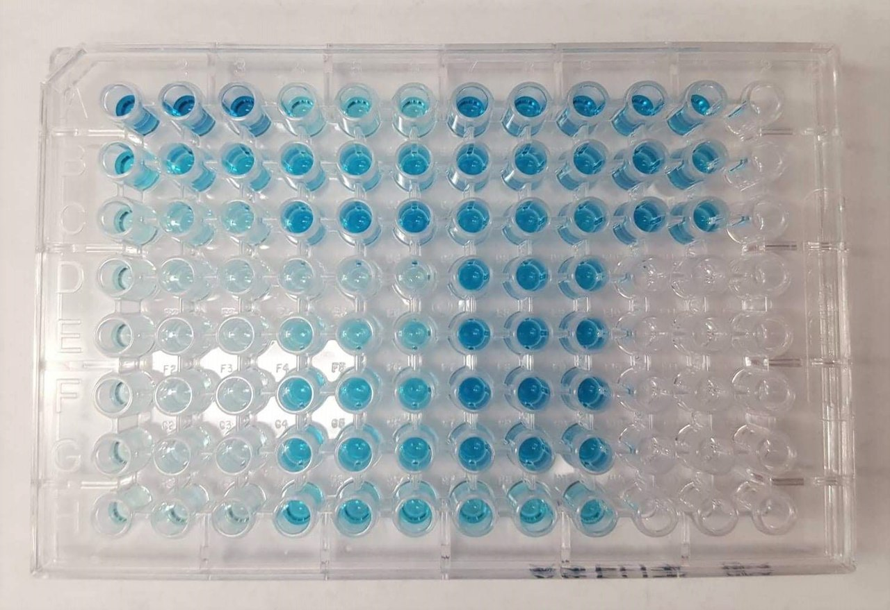
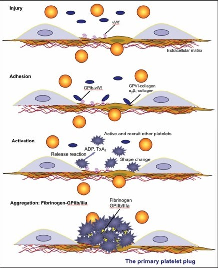
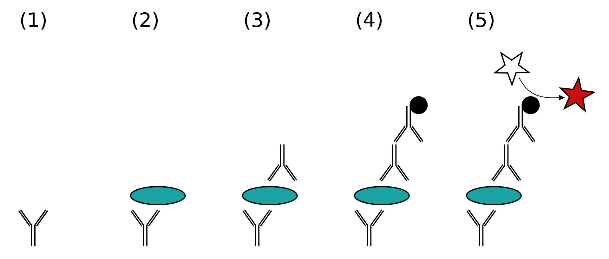
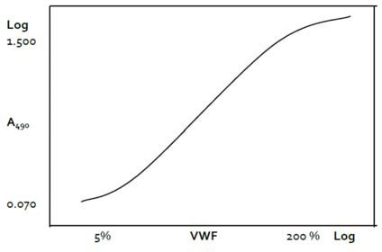
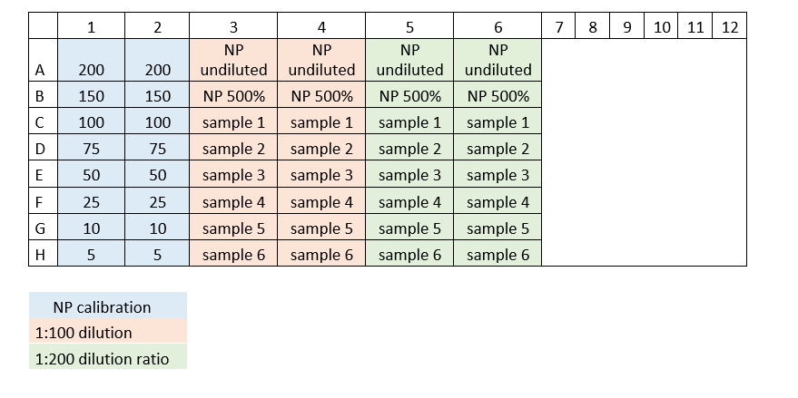



[Back to the main page](../index.md)

# Enzyme-linked immunosorbent assay (ELISA)

---

*Source: https://en.wikipedia.org/wiki/ELISA#/media/File:ELISA_TMB.jpg*

## Learning outcomes
- Pipetting in μl ranges
- Learning the principle of the ELISA test
- Spectometry
- Data analysis in Excel

---

## Introduction
Von Willebrand factor (VWF) plays a major part in the primary haemostasis process, where bleeding is stopped. In this process, VWF attaches to the damaged blood vessel wall, where it undergoes a conformational change and develops affinity for glycoprotein Ib/V/IX on the surface of the thrombocyte. 

*Figure 1: VWF structure. Source: https://en.wikipedia.org/wiki/Von_Willebrand_factor#/media/File:PBB_Protein_VWF_image.jpg*

When shear rates are high in the blood vessels, in particular, VWF is essential in helping blood platelets adhere to the damaged vessel wall in the early stages of haemostasis.

In addition, VWF, in its capacity as a 
'carrier protein’ of FVIII, is essential to the survival of this important coagulation factor in plasma. As a result, patients with severe VWF deficiency experience disorders of both primary and secondary haemostasis, meaning. in the thrombocyte plug and fibrin formation processes.
 
VWF is produced in the body by endothelial cells and megakaryocytes and secreted as a large collection of multimers, whose molecular weight ranges from 1 to 20 million Daltons, which are composed of dimers of an original 270 kD glycoprotein. 

VWF is secreted into the blood by both constitutive and regulated secretion, which means that secretion of additional VWF, stored in Weibel-Palade bodies (endothelial cells) and α‐granules (thrombocytes), can be induced by exercise, stress, smoking or other types of endothelial cell and thrombocyte activation, which is important in the interpretation of measured plasma concentrations of VWF (and FVIIIc).
Von Willebrand disease (VWD) is a disorder caused by a low level of VWF in the blood, or by abnormally functioning VWF. VWD is one of the most common bleeding disorders. Symptoms include skin lesions that keep bleeding for a long time, heavy blood flow during periods, mucosal bleeding and post-operative bleeding.   
VWD is highly heterogeneous in its clinical presentation and lab findings. As a result, incidence estimates range from 125 (based on hospital figures) to 8,000 (based on laboratory figures) in $10^6$ individuals. Reduced VWF antigen (VWF:Ag) levels are detected by means of an ELISA. What should be taken into account when diagnosing a patient is that, for reasons which are at present unknown, people who have blood group O tend to have lower VWF and FVIIIc values, probably due to increased clearance. Moreover, plasma VWF concentration increases by 0.6 to 1% per year as people age, with the exact increase depending on their blood group (A/B: > 50%, O: > 38%).

## VMF:Ag ELISA
The Enzyme-Linked ImmunoSorbent Assay (ELISA) is an immunoassay used to demonstrate the presence of an antibody or antigen in a sample. A VWF:Ag ELISA involves the use of a sandwich ELISA (see Figure 2).

*Figure 2. Sandwich ELISA. Source: https://en.wikipedia.org/wiki/ELISA#/media/File:ELISA-sandwich.svg*

First, VWF polyclonal antibodies are bound to the wells of a microtiter plate. The bound VWF from the sample is then detected with VWF antibodies linked to the peroxidase enzyme. A calibration curve (see Figure 3) is drawn up for diluted normal plasma (NP), which is pooled plasma collected from a large number of healthy persons, with NP 1:50 containing 100% VWF:Ag by definition. 

*Figure 3: Calibration curve for the VWF:Ag assay*

During this practical, you will determine the plasma VWF concentration of several blood samples.

---

## Protocol

### Reagents
Buffers:
- Buffer A: PBS (phosphate-buffered sodium chloride) (a 1x concentrate buffer is ready for use)
  -	1.3 mM $NaH_2PO_4 \cdot H_2O$
  -	9.0 mM $Na_2HPO_4\cdot 2H_2O$
  -	140.0 mM $NaCl$: 
- Buffer B: wash and dilution buffer, pH 7.2 (a 5x concentrate buffer is ready for use)
  -	2.5 mM $NaH_2PO_4 \cdot H_2O$
  -	7.5 mM $Na_2HPO_4\cdot 2H_2O$
  -	500 mM $NaCl$ 
  -	0.1% (w/v) BSA
  -	0.1% (v/v) Tween 20 
  -	2.0 mM  EDTA
  -	Add EDTA from a 0.2 M stock solution. To dissolve EDTA, adjust the stock solution to pH 8.0 by adding NaOH.

Coating:
-	Rabbit anti‐human Von Willebrand factor, DakoCytomation code No. A 082. Deep-frozen in portions

Conjugate:
-	Peroxidase‐conjugate rabbit immunoglobulins to human VWF, DakoCytomation code No. P 0226. Deep-frozen in portions

OPD substrate:
-	1,2 phenylenediamine, dihydrochloride, DakoCytomation code No. S 2045
-	For one plate:
  - prepare 10 minutes before use, store in the dark (cover with aluminium foil), keep stable at room temperature for 1 hour!
  - One 2 mg OPD tablet (avoid skin contact)
  - 7 mL $H_2O$
  - Add 5 µl 30% $H_2O_2$ right before use!

- 30% $H_2O_2$
- 3M Sulphuric acid

### Standard dilutions of normal plasma (NP) for the calibration curve 

-	Prepare a 1:10 predilution of NP: 100 µl NP + 900 µl buffer B (= 500%).
-	Use the NP pre-dilution (500%) to prepare standard dilutions in accordance with the table below.

| VWF:Ag (%) | NP 500% (µl) |Buffer B (µl)|
|-----------:|-------------:|------------:|
|200         |200           |300          |
|150         |150           |350          |
|100         |100           |400          |
|75          |75            |425          |
|50          |50            |450          |
|25          |25            |475          |
|10          |20            |980          |
|5           |10            |990          |

### Sample dilutions
-	First spin the tube containing the blood at 2,000 x g for 10 minutes.
-	Collect the plasma. (Plasma can be frozen and will remain stable for 3 months. Frozen plasma is always thawed for 5-10 minutes in a basin of 37°C water.)
-	Prepare a sample 1:10 pre-dilution: 100 µl plasma + 900 µl buffer B.
-	Use this to prepare 1:100 and 1:200 dilutions.
-	For additional control purposes, also prepare an undiluted NP sample and a NP 500% sample. Dilute both 1:100 and 1:200, in duplicate.

### Loading schedule
See figure 4 for a loading schedule.

*Figure 4: Loading schedule for the Elisa plate. Source: own work. License: CC-BY*

### VWF:Ag ELISA procedure

- Coating a microtiter plate: 
  - Add 100 µl diluted anti‐VWF per well for 1 plate: 10 µl anti‐VWF + 11 ml buffer A, mix
  - Cover the plate with tape and incubate overnight in a refrigerator, or incubate for 90 minutes in an incubator set to 37°C
  - Rinse 4x with buffer B
    Empty the wells by draining and shaking them until empty above the sink. Use a spray bottle to fill the wells with buffer B. After the final rinse, invert the plate and tap it against a tissue a few times
- Add 100 µl standard or sample dilution in duplicate (see loading schedule). 
- Cover the plate and incubate on a shaker at room temperature for 90 minutes (no shorter than that).
- Rinse 4x with buffer B (150 µl/well)
- Transfer 100 µl peroxidase conjugate (1:3000 dilution) to each well.
  >Prepare a 1:1000 pre-dilution: 10 µl peroxidase conjugate + 10 ml buffer B, prepare a 1:3000 dilution from these: 3.5 ml + 7 ml buffer B
- Cover the plate and incubate on a shaker at room temperature for 60 minutes.
- Rinse 4x with buffer B (150 µl/well)
- Add 100 µl OPD substrate to each well
- Allow the reaction to take place in the dark (several minutes, depending on the staining of the standards): 
  >check regularly during the reaction! A visible difference must be maintained betweenstandards 200 and 150)
- Add 50 µl 3 M sulphuric acid in order to stop the reaction 
- Read the plate at A490 nm within 2 hours
  >The calibration curve must be (partially) sigmoidal. The sample dilution ratios were selected in such a way that most of the measured extinctions will end up in the straight part of the curve, because that is where the assay will be most accurate. Optimal extinction of the highest calibration point is at approximately 1,500. Above that, the curve becomes much flatter.

### Processing the results
The measured extinction coefficients of the standard dilutions are plotted against the standard concentrations LOG-LOG (i.e. using logarithmic scales on both the horizontal and vertical axes). The samples are read and VWF:Ag is calculated with a dilution correction factor. Remember that NP 1:50 contains 100% VWF:Ag by definition.

--- 

[Back to the main page](../index.md)

