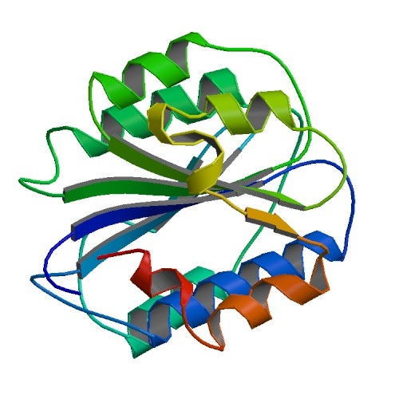

[Back to the main page](../index.md)

# Enzyme-linked immunosorbent assay (ELISA)

---

## Learning outcomes
- Pipetting in μl ranges
- Learning the principle of the ELISA test
- Spectometry
- Data analysis in Excel

---

## Introduction
Von Willebrand factor (VWF) plays a major part in the primary haemostasis process, where bleeding is stopped. In this process, VWF attaches to the damaged blood vessel wall, where it undergoes a conformational change and develops affinity for glycoprotein Ib/V/IX on the surface of the thrombocyte (see Figure 1). 

*Figure 1: VWF in primary haemostasis*

When shear rates are high in the blood vessels, in particular, VWF is essential in helping blood platelets adhere to the damaged vessel wall in the early stages of haemostasis.

In addition, VWF, in its capacity as a 
'carrier protein’ of FVIII, is essential to the survival of this important coagulation factor in plasma. As a result, patients with severe VWF deficiency experience disorders of both primary and secondary haemostasis, meaning. in the thrombocyte plug and fibrin formation processes.
 
VWF is produced in the body by endothelial cells and megakaryocytes and secreted as a large collection of multimers, whose molecular weight ranges from 1 to 20 million Daltons, which are composed of dimers of an original 270 kD glycoprotein. 

VWF is secreted into the blood by both constitutive and regulated secretion, which means that secretion of additional VWF, stored in Weibel-Palade bodies (endothelial cells) and α‐granules (thrombocytes), can be induced by exercise, stress, smoking or other types of endothelial cell and thrombocyte activation, which is important in the interpretation of measured plasma concentrations of VWF (and FVIIIc).
Von Willebrand disease (VWD) is a disorder caused by a low level of VWF in the blood, or by abnormally functioning VWF. VWD is one of the most common bleeding disorders. Symptoms include skin lesions that keep bleeding for a long time, heavy blood flow during periods, mucosal bleeding and post-operative bleeding.   
VWD is highly heterogeneous in its clinical presentation and lab findings. As a result, incidence estimates range from 125 (based on hospital figures) to 8,000 (based on laboratory figures) in $10^6$ individuals. Reduced VWF antigen (VWF:Ag) levels are detected by means of an ELISA. What should be taken into account when diagnosing a patient is that, for reasons which are at present unknown, people who have blood group O tend to have lower VWF and FVIIIc values, probably due to increased clearance. Moreover, plasma VWF concentration increases by 0.6 to 1% per year as people age, with the exact increase depending on their blood group (A/B: > 50%, O: > 38%).

## VMF:Ag ELISA
The Enzyme-Linked ImmunoSorbent Assay (ELISA) is an immunoassay used to demonstrate the presence of an antibody or antigen in a sample. A VWF:Ag ELISA involves the use of a sandwich ELISA (see Figure 2).

*Figure 2. Sandwich ELISA*

First, VWF polyclonal antibodies are bound to the wells of a microtiter plate. The bound VWF from the sample is then detected with VWF antibodies linked to the peroxidase enzyme. A calibration curve (see Figure 3) is drawn up for diluted normal plasma (NP), which is pooled plasma collected from a large number of healthy persons, with NP 1:50 containing 100% VWF:Ag by definition. 

*Figure 3: Calibration curve for the VWF:Ag assay*

During this practical, you will determine the plasma VWF concentration of several blood samples.

## Protocol

### Reagents
- Buffer A: PBS (phosphate-buffered sodium chloride) (a 1x concentrate buffer is ready for use)
  -	$1.3 \ mM \ NaH_2PO_4 \cdot H_2O$
  -	$9.0 \ mM \ Na_2HPO_4\cdot 2H_2O$
  -	$140.0 \ mM \ NaCl$: 
- Buffer B: wash and dilution buffer, pH 7.2 (a 5x concentrate buffer is ready for use)
  -	$2.5 \ mM \ NaH_2PO_4 \cdot H_2O$
  -	$7.5 \ mM \ Na_2HPO_4\cdot 2H_2O$
  -	$500 \ mM \ NaCl$ 
  -	$0.1\% \ (w/v) BSA$
  -	$0.1\% \ (v/v) \ Tween \ 20$ 
  -	$2.0 \ mM \ EDTA$ 
  -	Add EDTA from a 0.2 M stock solution. To dissolve EDTA, adjust the stock solution to pH 8.0 by adding NaOH.

Coating:
-	Rabbit anti‐human Von Willebrand factor, DakoCytomation code No. A 082. Deep-frozen in portions

Conjugate:
-	Peroxidase‐conjugate rabbit immunoglobulins to human VWF, DakoCytomation code No. P 0226. Deep-frozen in portions

OPD substrate:
-	1,2 phenylenediamine, dihydrochloride, DakoCytomation code No. S 2045

--- 

[Back to the main page](../index.md)

    
