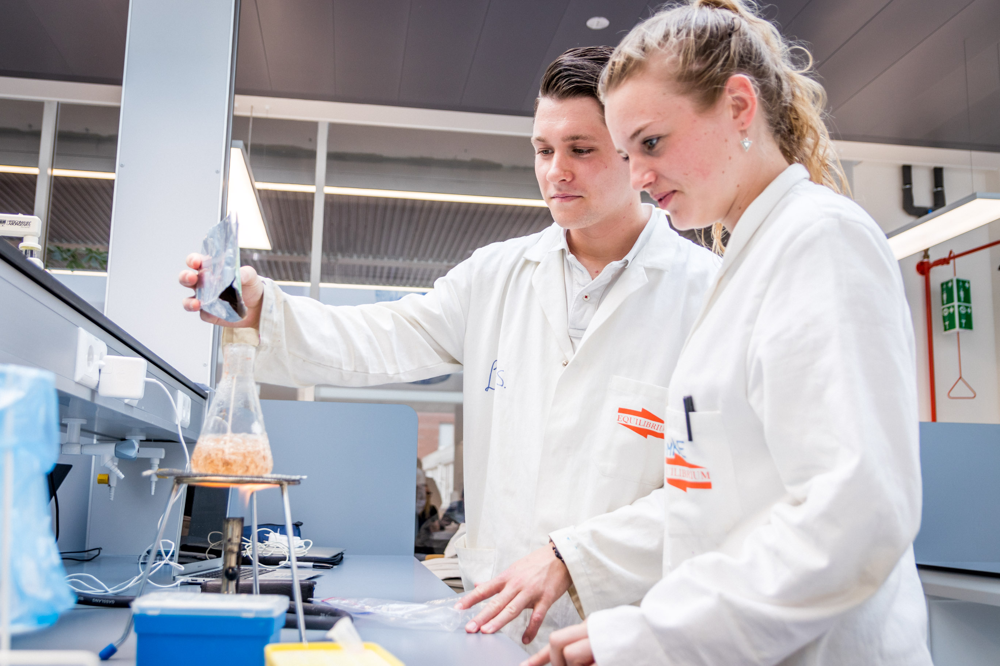



# Laboratory courses

## Main Page
---

*Source: Hanzehogeschool*

## Lab basics
- [Lab basics page](./labbasics/labbasics.md)

## Experiments 

- [Agarose gel electrophoresis](./agarose_gel_electrophoresis/agarose_gel_electropheresis.md)
- [Buffers and Growth](./buffers_growth/buffers_growth.md)
- [CRISPR-Cas9](./crispr/crispr.md) 
- [Calibration curve copper](./calibration_curve_copper/calibration_curve_copper.md)
- [Cloning](./cloning/cloning.md) 
- [ELISA](./elisa/elisa.md) 
- [Gram staining](./gram_staining/gram_staining.md)
- [Lowry](./lowry/lowry.md)
- [PCR](./pcr/pcr.md) 
- [Pipetting fluids](./pipetting_fluids/pipetting_fluids.md)
- [Plasmid DNA isolation](./nucleic_acid_isolation/nucleic_acid_isolation.md) 
- [RNA isolation and qPCR on HSP gene *C. elegans*. ](./elegans/elegans.md) 
- [Restriction analysis](./restriction_analysis/restriction_analysis.md) 
- [Western Blot](./western_blot/western_blot.md) 

--- 

## Courses
- [Crash Course](./crash_course/crash_course.md)
- [Keuzemodule Introductie Laboratoriumvaardigheden (Nederlands)](./keuzemodule_intro_lab/keuzemodule_intro_lab.md)
- [VMT](./vmt/00_vmt_index.md) 

>This web page is distributed under the terms of the Creative Commons Attribution License which permits unrestricted use, distribution, and reproduction in any medium, provided the original author and source are credited.
>Creative Commons License: CC BY-SA 4.0.

