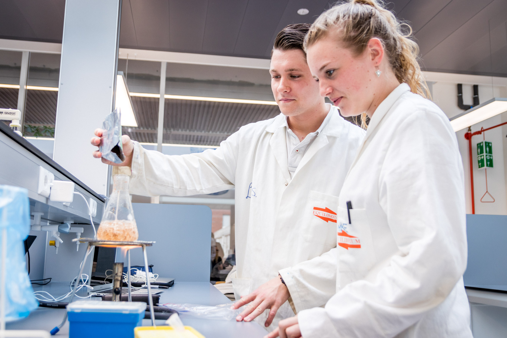



[Back to the home page](../index.md)

# Keuzemodule Introductie Laboratoriumvaardigheden

---

*Source: Hanzehogeschool*

## Inhoud
Het biologisch laboratorium is niet meer weg te denken uit de biologische en medische wetenschappen. Binnen het laboratorium worden experimenten in een gecontroleerde omgeving nauwkeurig uitgevoerd. Zo zijn bijvoorbeeld de vaccins tegen Corona snel en veilig ontwikkeld in een laboratorium. Om veilig en effectief in een biologisch laboratorium te kunnen werken, is het noodzakelijk om kennis over materiaal en apparatuur op te doen. Daarnaast moet je vaardigheden ontwikkelen om te kunnen werken in een laboratorium, zoals wegen en pipeteren. Deze basiskennis en basisvaardigheden leer je tijdens deze keuzemodule Introductie Laboratoriumvaardigheden.
Na de basisvaardigheden worden een aantal  belangrijke moleculaire technieken uitgevoerd op het lab. Dit zijn onder andere plasmide isolatie uit E. coli, restrictie analyse, polymerase chain reaction, DNA elektroforese. 
De beoordeling vindt plaats op grond van een tussentijdse “proeve van bekwaamheid” waarbij je uitgebreide feedback krijgt op je laboratoriumvaardigheden en logboek uitwerking. Deze tussentoets telt mee voor de eindbeoordeling. Aan het eind wordt je nogmaals beoordeeld op laboratoriumvaardigheden, uitwerkingen van het logboek, de dataverwerking en de uitwerking van de opdrachten in Benchling. 
Welke software je gebruikt voor de dataverwerking is je eigen keuze. Je mag spreadsheet software zoals Microsoft Excel/LibreOffice gebruiken maar ook de data-analyse uitvoeren in R of Python. Je maakt XY-scatterplots en barplots van je resultaten. Ook voer je regressie analyses uit.
Houd er wel rekening mee dat de docenten op het lab veelal alleen begeleiding kunnen geven voor spreadsheetsoftware en je mogelijk niet goed kunnen ondersteunen in R en Python. Als je voor R of Python kiest dan ben je dus wat meer op jezelf aangewezen.

## Planning

|Les     |Tijdsduur      |Onderwerp                               |Werkvorm             |Toets/product                  |
|:-------|:--------------|:---------------------------------------|:--------------------|:------------------------------|
|Les 1   |4 uur          |Les veiligheid                          |College en practicum |Formatieve (digitale) toets    |
|Les 2   |8 uur          |Microscopie                             |Lab practicum        |Logboek met formatieve feedback|
|Les 3   |8 uur          |Pipetteren/wegen                        |Lab practicum        |Logboek (summatief met feedback voor volgende logboek)|
|Les 4   |4 uur          |Ijklijn maken                           |Lab practicum        |Tussentoets ijklijn maken en uitwerken. (summatief met feedback voor volgende experiment)|
|Les 5   |4 uur          |Buffers en media                        |Lab practicum        |Logboek (summatief met feedback voor volgende logboek)|
|Les 6   |8 uur          |*E. coli* kweek                         |Lab practicum        |Logboek (summatief met feedback voor volgende logboek)|
|Les 7   |90 minuten     |PCR en restrictie in Benchling          |Computerles          |Opdrachten beoordelen (summatief maar met feedback)|
|Les 8   |8 uur          |PCR en agarose gelelectroforese         |Lab practicum        |Logboek (summatief met feedback voor volgende logboek)|
|Les 9   |8 uur          |Plasmide isolatie en restrictie analyse |Lab practicum        |Logboek Logboek (summatief met feedback)|

---

## Links naar experimenten

- [Algemene intro](../short/short.md)
- [Microscopie](../short/gram_staining.md)
- [Pipetteren/wegen](../short/pipetting.md)
- [Buffers en media](../short/chemical_calculations.md)
- [IJklijn maken](../short/calibration_curve_copper.md)
- [*E. coli* kweek](../short/buffers_growth.md)
- [PCR](../pcr/pcr.md)
- [Agarose gelelectroforese](../agerose_gel_electrophoresis/agerose_gel_electropheresis.md)
- [Plasmide isolatie](../nucleic_acid_isolation/nucleic_acid_isolation.md)
- [Restrictie analyse](../restriction_analysis/restriction_analysis.md)

---

[Back to the home page](../index.md)
