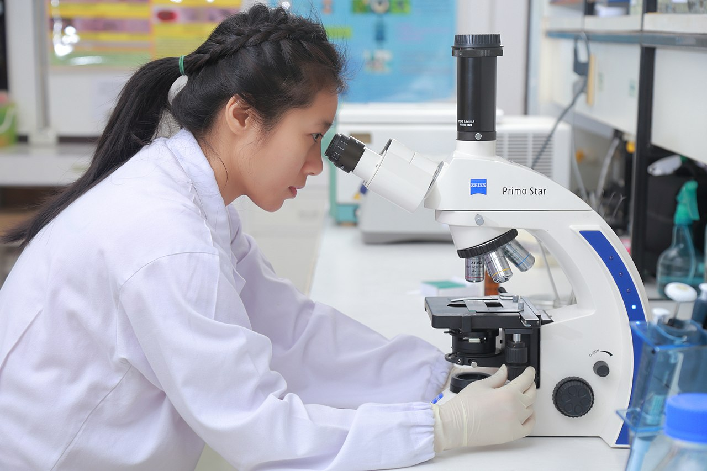
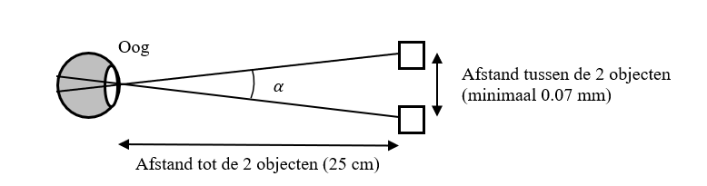
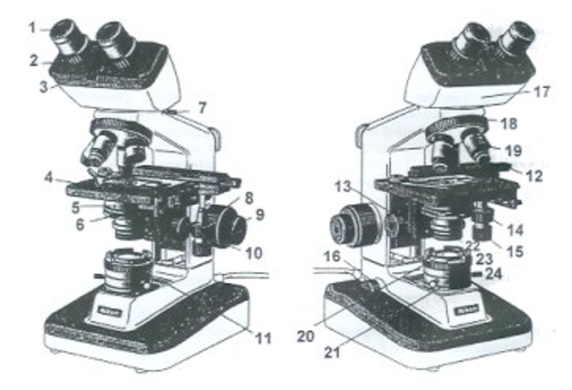



[Back to the home page](../index.md)  

# Working with a microscope

*Source: https://en.wikipedia.org/wiki/Microscope#/media/File:Scientists_are_working_in_the_lab.9.jpg*

## Learning outcomes
- Gaining knowledge of a microscope.
- Properly setting up a microscope.
- Using a microscope in the correct manner.

## Introduction and principle

The resolving power of the eye describes the ability to perceive two objects located next to each other separately. This refers to the minimum distance between objects that we can still perceive as separate objects. For example, if you look at the millimeter stripes on a ruler, they can be seen as separate stripes. If we stand further away from the ruler, the stripes blend together and we can no longer see them as separate.

The image that enters the eye falls on the cells in the retina. The signal is transmitted through nerve cells to the brain, where it is converted into an image that we perceive. This image can only be formed when multiple retina cells transmit a signal. For example, when we read a book, we can experience the letters as separate. When we stand too far from the book, the letters no longer fall on different cells in the retina. Due to the large distance, the letters become so small that multiple letters fall on one retina cell. As a result, they are no longer registered as separate, but as one black whole. For the same reason, a bacterium is not visible with the naked eye. Firstly, a bacterium is so small that it reflects insufficient light to project onto the retina. But even if the bacterium would reflect enough light, its size would only project it on one retina cell, and therefore it would not be registered.

In theory, the minimum visual angle (α) of the eye is 1 arcminute (1/60 degree). If we know this and look at two objects at a distance of 25 cm with the naked eye, then these objects must be at least 0.07 mm (70µm) apart to be able to distinguish them as separate (Figure 1). In that case, the image of the objects will fall on different retina cells and be registered as separate. In practice, this distance is often larger (1 to 2 mm), because the size and shape of the lens in the eye also affects the minimum visual angle.

*Figure 1: The effect of distance to and between objects on the resolving power of the eye. As the distance between objects becomes too small or the distance to the objects becomes too large, the visual angle decreases (α < 1 arcminute). This causes the image to be projected onto too small a part of the retina to be perceived as two separate objects.
*

To distinguish two points that are closer together than 0.07 mm, we can use a microscope. The microscope spreads the image with as little loss of detail as possible over a larger number of retina cells, or under a larger visual angle. This enlargement of the image is achieved by the lens system of the microscope. With a regular light microscope, the resolving power of 70 µm (naked eye) can be reduced to about 0.3 µm. That's about 300x more accurate than with the naked eye. In this way, biological specimens, which are often only a few millimeters in size, can still be studied.
During this lab week, you will learn how to work with a microscope. In addition, you will examine, describe, and draw specimens of different animal tissues. In order to work well with a microscope, it is necessary to know the structure of a microscope and the functions of the different parts. In Physics, you will learn the theoretical background of the operation of the microscope. During this lab, attention will be paid to the practical skills, such as setting up and working with the microscope.

## Parts of a microscope.

*Figure 2: The parts of a microscope. Adapted from: http://faculty.scf.edu/keirlem/BSC_1007_eText_UNIT_3/TEXT_Cellular_Structures/TEXT_Cellular_Structures_print.html
*

1.	ocular lenses 
2.	diopter ring for adjusting the eyepiece focus
3.	interpupillary distance adjustment scale
4.	specimen stage
5.	condenser lens
6.	diaphragm of the condenser
7.	lock screw for ocular lenses
8.	coarse focusing knob
9.	fine focusing knob
10. -
11. -
12.	crosshair table
13.	condenser focus knob 
14. knobs for moving the crosshair table (front/back)
15. knobs for moving the crosshair table (left/right)
16.	light switch
17.	binocular tube head
18.	revolving nosepiece with objective lenses
19.	objective lens
20.	-
21. holder with lens and field diaphragm
22.	location for (daylight) filter
23.	ring for opening and closing the field diaphragm
24.	centering screws for the field diaphragm

>Assignment: Use the following text as an exercise. Find the bolded parts in the (received) copy of the microscope that you have pasted in your logbook.

In the upper part of the tube is a prism system that splits the single projection of the object over both eyepieces. The eyepieces are adjustable to each other in the horizontal direction (interpupillary distance). The tube is rotatable on the stand. Below it is a rotatable objective holder, the revolver. Four objectives can be placed in the revolver. The rule is that the objectives are screwed in increasing strength in the revolver, for example 4x, 10x, 40x and 100x.
The object (subject) is on an objective glass and is sometimes covered by a cover glass. The objective glass is on the specimen stage and can be moved horizontally with the specimen guide using two coaxial control knobs (left/right and front/back).

Vertically, the specimen stage is adjusted with the large focus knob (macrometer) and later precisely controlled with the small focus knob (micrometer). The light through the object comes from the light source. The diverging lamp light is focused into an intense beam by the condenser.
The condenser is vertically adjustable with the condenser knob and is equipped with a diaphragm with which the amount of transmitted light can be adjusted. The aperture (width of the opening) also determines the amount of edge rays that are removed. Edge rays cause an unclear image. The lamp light is directed onto the condenser with the mounted mirror with a flat or a concave side.

## Theory section
Incorporate the following points in your notebook under the theory section. Do not do this by subject separately, but make it a cohesive whole. Link the different parts of the theory together so that one story emerges. Think about a logical order. Use as many scientific sources and your theory books as possible. Indicate by means of your references where you have obtained the information. Keep in mind that literal copying is not allowed.

• The role of the diaphragm.
• What is the condenser and what position should it usually be in?
• Name at least 2 conditions that must be met when using the 100x lens and explain.
• If the lens is very dirty, can you use? water or alcohol?
• What are a preparatory microscope, phase contrast microscope, and an inverted microscope, and when do you use these?

## The use of the microscope
When using the microscope, it is important to ensure that the image is as homogeneous as possible in terms of lighting. This means that the light beam from the lamp should pass through the lens systems as optimally as possible. This method is called Köhleren, named after its inventor, Köhler.
The light source, located at the bottom of the microscope, illuminates the specimen and creates an image of it through the lens system. A mirror directs the light through the specimen to the lenses. The size of the illuminated field can be adjusted using the field diaphragm. By setting the field diaphragm so that it just fills the entire field of view, interfering stray light is prevented from entering the specimen (see Köhleren steps). Then, the light from the field diaphragm is focused on the specimen by the condenser. The focus of the condenser should be set so that the edge of the field diaphragm falls exactly in the plane of the in-focus specimen. Also, the field diaphragm should be in the middle of the field of view, so that the lighting is even (see Köhleren steps). If these conditions are met, the microscope is Köhler-aligned. These settings prevent over-exposed regions, shadows and distortions (artifacts) in the specimen from being seen, and also increase the contrast in the specimen, allowing you to study it optimally!

## Köhler illumination

1.	Check that the 4x objective lens is in use and place the specimen on the stage.
2.	Adjust the eyepieces: both the horizontal distance and any diopter setting.
3.	Focus on the specimen using the 4x and then the 10x objective lens.
4.	Set the condenser to the highest position and close the field diaphragm so that you see a small light spot. This is the image of the field diaphragm.
5.	Sharpen the edges of the field diaphragm by slowly turning the condenser down using the condenser knob.
6.	Center the condenser with the centering screws (usually located at the front of the condenser). Centering is easy if you open the field diaphragm so that the edges of your field of view and field diaphragm almost coincide.
7.	Open the field diaphragm until it is no longer visible in the field of view.
8.	Adjust the condenser diaphragm if necessary, for smaller magnifications it should be more closed. The value of the condenser diaphragm or aperture diaphragm is usually on the objective lens.
**General rules for microscope use, setting up an optimal image:**
9.	Always place the specimen under the lowest magnification (4x objective) in the center of the stage, with the objects positioned just above the opening of the stage and the condenser lens.
10.	At the lowest magnification, you can turn the stage to the highest position without the lens touching the objective glass.
11.	Now, using the coarse focus knob, slowly lower the stage while looking through the microscope, until a sharp image of the object has formed.
12.	Bring the best object (the one you want to see at a higher magnification) to the center of the field of view.
13.	Now, you can rotate smoothly to the 10x objective. Focus using the fine focus knob. At this magnification, you may want to perform Köhleren (steps 1-7).
14.	Then, after placing the part you want to examine further in the center of the field of view, rotate to the next magnification (40x objective).
15.	Focusing of the image is again done only with the fine focus knob. Adjust the condenser diaphragm if necessary.
16.	Replacing or removing a specimen should always be done under the lowest objective.
17.	Lenses are usually cleaned with a dry tissue. For very dirty lenses, you can clean them with a tissue with xylene or lens cleaner, but only with the permission of the teacher.
18.	Before putting away the microscope, rotate the nosepiece back to the 4x objective (lowest magnification), remove the specimen and clean the lenses. The microscope is put away in the cabinet, covered with a cover.

>Assignment: Set up your microscope as optimally as possible by performing Köhleren on the microscope you are using today.

>Remark: Köhler illumination is a skill that you must be able to demonstrate. Elsewhere in this topic, you will have to show Köhleren to the teacher once, and then it will be assessed on your competence form.

## Measuring the size of the field of view
For this determination, an object micrometer is used, which is placed on the stage with the scale facing up. Take the 4x magnification objective and slide the object micrometer so that the scale runs across the center of the field of view. The entire field of view can be illuminated by adjusting the iris diaphragm (in the condenser). The scale of the object micrometer is divided into 100 lines and is a total of 1 mm.

>Assignment: Create a table in which you record the magnification of the objective lens (4x, 10x, 40x), that of the eyepiece (10x), and the measured diameter of the field of view for the corresponding combination of objective lens and eyepiece. Label this table "Table 1" (note: a table should have a "heading"). After this, answer the following question (note the question and answer in your logbook).

>Question: Can the relationship between the objective magnification and the diameter of the field of view be determined by calculation, using the results in Table 1?

## Ocular Micrometer
When studying cells or tissues with a microscope, it is important to know the actual size of the cells, organisms, or tissue components, and how they relate to each other. In publications and biology textbooks, you will often see a measuring scale or "bar" in microscope photos. For precise measurements of objects and parts of objects viewed with a microscope, a device called an ocular micrometer is used. This is a glass plate with a scale. On Olympus microscopes, this is standard in the eyepiece, while on Leica microscopes, there is a separate eyepiece with a micrometer that is located at the top of the microscope cabinet. The ocular micrometer is calibrated using an object micrometer, whose size of one scale division is known. Usually, the scale division is 1 mm, divided into 100 parts, so that one scale division is 0.01 mm (= 10 m). Now, the focus is set on the object micrometer. There are then two scale divisions visible: that of the ocular micrometer and that of the object micrometer. By turning the eyepiece, the two scale divisions are made parallel. Then, you place 2 lines of both scales exactly opposite each other. Again, at a reasonable distance from these two lines, you look for 2 lines that are opposite each other. Now, there are a number of scale divisions of the ocular micrometer (a) equal to a number of scale divisions of the object micrometer (b). In the illustration, 13 scale divisions of the ocular micrometer correspond to 50 scale divisions of the object micrometer. 1 scale division of the object micrometer is 0.01 mm = 10 µm. So, 50 scale divisions are 500 µm together. Then, 1 scale division of the ocular micrometer is $\frac{500}{13}= 38.50 µm$. Expressed in a formula, this is: $\frac{b}{a} \cdot 10 (µm)= µm$

>Assignment: Determine the value of one scale division of the ocular micrometer for the 4x, 10x, and 40x lens. For each lens, determine the value of the scale divisions 3 times, with the object micrometer slightly shifted between measurements. This way, you minimize measurement error by taking the average value of the three measurements. Record these values in a clear and organized table (Table 2), also with a clear heading! Use the values from this table throughout the rest of the theme when using the microscope.

## Calculation of the resolving power
The resolving power or resolution are names for the same thing. We mean by this the ability to see two points as two points. The higher the resolving power, the sharper the image. The resolving power (d) of the microscope can be approximately calculated using the formula:"

$d = \frac{\lambda}{1,64 \cdot NA}$

Where:
d = the smallest distance at which you can still see two points separated 
λ = the wavelength of the light used (for white light 0.55 µm and for blue light 0.48 µm) 
NA = the numerical aperture of the objective used (n sin ½ ) is on each objective 
1.64 = correction factor

>Assignment: Record in a table (table 3) the objective magnification with the corresponding NA value and calculate the resolving power d in µm. (The naked eye has a resolving power of 100 µm). Calculate the value for white light and for blue light (when using the filter).

>Note: During this practical you will make several drawings of preparations. Make sure that you add a scale indication (measurement bar) and the magnification to each drawing
---

The end...

[Back to the home page](../index.md)  
 
