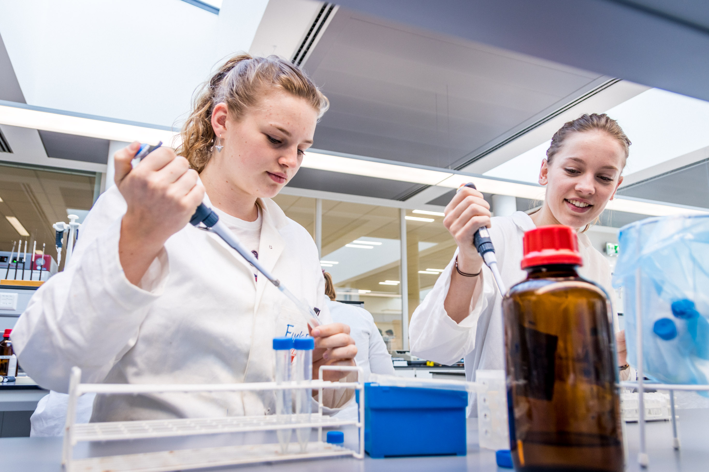
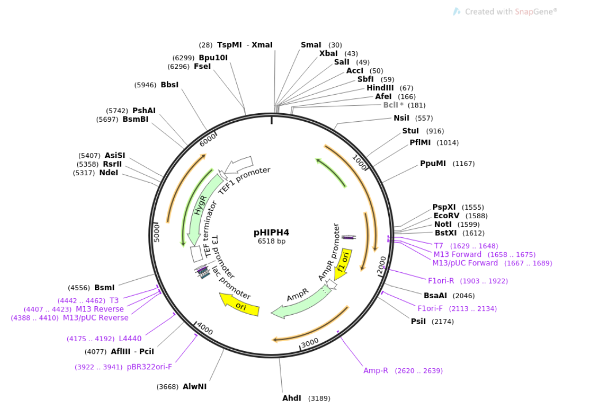

[Back to the main page](../index.md)

# Plasmid DNA isolation from bacteria

---

## Learning outcomes
- Pipetting in μl ranges
- Learning the principle of plasmid DNA isolation
- Quantification of DNA using the nanodrop

## Preparation
Watch the [following video](https://www.youtube.com/watch?v=S-6177IEUMo) regarding the principle of alkalyne lysis.

---

## Introduction
A plasmid is a small, extrachromosomal DNA molecule and able to replicate independently from the chromosomal DNA. In nature, plasmids may carry genes that are of benefit for the survival of the organism (e.g. antibiotic resistance genes). Plasmids are used as vectors in genetic engineering. As such, plasmids serve as important tools in genetics and biotechnology labs and are used to clone, amplify or express particular genes. 
The isolation of plasmid DNA from microorganisms like *Escherichia coli* is a fundamental techniques used in molecular biology. 

Plasmids are mini-chromosomes of sorts. The main difference with ‘real’ chromosomes is the size: bacterial chromosomes are generally several millions of base pairs in size, whereas most plasmids are only several thousands of base pairs in size.

During this practical course, we will isolate a plasmid (pUC18 and pHIPH4) from *E. coli* using the alkaline lysis principle according to Birnboim. See Figure 1 for a vector map of pHIPH4. 

*Figure 1: Plasmid map of pHIPH4. Source: Addgene.org.* 

During alkaline lysis, a strong alkaline solution consisting of the detergent sodium dodecyl sulfate (SDS) and a strong base (NaOH) is added The detergent disrupts cell membranes and allows the alkali to contact and denature both chromosomal and plasmid DNA. Thereafter, potassium acetate is added. This acidifies the solution and allows the renaturing of plasmid DNA, but not chromosomal DNA. The chromosomal DNA precipitates and can be seperated from the plasmid DNA. Plasmid DNA will subsequently be precipitated by isopropanol, washed with ethanol and dissolved in sterile water.

At the end of the procedure, we will quantify the amount of plasmid isolated using spectrophotometric analysis using the nanodrop.

---

## Solutions

- Solution 1 (per 100 ml):
  - 5 mM Tris‐HCl (pH 8.0)
  - 50 mM glucose
  - 10 mM EDTA

- Solution 2 (per 100 ml):
  - 0.2 M NaOH
  - 1% SDS

- Solution 3 (per 100 ml):
  - 5 M KAc
  - 11.5 ml 100% HAc

## Protocol

-	Using a pipette, transfer 2 ml culture to a 2 ml Eppendorf tube and centrifuge at maximum speed for 2 minutes.
-	Carefully remove the supernatant by sucking it up with a pipette.
-	Add 250 μl of Solution 1 (cold) and briefly vortex until a homogenous solution is formed. You may also wish to 'scrape' the tube along a rack a few times. This will generally help the pellet to dissolve properly, as well.
-	Add 500 µl of Solution 2 and mix gently. Now leave the tube on ice for 5 minutes. Solution 2 will cause the cells in the solution to lysate.
-	Add 375 µl of Solution 3 (cold). You will now see precipitation in the chromosomal DNA and protein complexes solution. Leave the tube on ice for 1 minute.
-	Centrifuge at 12,000 g for 5 minutes.
-	Carefully pour the supernatant into a fresh 2 ml tube and add 875 µl isopropyl alcohol (2‐propanol). Mix until the white strands have disappeared.
-	Centrifuge at maximum speed for 5 minutes.
-	Using a pipette, remove the supernatant and add 500 µl 70% ethanol.
-	Centrifuge at maximum speed for 2 minutes and remove the supernatant with a pipette.
-	Briefly centrifuge again and remove the last drops of fluid with a pipette.
-	Air-dry the pellet for approximately 5 minutes, then dissolve the pellet in 75 µl milliQ.

At the end:
>Quantify the amount of plasmid DNA using a nanodrop. In addition, check the purity by inspecting the $\lambda$ 260/280 ratio (should be 1.8 < ratio < 2.0). See Figure 2 below as an example.  

*Figure 2: Optical density of nucleic acid sample. The important wavelengths of 260nm and 280nm are labeled. Source: Wikipedia.org* 

--- 

[Back to the main page](../index.md)

    
