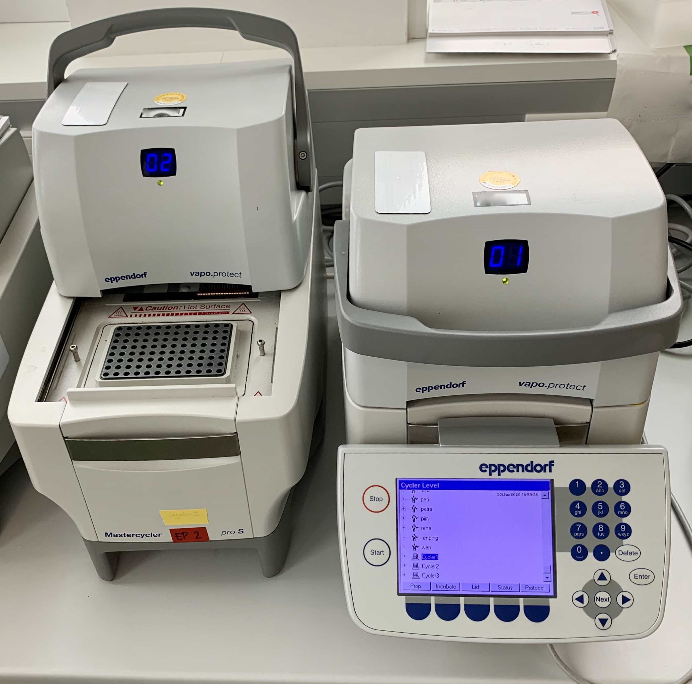
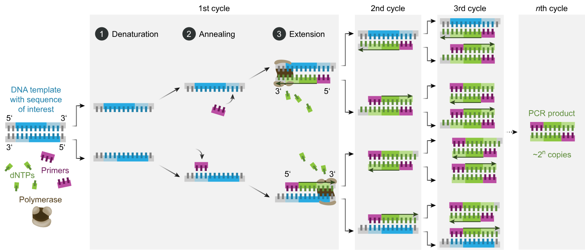
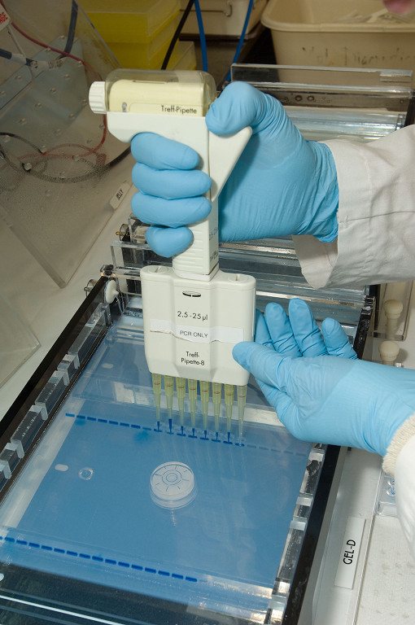
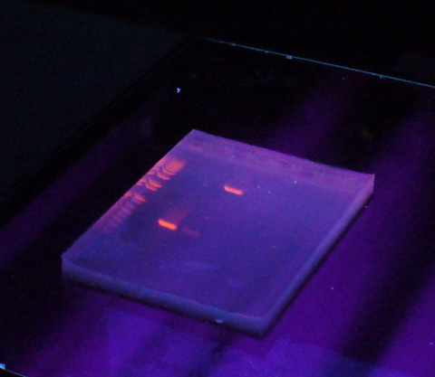

[Back to the main page](../index.md)

# Polymerase Chain Reaction

---

## Learning outcomes
- Pipetting in μl ranges
- Learning the principle of PCR
- Amplification of DNA with the PCR reaction
- Agarose gel electrophoresis

---
## Preparation
Watch the [following video](https://www.youtube.com/watch?v=iQsu3Kz9NYo) regarding the principle of the PCR reaction.

## Introduction
Polymerase chain reaction (PCR) is a molecular biology method to rapidly amplify a short piece of a specific DNA molecule. The PCR method is a very sensitive method that allows for a very small sample of DNA to be amplified in a large enough amount for analysis by (for instance) electropheresis. Oligonucleotides (or primers) act as starting point for the polymerase reaction. This means that some information about the target sequence is required in order for the PCR reaction to succeed.  

A typical PCR set-up requires several components and reagents:

- a DNA template that contains the DNA target region to amplify
- a DNA polymerase; an enzyme that polymerizes new DNA strands; heat-resistant Taq polymerase is especially common,as it is able to remain intact during the high-temperature DNA denaturation process.
- two DNA primers that are complementary to the 3′ (three prime) ends of each of the sense and anti-sense strands of the DNA target. 
- deoxynucleoside triphosphates, or dNTPs (sometimes called "deoxynucleotide triphosphates"; nucleotides containing triphosphate groups), the building blocks from which the DNA polymerase synthesizes a new DNA strand
- a buffer solution providing a suitable chemical environment for optimum activity and stability of the DNA polymerase together with $Mg^{2+}$-ions. 

The PCR reaction is set up in a small tube and a thermal cycler will facilitate the PCR reaction in the microtube. The PCR reaction consists of several stages (see Figure 1):
- Initialization: This step is only required for DNA polymerases that require heat activation by hot-start PCR (like our VWR Taq polymerase).
- Denaturation: This step is the first regular cycling event and consists of heating the reaction chamber to 95 °C. This causes DNA melting, or denaturation, of the double-stranded DNA template by breaking the hydrogen bonds between complementary bases, yielding two single-stranded DNA molecules.
- Annealing: the reaction temperature is lowered to 50–60 °C allowing annealing of the primers to each of the single-stranded DNA templates. During this stage, the polymerase already extends the primers, albeit at a slower rate, causing the melting temperature of the primers to rise.
- Extension/elongation: The temperature at this step is raised to 72 °C. In this step, the DNA polymerase synthesizes a new DNA strand complementary to the DNA template strand by adding free dNTPs from the reaction mixture that is complementary to the template in the 5′-to-3′ direction.

*Figure 1: The PCR reaction. Source: Wikipedia.org.*

After the PCR reaction, a small part of the reaction mixture can be analyzed by agarose electrophoresis. This method is used to separate DNA molecules according to mass. The agarose gel is a three-dimensional matrix formed of agarose molecules aggregated into a three-dimensional structure. This forms a maze of channels and pores through which DNA molecules can pass. DNA migrates towards a positive charge because the molecule is negatively charged due to its abundant phosphate groups. See Figure 2 for loading of an agarose gel.

*Figure 2: Loading of an agarose gel. Source: Wikipedia.org.*

DNA is visualized by staining with Midori Green, which intercalates into the major grooves of the DNA and fluoresces under UV light. When stained with ethidium bromide, the gel is viewed with an ultraviolet (UV) transilluminator. The UV light excites the electrons within the aromatic ring of ethidium bromide, and once they return to the ground state, light is released, making the DNA and ethidium bromide complex fluoresce (Figure 3).

*Figure 3: Visualization of an agarose gel. Source: Wikipedia.org.*

## The experiment
We will use the pHIPH4 plasmid to PCR amplify the Hygromycine gene using a forward and reverse primer. 

Primer sequences:  
•	KO-SUC2-f: ATGCTTTTGCAAGCTTTCCTTTTCCTTTTGGCTGGTTTTGCCCACACACCATAGCTTCAA  
•	KO-SUC2-r: CTATTTTACTTCCCTTACTTGGAACTTGTCAATGTAGAACCGTTTTCGACACTGGATGGC  

•	pHIPH4-f: CCCACACACCATAGCTTCAA  
•	pHIPH4-r: CGTTTTCGACACTGGATGGC  

The [sequence of pHIPH4](https://www.addgene.org/117685/) can be found at the addgene website.

## Simulate the PCR
Simulate the PCR using [Benchling](https://www.benchling.com/).
A step-by-step guide can be found [here](https://help.benchling.com/en/articles/672748-run-pcr-in-silico).

Simulate the PCR reaction and record the expected product length in your lab journal.

## Protocol

### Day 1: PCR

Set up a series of PCR reactions. Include a negative control and a positive control according to the table below:

| Sample #| Sample name     |Sample content       |
|:-------:|:---------------:|:-------------------:|
|1        |negative control |PCR-mix + water      |
|2        |positive control |PCR-mix + PCR-product|
|3        |sample           |PCR-mix + pHIPH4     |

The PCR mix for 50 µL should contain the following:
- 5 µL key buffer
- 1 µl dNTP mix (10 mM each). Create mix from 100 mM stock.
- 10 pmol forward primer. Pipet from 10 μM stock.
- 10 pmol reverse primer. Pipet from 10 μM stock.
- 0.4 µl TEMPase Hot Start DNA Polymerase
- PCR-grade $H_2O$ up to 49 µl.

Then add:
- 1 µl PCR-grade $H_2O$ to tube 1.
- 1 µl PCR product from a 100X-dilluted previous reaction (provided by your supervisor) to tube 2.
- 25 ng of plasmid (pHIPH4) of a 25 ng/µl stock to tube 3. 

PCR conditions:
- Denaturation for 15 minutes at 95˚C (to activate the hot-start polymerase) 
- 30 cycles of:
  - 95˚C for 30 seconds
  - 58˚C for 40 seconds
  - 72˚C for 2 minutes 
- extension step of 5 minutes at 72˚C. 
 

### Day 2: Agarose gel electrophoresis

**For creating a 1.5% agarose gel:**

- Seal the gel holder with painter's tape.
- Place a comb 1 to 2 cm from the top of the gel and 1 to 1.5 mm from the bottom of the gel holder.
- Prepare 400 ml of TBE buffer to fill the electrophoresis tank with and to prepare a gel. The stock solution you will find in the lab is a 10x concentrate. So first of all, calculate how to prepare the 1X solution.

**The gel:**

- Add the right amount of agarose to 60 ml TBE to prepare a 1.5% (w/v) gel.
- Heat the solution to the boiling point in a microwave until all the agarose has dissolved.
- Allow the solution to cool down to a temperature of approximately 60°C. Add 3 µl Midori Green to the warm agarose solution.
- Pour the warm agarose solution into the gel holder. Make sure the gel is approximately 5 mm thick.
- After 30 minutes, carefully remove the comb and place the gel into the electrophoresis tray.
- Fill the electrophoresis tray with TBE buffer. Make sure the gel is completely submerged by the electrophoresis buffer before inserting the samples.

**Insering the samples:**

- Suck at least 10 µl of the reaction mixture into the pipette and transfer it to a well containing 2 µl of 6X-loading buffer. Alternatively, to avoid using too many wells, you could consider using a sheet of Parafilm and transferring the drops (2 µl) of loading buffer to that with a pipette. You can then mix the samples with loading buffer, suck them into the pipette and load the gel with them.
- Make sure the sample and loading buffer are mixed properly. Mix them by aspirating the tip a few times.
- Now deposit the samples into the slots with extreme care. To load the samples, insert the pipette deep into the slots, or the samples may float out of the slots. However, do not insert the pipette too deep into the slots, as this may cause you to perforate the gel.
- Run electrophoresis at 100-120 Volt. If you use a higher voltage, the gel may melt.

**Please Note:**

- Make sure you fill each slot halfway, since the sample may run over.
- Insert the pipette deep into the slots to load the samples, then slowly press the plunger downwards. Make sure the pipette does not emit any air bubbles. Make sure you do not damage the gel.
- Do not allow the blue agent to spread too far. In 1.5% agarose gel, the colouring agent will run in the same way as a the DNA fragment.
- View the gel under a UV source and take a picture of the gel with your mobile phone. Use this photo to determine the results in your logbook. Make sure that you have a clear photo that you can use to determine the results.

--- 

>Some  information on this page was adapted and modified from Wikipedia.org.

[Back to the main page](../index.md)

    
