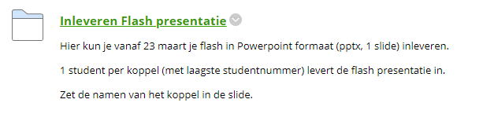
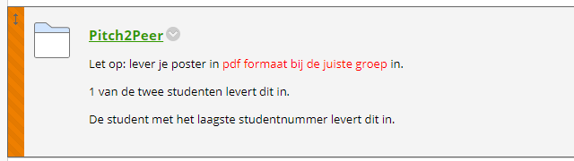
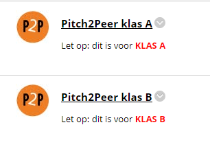

# Opzet Thema 7 posterpresentaties 2021

## Datum Postermiddag thema 7: 26-03-2021

>Vanwege de Coronacrisis moet de posterdag online georganiseerd worden.
Hieronder vind je de opzet van de posterdag.

---

>NB: De voertaal van zowel de poster als de pitch is **Engels**. De Pitch geef je dus in het Engels.

---

## Programma postermiddag thema 7:

- **26 maart 2021 12:30-13:30**: flash presentaties (1.5 tot 2 minuten, live presentatie via BB Collaborate door 1 student van koppel)
- **26 maart 2021 13:45-14:30**: beoordelen posters door studenten
- De docenten maken de "top 3 posters" die door gaan naar de posterweek bekend op **maandag 29 maart 2021**

## Voor studenten:

### 1. Inleveren poster voor feedback studentkoppel

- Lever de eerste versie van je poster in (labjournaal met naam `Poster`) in eLabjournal voor feedback van ander studentkoppel
- Je geeft **constructieve** feedback op de poster van een ander koppel. Op deze manier geeft en krijgt iedereen feedback.
- Zorg ervoor dat dit commentaar opgeslagen wordt in het labjournaal genaamd `Poster` in eLabjournal bij het betreffende koppel.
- Dit hoeft maar bij 1 van de studenten van het koppel.
- De student waarbij geen feedback geschreven is mag dit commentaar overnemen van de andere student van het koppel.
- De docent maakt de indeling voor de feedback of jullie mogen dit onderling regelen (vraag je docent van het practicum).
- Uiteraard gebruik je deze feedback om de eerste versie van je poster te verbeteren. De verbeterde versie pas je uiteraard aan.
- Zorg ervoor dat dit deel is afgerond voor **23 maart 2021 9:00**.

### 2. Inleveren poster voor vak "Poster Engels"

- Lever je poster via Blackboard thema 7 (zie screenshot) in.
- Per koppel lever je maar **1 poster** in.
- De student met het **laagste** studentnummer levert de poster in.
- Lever je poster in in **PDF** formaat. Dus niet als PowerPoint file.
- De assignment gaat **23 maart 9:00** open.
- De assignment sluit op **25 maart om 9:00 in de ochtend**. Zorg er dus voor dat je het voor die tijd hebt ingeleverd! 

### 3. Inleveren Slide Poster Flashes

- De poster flashes worden gegeven in Blackboard Collaborate in de Blackboard course `thema 7 practicum`
- Er zijn parallele groepen (A klas en B klas)
- Per koppel geeft één student de flash.
- De flash duurt 1.5-2 minuten.
- De flash bestaat uit 1 slide gemaakt in Microsoft PowerPoint (A4 liggend).
- De flash kun je inleveren via Blackboard (zie screenshot hieronder vanaf **23 maart om 9:00**)
- De flash lever je uiterlijk **25 maart om 9:00 in de ochtend** in.
- Lever de flash in als `Powerpoint` file (pptx).

De Flash lever je in Blackboard in:

De Collaborate sessies staan klaar in thema 7. Iedereen heeft presentatierechten in deze sessie:

### 4. Pitch2Peer (beoordelen van posters)

#### Inleveren van de poster:

>Opmerking: Dit zal via Pitch2Peer verlopen.

- Lever je poster in voor Pitch2Peer via `Blackboard>thema 7>practicum` (zie screenshot).
- Lever je poster in in **PDF formaat**.
- Alleen de student met het laagste studentnummer van een koppel levert in.
- Lever dit in na **23 maart om 9:00**
- Uiterlijke inleverdatum is **25 maart om 9:00 in de ochtend**

#### Beoordelen van de posters:

Op **vrijdag 26 maart** gaan jullie om **13:45** elkaars posters `likes` geven met `Pitch2Peer`.
Je kan in Pitch2Peer komen via `Blackboard>thema7>practicum`. Zie screenshot hierboven.

>Tip: denk bij de beoordeling aan dingen als:
>- is de poster overzichtelijk?
>- zijn de figuren goed opgemaakt? 
>- is de inhoud wetenschappelijk informatief?

We hebben verder de volgende spelregels opgesteld:
- iedere student kan 5 `likes` geven.
- je mag niet voor je eigen poster kiezen.
- de top 3 met de meeste `likes` per klas gaan naar de selectiepool voor docenten.
- het kan zijn dat er een gelijkspel ontstaat, in dat geval kunnen meer dan 3 posters door gaan naar de selectiepool voor docenten.
- De docenten kiezen uit deze pool van 6 posters (kunnen er meer zijn in geval van gelijk spel) 3 posters voor de posterweek.
- De docenten laten **maandag 29 maart 2021** weten welke posters doorgaan naar de posterweek.

### 5. De Posterweek

Zoals gezegd gaan de top 3 posters door naar de posterweek. Je krijgt nog verdere informatie over deze posterweek. Deze is namelijk nog in ontwikkeling.

---

## Voor docenten:

### Posters in Grade Center

De posters kunnen benaderd worden via een `Smart View` in Blackboard Grade Center:

Daarna kun je de items beoordelen van de rubric:

De practicumdocenten beoordelen:
- Overzichtelijkheid
- Figuren
- Wetenschappelijk informatief
- Aantrekkelijkheid poster
- Posterflash.

De docent van het vak `Poster Engels` beoordeelt de rubric `Wetenschappelijk taalgebruik Engels`

---