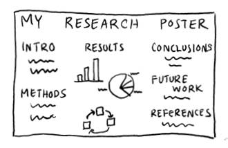
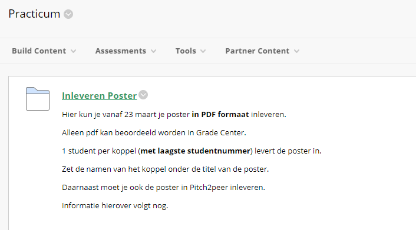
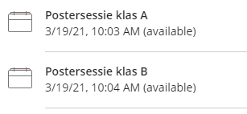
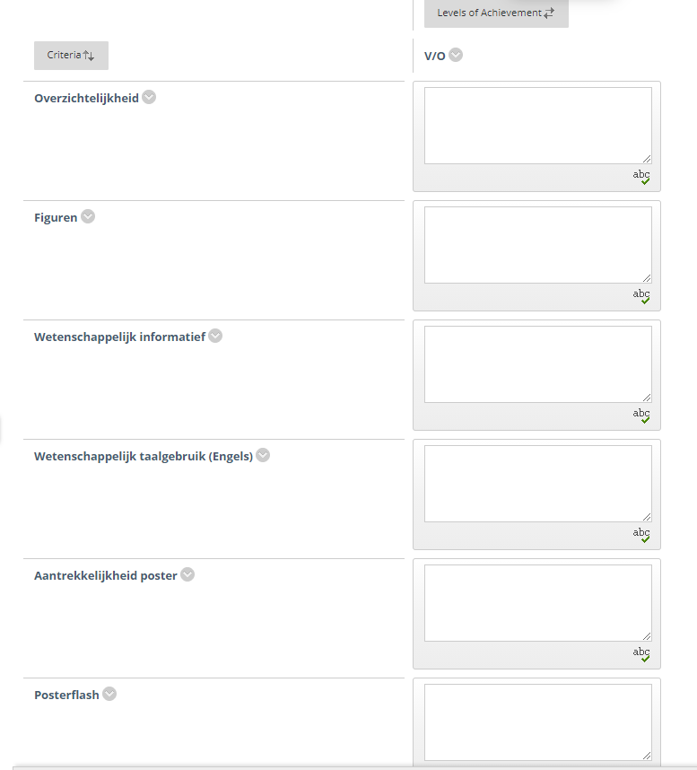
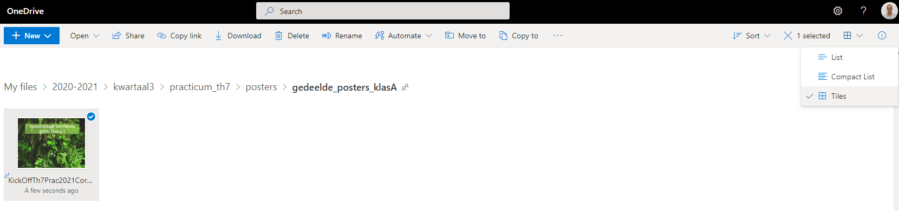
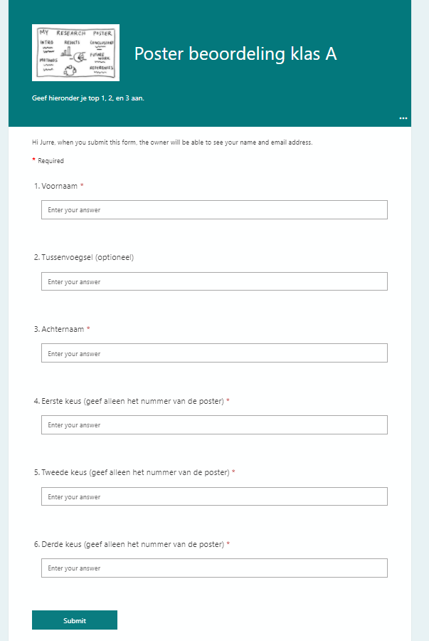
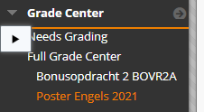

# Opzet Thema 7 posterpresentaties 2021

## Datum Postermiddag thema 7: 26-03-2021

>Vanwege de Coronacrisis moet de posterdag online georganiseerd worden.
Hieronder vind je de opzet van de posterdag.

---

## Programma postermiddag thema 7:

- 26 maart 2021 12:30-13:30: flash presentaties
- 26 maart 2021 13:45-14:15: beoordelen posters door studenten
- 26 maart 2021 14:15-14:30: afsluiting

## Voor studenten:

### 1. Inleveren poster voor feedback studentkoppel

- Lever je eerste versie poster in via eLabjournal voor feedback van ander studentkoppel
- Je geeft **constructieve** feedback op de poster van een ander koppel.
- Zorg ervoor dat dit commentaar opgeslagen wordt in eLabjournal bij het betreffende koppel.
- Dit hoeft maar bij 1 van de studenten van het koppel.
- De student waarbij geen feedback geschreven is mag dit commentaar overnemen van de andere student van het koppel.
- De docent maakt de indeling voor de feedback of jullie mogen dit onderling regelen (vraag je docent van het practicum).
- Zorg ervoor dat dit deel is afgerond voor **23 maart 2021**.

### 2. Inleveren poster voor vak "Poster Engels"

- Lever je poster via Blackboard thema 7 (zie screenshot) in.
- Per koppel lever je maar **1 poster** in.
- De student met het **laagste** studentnummer levert de poster in.
- Lever je poster in in **PDF** formaat. Dus niet als PowerPoint file.
- De assignment gaat **23 maart** open.
- De assignment sluit op **25 maart om 9:00 in de ochtend**. Zorg er dus voor dat je het voor die tijd hebt ingeleverd! Wij moeten namelijk de posters op tijd klaar zetten.

### 3. Inleveren Slide Poster Flashes

- De poster flashes worden gegeven in Blackboard Collaborate in de Blackboard course `thema 7 practicum`
- Er zijn parallele groepen (A klas en B klas)
- Per koppel geeft één student de flash.
- De flash duurt 1.5-2 minuten.
- De flash bestaat uit 1 slide gemaakt in Microsoft PowerPoint (A4 liggend).
- De flash lever je uiterlijk `24 maart om 9:00` in.
- Lever de flash in als `Powerpoint` file (pptx).

De Collaborate sessies staan klaar in thema 7. Iedereen heeft presentatierechten in deze sessie:

### 4. Geef een rating voor de mooiste/beste posters

>Opmerking: Dit gaat mogelijk via Pitch2Peer.
Houd deze webpagina in de gaten voor dit punt. Indien Pitch2Peer niet gebruikt wordt dan geldt onderstaande:

De posters beoordelen jullie via een webformulier.

>Tip: denk bij de beoordeling aan dingen als:
>- is de poster overzichtelijk?
>- zijn de figuren goed opgemaakt? 
>- is de inhoud wetenschappelijk informatief?

We hebben verder de volgende spelregels opgesteld:
- het is de bedoeling dat iedere student een top 3 van de posters opgeeft.
- je mag niet voor je eigen poster kiezen.
- keuze 1 levert 3 punten op, keuze 2 levert 2 punten op en keuze 3 levert 1 punt op.
- de top 3 met de meeste punten gaan naar de selectiepool voor docenten
- het kan zijn dat er een gelijkspel ontstaat, in dat geval kunnen meer dan 3 posters door gaan naar de selectiepool voor docenten.
- De docenten kiezen uit deze pool van posters 3 posters voor de posterweek.

De links naar de posters staan in Blackboard (nu nog niet open). Selecteer de juiste groep (klas A of klas B)

>Tip: zet de tegelvoorvertoning in OneDrive optie op actief (tiles).
Op deze manier zie je al een voorvertoning van de poster.

Selecteer de juiste groep om je voorkeuren op te geven (klas A of klas B)
Een screenshot van het webformulier zie je hieronder:

### 5. De Posterweek

Zoals gezegd gaan de top 3 posters door naar de posterweek. Je krijgt nog verdere informatie over deze posterweek. Deze is namelijk nog in ontwikkeling.

---

## Voor docenten:

### Posters in Grade Center

De posters kunnen benaderd worden via een `Smart View` in Blackboard Grade Center:

Daarna kun je de items beoordelen van de rubric:

De practicumdocenten beoordelen:
- Overzichtelijkheid
- Figuren
- Wetenschappelijk informatief
- Aantrekkelijkheid poster
- Posterflash.

De docent van het vak `Poster Engels` beoordeelt de rubric `Wetenschappelijk taalgebruik Engels`

---