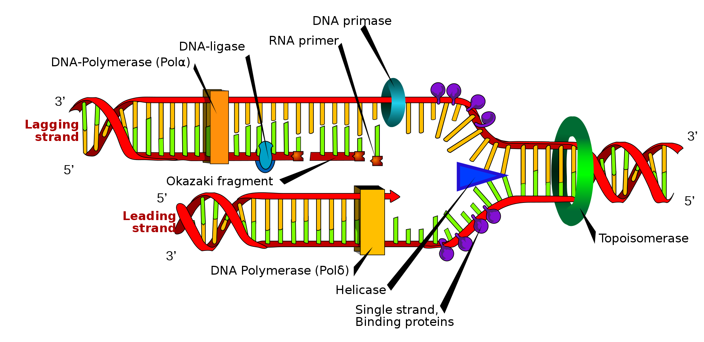



[Back to the main page](../index.md)

# Primer Design

---

## Learning outcomes
- Design primers using [Benchling](https://www.benchling.com/)
- Perform an *In Sillico* PCR

--- 

## Use the following links for this lesson

- [*In Sillico* PCR Benchling](./files/Primer_design_benchling.pdf)
- [Solutions](./files/Primer_design_benchling_solutions.pdf)
- [Files](./files/Files.zip)

## Tutorial from Benchling

- [Tutorial from Benchling](https://www.benchling.com/blog/in-silico-pcr-primer-design-and-gene-amplification)

---

>Some  information on this page was adapted and modified from Wikipedia.org.

[Back to the main page](../index.md)