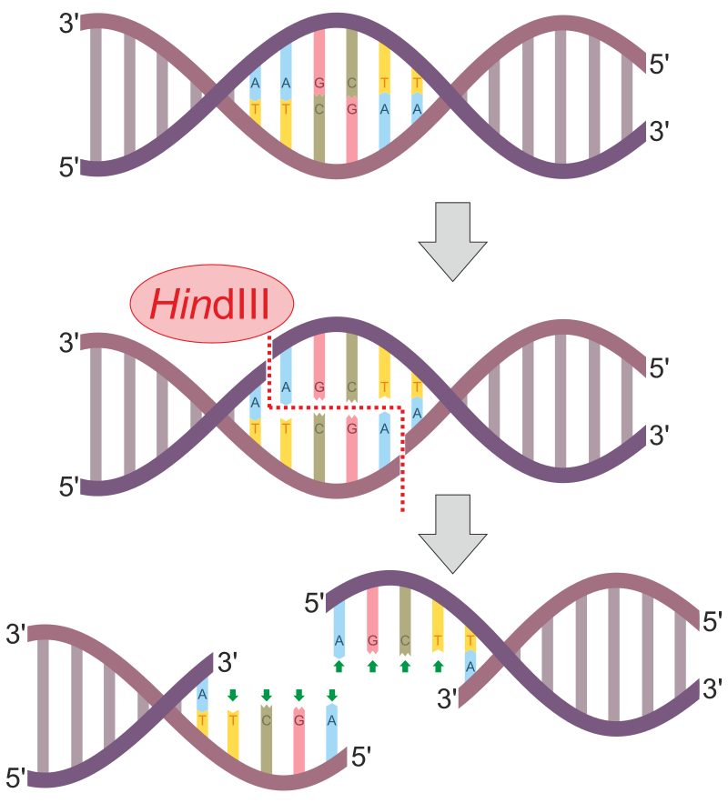



[Back to the main page](../index.md)

# Restriction Analysis

---

*Source: https://en.wikipedia.org/wiki/Nuclease#/media/File:HindIII_Restriction_site_and_sticky_ends_vector.svg.*

## Learning outcomes
- Pipetting in μl ranges
- Learning the principle of Restriction Analysis
- Agarose gel electrophoresis

---
## Preparation
Watch the [following video](https://www.youtube.com/watch?v=U2cKywEn6KY) regarding the principle of restriction analysis.

## Introduction
The isolation of plasmid DNA, restriction analysis and agarose gel electrophoresis are fundamental techniques used in molecular biology to analyse the length of unknown DNA fragments. In addition to the chromosome, bacteria often contain one or more smaller DNA molecules, called plasmids. Basically, these are mini-chromosomes of sorts. The main difference with ‘real’ chromosomes is the size: bacterial chromosomes are generally several millions of base pairs in size, whereas most plasmids are only several thousands of base pairs in size.

During this practical, we will isolate a plasmid (pUC18) from *E. coli*. We will treat this plasmid with certain restriction enzymes (DraI, HaeII and BamHI), after which we will determine the length of the DNA fragments using gel electrophoresis. The DNA length and fragment sequence will then allow us to draw up a restriction map of the plasmid (pUC18) we have isolated. In order to determine DNA length (with length being expressed in the number of base pairs), we will use a DNA ladder (a collection of DNA fragments of known lengths) running alongside the gel.

Record the following aspects in the logbook you will keep as part of your theory section. Do not create separate entries for each separate topic, but rather incorporate them into a well-structured whole. Link the various components of your theory section to create a single narrative. Make sure you present the various aspects in a logical order. Tell a clear story and use illustrations to clarify the points you are making. In your text, refer to the illustrations you are explaining, and ensure that these visualise what you are saying. Use scientific sources and your textbooks wherever possible. Use references to indicate the source of the information you cite. Please note that you are not allowed to include direct quotations. At the end of your theory section, you will of course make a prediction regarding the outcome(s) of the experiment.

-	What kind of vector/plasmid is pUC18?
-	What are restriction enzymes, and what is their mechanism of action?
-	Why is this technique so useful? (Hint: cloning)
-	How does the Birnboim method work? (What is the underlying principle?) Tip: look at the agents you used to perform the test.

In addition to the actions performed as part of the experiment, you can also perform the restriction analysis on a computer, before doing it in the lab. For instance, you can use Clone Manager, which is used in Theme 4 in the Bioinformatics course.

In this experiment we will use an online programme that can perform the restrictions *in silico*. To do so, go to the following website: [NEBcutter2](http://nc2.neb.com/NEBcutter2/)

Under 'Standard sequences', select: pUC18 plasmid and click 'Submit'. Under 'Main options', select 'Custom digest', then select the enzyme you wish to use to perform the restriction. You can select multiple restriction enzymes, which will cause the vector to be cut for several enzymes simultaneously. Click 'Digest' at the bottom of the window, and a new page will appear. Under 'List', if you click 'Fragments', you will see a list of fragments that will occur if you cut the pUC18 plasmid with the chosen restriction. You can use these values to fill out the table on p. 27 (in the column called 'Predicted size of fragment(s)').

After analysis using [NEBcutter2](http://nc2.neb.com/NEBcutter2/), try to similate the digestion and alectropheresis in Benchling [Benchling](https://www.benchling.com/).

## Protocol

Start with the isolation and quantification of plasmid DNA according to [Plasmid Isolation](../nucleic_acid_isolation/nucleic_acid_isolation.md)

We will use 8 tubes (see next page) with restrictions. Make sure you properly label the tubes! Keep the restriction enzymes on ice at all times! Always wear gloves while you go about your work!

The restriction enzymes have been dissolved in glycerol, meaning they will not freeze at −20°C, and no ice crystals will form in the tube. However, glycerol will also cause the enzymes to be inactive. Enzymes must be diluted by a factor of at least 10 in order to be able to be used. This means that the final volume in the restriction analysis tube must be at least 10 times the volume of the restriction enzymes. For example: Tube No. 7: DraI x HaeII x BamHI. In this case, the volume of the restriction enzymes is 1+1+1 = 3 µl, so the final volume of this tube is 30 µl (10 x 3).

Restriction enzymes always come with a restriction buffer. This is the buffer that will cause the enzyme to work best (i.e. have the highest level of activity). The buffers are a 10x concentrate, which is to say that they must be diluted by a factor of 10 in order to be used. Looking closely, you will see that the final concentration of the buffer in each tube of the restriction reaction is 1x. For example: Tube No. 7: DraI x HaeII x BamHI. In this case, the final volume in this reaction is 30 µl. 3 µl 10x concentrated buffer was transferred to it.

The following restriction reaction must be pipetted very carefully. First decide which pipette you will use (P2, P20, P50, P100, P1000) and then transfer the solution to the side of the tube at a 45° angle, holding the pipette straight and the tube at an angle. Check whether you can see a drop. Close the lid and place the tube into an Eppendorf centrifuge. Centrifuge every drop to the bottom by means of a short pulse. Now you will know for sure that the solutions are in the tube. Follow the steps of the loading schedule in the order provided. In other words: first add water, then add buffer, and then add the restriction enzymes. Enzymes do not tolerate high concentrations of salt. If you follow the steps in the correct order, you will see that the enzymes are transferred to a diluted buffer solution.

## Restriction reaction loading schedule

1.	DraI
- 3 µl plasmid DNA
- Add Millipore water to adjust volume to 8 µl 
- 1 µl CutSmart restriction buffer (NEB) 
- 1 µl (20 units/µl) DraI
- Incubate a total of 10 µl at 37°C for one hour

2.	HaeII
- 3 µl plasmid DNA
- Add Millipore water to adjust volume to 8 µl 
- 1 µl CutSmart restriction buffer (NEB) 
- 1 µl (20 units/µl) HaeII
- Incubate a total of 10 µl at 37°C for one hour

3.	BamHI
- 3 µl plasmid DNA
- Add Millipore water to adjust volume to 8 µl 
- 1 µl CutSmart restriction buffer (NEB) 
- 1 µl (20 units/µl) BamHI
- Incubate a total of 10 µl at 37°C for one hour

4.	DraI x BamHI
- 5 µl plasmid DNA
- Add Millipore water to adjust volume to 16 µl 
- 2 µl CutSmart restriction buffer (NEB) 
- 1 µl (20 units/µl) DraI
- 1 µl (20 units/µl) BamHI 
- Incubate 20 µl at 37°C for one hour

5.	DraI x HaeII
- 5 µl plasmid DNA
Add Millipore water to adjust volume to 16 µl 
- 2 µl CutSmart restriction buffer (NEB) 
- 1 µl (20 units/µl) DraI
- 1 µl (20 units/µl) HaeII 
- Incubate a total of 20 µl at 37°C for one hour

6.	HaeII x BamHI
- 5 µl plasmid DNA
- Add Millipore water to adjust volume to 16 µl 
- 2 µl CutSmart restriction buffer (NEB) 
- 1 µl (20 units/µl) HaeII
- 1 µl (20 units/µl) BamHI 
- Incubate a total of 20 µl at 37°C for one hour

7.	DraI x HaeII x BamHI
- 5 µl plasmid DNA
- Add Millipore water to adjust volume to 24 µl 
- 3 µl CutSmart restriction buffer (NEB) 
- 1 µl (20 units/µl) DraI
- 1 µl (20 units/µl) HaeII
- 1 µl (20 units/µl) BamHI 
- Incubate a total of 30 µl at 37°C for one hour

8.	Without restriction enzyme
- 3 µl plasmid DNA
- Add Millipore water to adjust volume to 10 µl
- Add Millipore water to adjust volume to 9 µl 
- 1 µl CutSmart restriction buffer (NEB) 
- Incubate at 37°C for one hour

### Day 2: Agarose gel electrophoresis

Proceed with the procedure of [Agerose gel electrophoresis](../agerose_gel_electrophoresis/agerose_gel_electropheresis.md)

--- 

>Some  information on this page was adapted and modified from Wikipedia.org.

[Back to the main page](../index.md)

