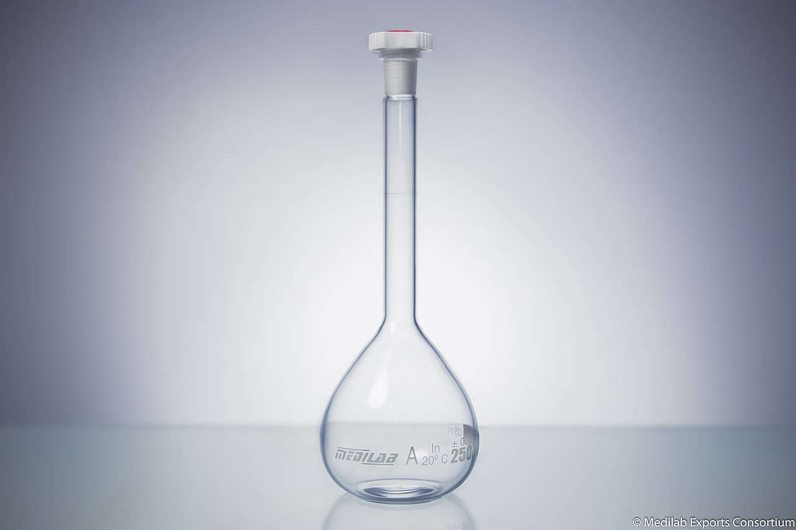
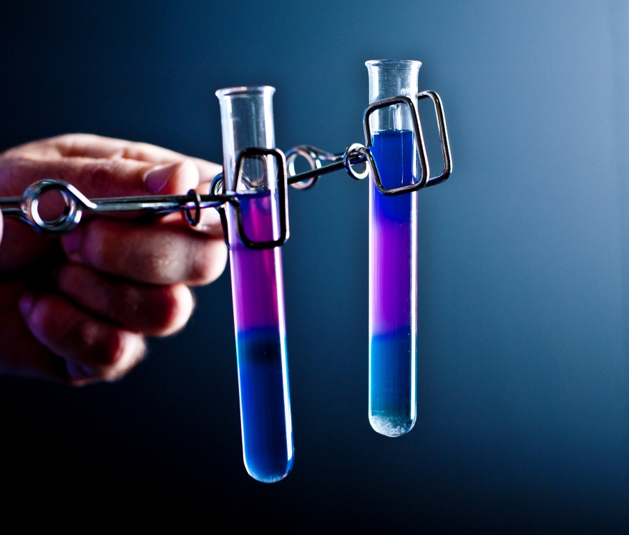



[Back to the home page](../index.md)  
[Back to the home page of the crash course](./short.md)  

# Lab Equipment

On this page, you will get some information about lab equipment.

## Laboratory Glassware

Laboratory Beaker:

*Source: https://en.wikipedia.org/wiki/Beaker_(laboratory_equipment)#/media/File:Glassware-_Beaker.jpg*

Erlenmeyer:

*Source: https://en.wikipedia.org/wiki/Erlenmeyer_flask#/media/File:20150320-OSEC-LSC-0080_(16299658674).jpg*

Graduated Cylinder:

*Source: https://en.wikipedia.org/wiki/Graduated_cylinder#/media/File:Different_types_of_graduated_cylinder-_10ml,_25ml,_50ml_and_100_ml_graduated_cylinder.jpg*

Volumetric Flask:

*Source: https://en.wikipedia.org/wiki/Volumetric_flask#/media/File:Volumetric_Flask_250ml.jpg*

Funnel:

*Source: https://en.wikipedia.org/wiki/Laboratory_funnel#/media/File:FilterFunnelApparatus.png*

Watch Glass:

*Source: https://en.wikipedia.org/wiki/Watch_glass#/media/File:Watch_glass.JPG*

Test Tube:

*Source: https://en.wikipedia.org/wiki/Test_tube#/media/File:Two_small_test_tubes_held_in_spring_clamps.jpg*

Petri Dish:

*Source: https://en.wikipedia.org/wiki/Petri_dish#/media/File:Petri_dish_at_the_Pacific_Northwest_National_Laboratory.jpg*

## Pipetting

Adjustable pipette:

*Source: https://en.wikipedia.org/wiki/Pipette#/media/File:P5000_pipette.jpg*

Volumetric Pipette:

*Source: https://en.wikipedia.org/wiki/Volumetric_pipette#/media/File:Vollpipetten.jpg*

Measuring Pipette:

*Source: https://commons.wikimedia.org/wiki/File:Pipette_1.jpg*

## Weighing of chemicals

Weighing scale:

*Source: https://commons.wikimedia.org/wiki/File:Electronic_scale.jpg*

Analytical Weighing Scale:

*Source: https://en.wikipedia.org/wiki/Analytical_balance#/media/File:Analytical_balance_mettler_ae-260.jpg*

## Spectrophotometer

*Source: https://commons.wikimedia.org/wiki/File:Spectrophotometer_Model_1.JPG*

## Stereo Microscope

*Source: https://commons.wikimedia.org/wiki/File:Bresser_binocular_microscope_and_a_Stereo_microscope.jpg*

## Incubator

*Source: https://commons.wikimedia.org/wiki/File:LTEE_Incubator.jpg*

[Back to the home page](../index.md)  
[Back to the home page of the crash course](./short.md)  
