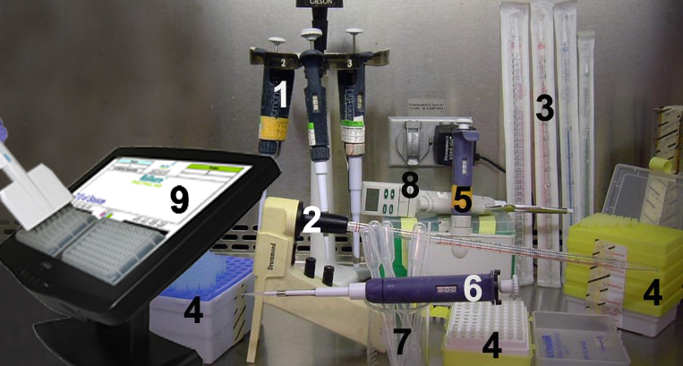
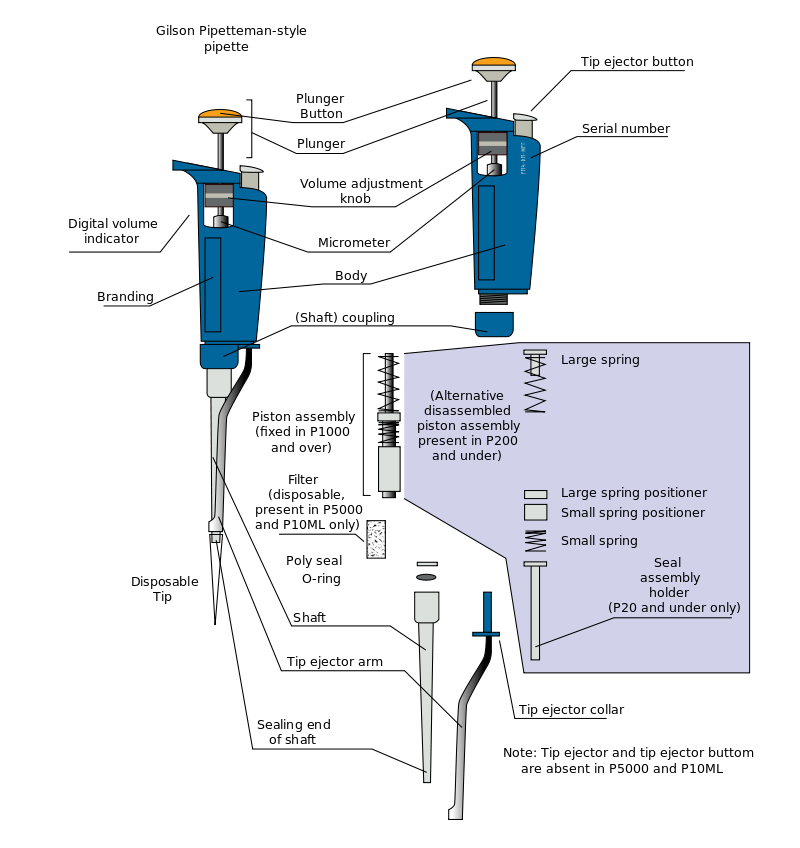
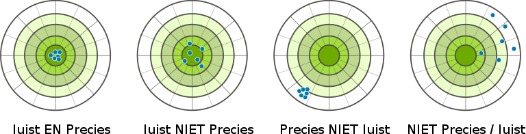
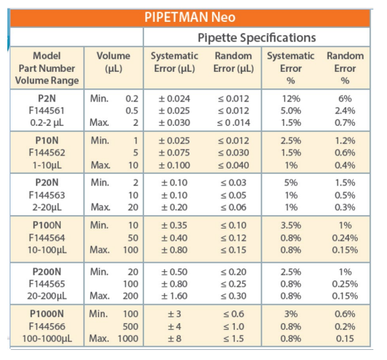
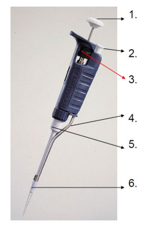
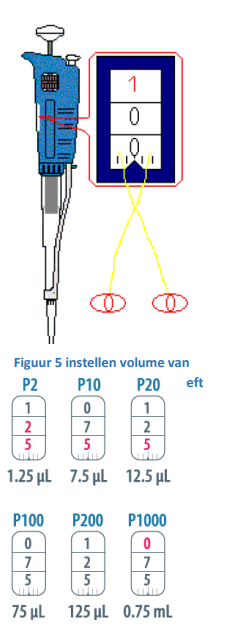
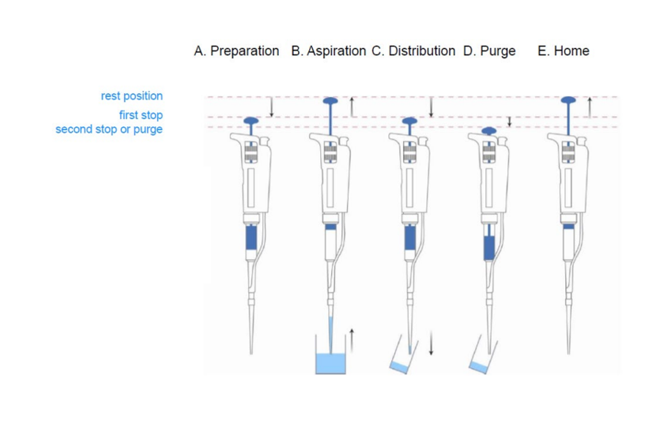
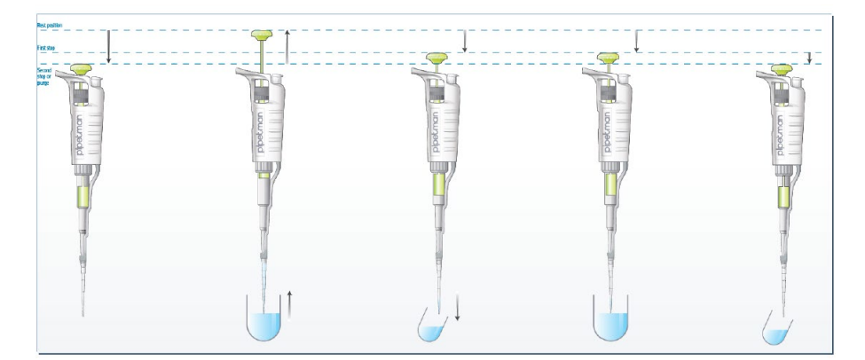



[Back to the home page](../index.md)  
[Back to the home page of the crash course](./short.md)  

# Pipetting fluids

## Learning outcomes
- Pipetting fluids

## Introduction
During this training you will need to transfer liquids from one place to another. In most cases, when it comes to small volumes, a pipette is used for this. A pipette is a laboratory tool commonly used in chemistry, biology and medicine to transport a measured volume of liquid. Pipettes come in several designs for various purposes with differing levels of accuracy and precision. Many pipette types work by creating a partial vacuum above the liquid-holding chamber and selectively releasing this vacuum to draw up and dispense liquid. Measurement accuracy varies greatly depending on the instrument. It is important to use the pipette correctly so that you transfer liquids with a high degree of accuracy.
There are many different types of pipettes that are used in practice:
1. Adjustable pipettes, from left: 20–200 μl, 2–20 μl, 100–1000 μl; 
2. Graded transfer pipette and electric pipette filler; 
3. 25 mL, 10 mL, 5 mL, and 2 mL transfer pipettes; 
4. Disposable tips for adjustable pipettes; 
5. 12-channel adjustable pipette for microplates; 
6. Low-retention 0.5–10 μl adjustable pipette; 
7. Squeezable transfer pipettes; 
8. Digital adjustable pipette; 
9. Light-guided pipetting system
This manual explains the adjustable pipette and how it should be used in the laboratoty. 

*Source: https://en.wikipedia.org/wiki/Pipette#/media/File:Pipettes.jpg*

## Air-displacement pipet vs positive-displacement pipet

Within the types of automatic pipettes, there are 2 types of pipettes that differ in the principle of suction of the liquid. The air-displacement pipette uses a column of air between the pipette liquid sample and the plunger. This pipette is very suitable for aqueous and non-viscous liquids. The temperature and pressure in the atmosphere affect the performance of the air-displacement pipette. This is
the type of pipette that is standardly used in the lab.
With the positive-displacement pipette, the volume pipetted is not affected by the properties of the liquid to be pipetted. Also, the temperature has no influence on the volume. That makes This pipette is extremely suitable for pipetting viscous, cold or warm liquids

*Schematic diagram of an air displacement pipette. The "Digital volume indicator" is a dial display that indicates the digits. Source: https://en.wikipedia.org/wiki/Air_displacement_pipette#/media/File:Gilson_schematic.svg*

## Range and accuracy of the different types of pipettes

Table 1 shows the range and systematic and random error for each type of pipette in the Pipetman Neo range indicated. The systematic or accuracy error is caused by the properties of the pipette itself or by using improperly fitting pipette tips. The precision or accidental (random) error is caused by the user's technique or also the pipette tips.

*Schematic diagram of an air displacement pipette. The "Digital volume indicator" is a dial display that indicates the digits. Source: https://en.wikipedia.org/wiki/Air_displacement_pipette#/media/File:Gilson_schematic.svg*

*Accuracy and precision. Source: https://commons.wikimedia.org/wiki/File:Accuracy-vs-precision-nl.svg*

*Specifications of Pipetman Neo. Source: https://commons.wikimedia.org/wiki/File:Accuracy-vs-precision-nl.svg*

## Parts of a Pipette

A pipette always consists of the following parts:
1. Push button: pipette operation and volume adjustment
2. Tip ejector: ejection of the pipette tips
3. Volume adjustment screw: adjust the desired volume
4. Tip ejector arm: ejection of the tips
5. Tip holder: air column and placement of disposable tips
6. Disposable tips: always work with a well-fitting clean tip

*Parts of a Pipette*

## Set the volume

The volume should always be set clockwise. This means if while the volume should be adjusted to a lower volume this quietly, with clockwise to the desired volume. If the volume should be larger, the mechanism should be turned 1/3 further than desired volume and then gently turned back to it desired volume. When setting the correct volume, the pipette should be in a horizontal position. That way you don't get a skewed image, which can cause a reading error to arise. With the Pipetman Neo, the volume can be set with both the push button and the volume adjustment screw. For older models, setting the volume applies only with the volume adjustment screw The volume setting must be within the volume range of the pipette lie down (see table 1). Most of the numbers on the eyedropper are black in color. This one all represent microliters. The different red color indicates either 10th or 100th microliter again at the P2, P10 or P20. Or the red number indicates milliliters the P1000. PAY ATTENTION! All pipettes are never turned to a higher volume may exceed the maximum volume. Place the correct tip of the correct size/color on the matching pipette.

*Display of volume settings for different pipettes*

|Pipettype|Color/Type     |
|:--------|:--------------|
|P2       |White small tip|
|P10      |White small tip|
|P20      |Yellow tip     |
|P100     |Yellow tip     |
|P200     |Yellow tip     |
|P1000    |Blue tip       |
|P5000    |Large white tip|

You can place the pipette tip by turning the pipette a quarter turn while pressing. Then close the pipette tip best on the tip holder. Do not do this by repeatedly tapping the tip holder on the pipette.

## Pre-Rinse

Before each pipetting operation, the pipette tip must be pre-rinsed with the liquid to be pipetted become. This ensures that the temperature of the pipette tip becomes equal to the temperature of the te pipetting liquid. It also prevents evaporation. In short, it ensures greater uniformity and greater accuracy and precision.
Pre-flushing a pipette tip should be done in the following cases:
- after applying a new pipette tip
- after setting a higher volume
- when a pipette tip has not been used for more than 1 minute

This pre-rinsing is carried out by sucking in and blowing out the liquid.

## Forward Pipetting

The most important thing when pipetting correctly is that you watch what happens in the pipette tip during the different steps of pipetting. Then you can check any irregularities that may occur (discussed below).

*Forward Pipetting technique*

In most cases, the forward pipetting technique is used.
**A.** Bring the push button to the first stop with your thumb
**B.** Draw up the liquid. Pay attention to the suction speed. Do this slowly! And at a constant speed. Too fast vacuuming can cause the following:
- splashes of liquid in the pipette tip
- air bubbles in the sample
- the sample can get into the tip holder and contaminate the pipette
How deep you insert the pipette tip into the liquid depends on the volume to be pipetted, see table below.

|Volume (µl)|Immersion depth (mm) |
|:----------|:--------------------|
|0,1 – 1    |1                    |
|1 - 100    |2-3                  |
|101 - 1000 |2-4                  |
|1001 – 10.000|3-6                |

After drawing up the liquid, always wait a few seconds until the liquid no longer enters the pipette moves.

Do not pull the pipette tip out of the pipetted liquid too quickly, as this may cause liquid droplets to stick to the tip
outside of the pipette tip.
**C+D.** To get the liquid to the next destination correctly, bring the pipette tip against the wall of the beaker/cup etc. at an angle of 10-45°. Hold the pipette as vertically as possible. You press the liquid out until by pressing the push button to the first stop. Then you press more forcefully to the 2nd stop while the pipette tip is slowly swept upwards against the wall of the beaker/cup etc.
**E.** Remove the pipette tip from the liquid just pipetted and fully raise the push button. Don't do this too quickly before the tip is loose from the liquid, or you'll suck up that liquid again. Now the pipette tip with the ejector can be removed.
>PAY ATTENTION! For small volumes (1-5 µl) it is common practice to pipette in the liquid already present, instead from against the wall.

## Reverse Pipetting

The reverse pipetting method can be used for pipetting “difficult” liquids.
This method is used for:
- viscous/viscous liquids
- solvents
- foaming liquids
- repetitive pipetting
You will not need to use this technique very often. There is a short practice with pipetting assignments 3 and 4.

*Reverse Pipetting technique*

>With this technique you do NOT wipe the pipette tip against the wall when pipetting!

## Preparation elab journal

The introduction/theory in Elab should cover the following points:
- The importance of pipetting according to the guidelines
- The difference between forward and reverse pipetting
- The cost of a pipette set (P1000, P200, P20) from Gilson
- The relation between the volume to be pipetted and the error (systematic and random)
- The principles of the determinations in the Dipstick and Bradford method to determine the protein content
- The function of a calibration curve in the Bradford determination
Process the above points in a continuous story in which the various sub-topics are logically connected linked together (not point by point). Use sources and list them with references. Refer the text to the numbered sources. It concludes with an expectation for the outcome of the protein determination.
During the practical preparation, the completed dilution schedule must be placed. So determine the concentration of the standard and fill in the dots! This will be the pipetting schedule you will use during the practical day.

## Assay

### Assignment 1: Setting the volume

A. You have been given a pipetting table (Table below). Copy the table into your notebook and fill it in further.
Remember that it is better to be at the maximum of the pipette than at the minimum.

|Quantity      |Range   |Pippet |Setting  |
|:-------------|:-------|:------|:--------|
|Example 9.1 μl|1-10 μl |P10    |0 – 9 – 1|
|1000 μl       |        |       |         |
|973 μl        |        |       |         |
|200 μl        |        |       |         |
|72 μl         |        |       |         |
|12,5 μl       |        |       |         |
|2,1 μl        |        |       |         |
|1,25 μl       |        |       |         |

B. Take a look at the red numbers of the institution. What do these numbers represent? There is an exception on that line. Which pipette is that and what do the red numbers indicate with that pipette?

## Processing lab data using a spreadsheet

The end...

>Some information on this page was adapted and modified from Wikipedia.org.

[Back to the home page](../index.md)  
[Back to the home page of the crash course](./short.md)  
