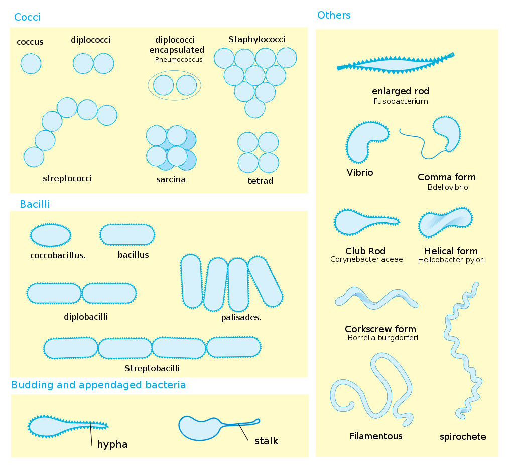

[Back to the main page](../index.md)  
[Back to the VMT index page](./00_vmt_index.md)  

# Veilige Microbiologische Technieken (Safe Microbiological Techniques)

---

## Theory 

### An introduction to SMT
Sterile working (or aseptic working) is the name given to procedures used when working with cell cultures/micro-organisms. It often refers to the techniques used for all cell cultures. In this course, you will learn the basic techniques needed when working with micro-organisms. The concept of Safe Microbiological Techniques has two main objectives:  

- To prevent contamination of cultures in the laboratory by external sources, e.g. the skin, clothing or the environment (air).
- To prevent microbial contamination of laboratory personnel (in this case, this includes students) and the environment.

>All microbial cultures must be classified as contaminated material. If work is being carried out with cell cultures, SMT must be applied at all times.

Caution is required is because:
- There is always the possibility of unknowingly isolating a hazardous, pathogenic bacterium from a relatively harmless cell culture or sample.
- Some individuals are much more susceptible to certain micro-organisms than others and not everyone who is exposed to a particular micro-organism will become ill.  
- Laboratory cultures often contain large quantities of micro-organisms. Such large quantities are often much more hazardous than smaller quantities.  
- Micro-organisms sometimes undergo spontaneous mutations, giving them different properties.  

The most common risk when working with micro-organisms is the risk of penetration via the skin. It is essential that all cuts and wounds are covered with a plaster or that gloves are worn.

### SMT work area
When SMT is applied, the layout and work area of the laboratory must satisfy ML-II requirements. When working to these requirements, the following layout and work instructions are important.  

#### Layout instructions:  

##### Work area
a. The work area must comprise a permanent structure where the work surfaces, floors, walls and doors are finished with a non-absorbent material and where the work surfaces are resistant to water, acids, bases, solvents, disinfectants and disinfectant reagents, and are easy to clean;  

b. The work area must be accessed through a lockable door:  
- With an indication that the area is an ML-II area;
- With the biohazard symbol;  
- With the names and telephone numbers of at least one person responsible for the area and the name and telephone number of the biological safety officer;  

c. It must not be possible to open windows in the work area.  

##### Equipment 
d. An autoclave must be available in the building;  
e. A wash basin and soap dispenser must be located close to the exits to the work area, where both the tap and the dispenser can be operated without having to use the hands;  
f. There must be a coat stand in the work area for work clothing;  
g. There must be a safety cabinet of class-II in the work area.  

##### Miscellaneous  
h. Equipment must be in good condition.  

### Work instructions:

##### General
a. The work area must be kept clean and tidy;  
b. Eating, drinking, smoking, the presence of eating and drinking utensils, applying cosmetics and storing food and drink in the work area must be prohibited;  
c. Pipetting by mouth must prohibited;  
d. The presence of vermin must be excluded;  
e. Access to the work area must be locked if no personnel are in the work area;  
f. Access to the work area must be prohibited to unauthorised personnel;  
g. Work clothing must be disinfected or sterilised before it is washed;  
h. Personal possessions, including clothing that is not being worn, must be stored outside of the work area;  
i. Following written approval from the biological safety officer, the work area may be used for solely ML-I activities in accordance with the instructions specified under 4.1.1.1 or solely for activities involving non-genetically-modified organisms. This must be indicated on the access door. Employees concerned must be informed of this in advance;  
j. Following contamination, contaminated surfaces must be disinfected immediately.  

##### During work  
k. The doors to the work area must be closed whilst work is being carried out;  
l. Work that may produce aerosols must be carried out in a safety cabinet of class II;  
m. Wrist watches and jewellery on the hands and arms must be prohibited;  
n. Appropriate protective clothing must be worn. This clothing must be left behind in the work area once work is complete.  

##### Terminating work
o. All workbench surfaces must be disinfected once work is complete and at the end of every working day;  
p. Hands must be washed with soap before leaving the work area.  

Waste and contaminated material (see also Appendix 5)  
q. All biological waste must be collected in a shatterproof, leak-proof container that can be closed and must be inactivated before disposal;  
r. Material that has been in contact with genetically-modified organisms must be inactivated or disinfected before it is washed, reused or disposed of as waste.  

##### Miscellaneous
s. Animals and plants, modified and unmodified, that are not part of an experiment must not be present in the work area;  
t. The accommodation of animals and plants in the work area must be prohibited;  
u. In the event that work is being carried out with a bioreactor:
- It must have an effective capacity that does not exceed 100 l and a hydrophobic absolute filter in the air outlet of the bioreactor, or equivalent equipment;  
- The bioreactor must be constructed such that the spread of genetically-modified organisms is severely restricted;  
- Sampling of the bioreactor, addition of material to the bioreactor and the transfer of material to another system must be separated such that the formation or spread of aerosols and the contamination of external surfaces are prevented;  
- The contents of the bioreactor may only be discharged once any genetically-modified organisms that may be present have been inactivated in accordance with a validated method;  

v. All work involving animals and plants must be carried out in a safety cabinet of class II;  
w. Gloves must be worn when working with animals;  
x. In the event that work is simultaneously carried out with genetically-modified organisms classified at level ML-I or work is being carried out with non-genetically-modified organisms, the ML-II work instructions must be observed.  

### Microbiology

#### Introduction
Microbiology is the science concerned with the study of the structure and life functions of micro-organisms that can only be viewed with the aid of an (electron) microscope. Fungi, which can sometimes grow into microscopically visible structures, are also considered to be micro-organisms.  
Generally speaking, the following groups are considered to be micro-organisms:  

 - Protozoa
 - Single-cell algae
 - Viruses
 - Fungi, including yeasts
 - Bacteria

In this practical exercise, we will only consider the latter two groups (fungi and bacteria). Both groups are found naturally, in or on animals, in or on plants, in the ground, in water and in the air. They are either feared as pathogenic or are organisms that cause decay, or are sought-after as life forms that can cause useful chemical compounds.

#### Bacteria

##### Bacteria cell wall 
Bacteria are prokaryotic cells with a size of 0.3 to 10 µm. Based on the structure of the cell wall, we can divide bacteria into two clearly defined groups. The difference in cell wall structure can be demonstrated with the gram staining procedure, with the groups being named gram-positive or gram-negative (see also p. 21).
Gram-positive bacteria have a thick wall and no outer membrane, while gram-negative bacteria have a fairly thin wall surrounded by an outer membrane.  
Due to the presence of the outer membrane, gram-negative bacteria are generally less sensitive to antibiotics than gram-positive bacteria. The outer membrane also contains substances that can be highly toxic if they enter the human blood stream. These toxic substances cause a general feeling of illness, fever, nausea, vomiting, shock and, in high concentrations, fatality (e.g. typhoid, paratyphoid).  

##### Capsule 
Some bacteria secrete large quantities of substances into their environment during growth. These substances, typically polysaccharides, may exist as an amorphous loose layer (mucus layer) or as a solid layer (capsule) around the cell. On a solid culture medium, a large mucilaginous colony often indicates the presence of a capsule or mucus layer. This capsule protects the bacteria from immune cells and disinfectants.

##### Endospores 
With bacteria of the genera Bacillus and Clostridium, a new cell can form inside the cell, known as an endospore.
It is formed by the invagination of a cytoplasmic membrane, whereby the DNA and part of the cytoplasm are separated from the rest. The spore is then surrounded by a solid wall that contains waxy substances and has low permeability to water.
These spores are resistant to heat, drought, chemicals (dissolved in water) and UV rays and can survive for lengthy periods in unfavourable conditions.

##### Bacteria morphology
Looked at from a morphological perspective, there is little variation within bacteria. We can distinguish four main forms:

1. The coccus is a spherical cell  
a)Loose cocci  
b)Streptococci. Streptococci are cocci in chains. All streptococci (including diplococci) belong to the genus Streptococcus.  
c)Staphylococci are cocci in random groups (like bunches of grapes). All staphylococci belong to the genus Staphylococcus.  

2. The rod is a cylindrical cell. Rods can have different forms, which can vary from a short rod (virtually spherical) to very long and thread-like. In the case of cocci, we need to look closely at the arrangement of the cells in respect of one another. With rods, the shape of the cell needs to be very precisely described.  

3. The spiral is a spiral-shaped cell. The shape can be a spiral with a number of windings or just one part of a winding. The latter can be compared with an arc-shaped rod, in which case we refer to it as a vibrio.  

4. The spirochete is a thin, corkscrew-like flexible thread.  

Almost all cocci, with a few pathogenic exceptions, are gram-positive. The rods can be both gram-positive (lactic acid bacteria and spore-forming bacteria) and gram-negative (pathogenic intestinal bacteria and anaerobic soil bacteria).  

*
Bacteria display a large diversity of cell morphologies and arrangements. Source: https://en.wikipedia.org/wiki/Bacterial_cellular_morphologies#/media/File:Bacterial_morphology_diagram.svg
*

##### Bacteria colony characteristics
On a favourable culture medium, a single bacteria cell can grow into a macroscopically visible heap of cells. This is known as a colony. If the colony is the result of the growth of a single cell, it is a miniature pure culture and the characteristics of the colony are often essential when it comes to identifying a certain bacterium.
During the practical exercise, the colony characteristics must be described in detail, in addition to the microscopic observations, as otherwise, it will be impossible to reliably determine the bacteria or yeast. The following diagram may be used for a complete description.

|Item|Description|
|:---|:----------|
|Size:|In mm|
|Horizontal colony section|round, oval, lobed|
|Verical colony section|spherical, flat, pressed-in|
|The edge of a colony| smooth, frayed, hairy|
|The colour	of a colony|This can vary, state also shiny, matte or slimy|
|Gram character:|State the percentage of gram-positive cells|
|Cell form:|The form must be described as accurately as possible.|

#### Fungi
Under a microscope, fungi are viewed as long threads (hyphae).  Fungi are multi-cell organisms, but sometimes lack separating walls (septa), such that multiple nuclei are visible in a single cell. The hyphae are typically branched and form a network, the mycelium, which give fungi a woolly appearance once grown. Single-cell fungi are called yeasts.  

Spores are formed on or in the mycelium, which exist for both sexual and asexual reproduction. In favourable conditions, these spores can continue to grow into hyphae or into a mycelium.  

As mycelium can contain vast amounts of spores and as they are usually coloured, they may determine the colour of a fungus. Fungal threads may also, however, contain a pigment that determines the colour. The spores are often formed on special parts of the mycelium. The formation of these structures is extremely important when it comes to determining fungi.  

Yeasts are fungi that no longer have the ability to form a mycelium and have become single-celled. They are also distinguished by:
-Asexual reproduction through bud formation rather than spore formation.
-The ability to execute a number of chemical conversions that are not common to fungi, particularly the fermentation of sugars into ethanol and carbon dioxide.  

Yeasts are principally classified according to their physiological characteristics, namely the (non-)fermentation or (non-)assimilation of sugars, including glucose, fructose, lactose and maltose, or of polyalcohols, including mannitol and sorbitol.  

## SMT objectives

SMT objective: safe work with micro-organisms, GMOs (genetically-modified organisms) and cell lines.  

Rhino viruses, methicillin-resistant Staphylococcus aureus (MRSA), Severe Acute Respiratory Syndrome (SARS virus), multi-resistant Mycobacterium tuberculosis and Human Immunodeficiency Virus (HIV) are examples of biological agents that can cause disease, ranging from a simple cold to the fatal Acquired Immunodeficiency Syndrome (AIDS). When genetically-modified micro-organisms are used in laboratories, it is essential that they are not released into the environment so as to minimise the risk to human health.
Biological agents and GMOs are each divided into four classes of risk; each class has a different approach representing a certain level of risk management.  

>The basic principle when it comes to risk management at all levels is to work according to the rules of Safe Microbiological Techniques (SMT).    

It has been endeavoured to provide the SMT ‘just in time’. These are short experiments designed to demonstrate the consequences of certain actions being performed incorrectly and correctly.  
They also demonstrate the consequences of careless work. The experiments are designed to raise your awareness of the risks involved when working with microbiological material.  

---

## Logbook

>Before every experiment, indicate the objective (consider the SMT objective), the approach (how and when), and your expectation. At the end of the experiment, indicate your conclusion/discussion.  

Do not write an extended theory for every experiment. Provide a brief explanation on what your expectation is based on. For the latter, you can use the answers to the preparatory questions. For this expectation, you should make use of literature.  

For SMT, it is essential to log carefully and clearly so that, in the event of an incident, the type of bacteria involved can be easily traced. It is also important to record how the bacteria were incubated overnight – i.e. the temperature, in a shaking oven or regular oven.  

## Assessment

Completion of the SMT course will be confirmed by a nationally recognised SMT certificate. To receive this, you must satisfy the requirements. These are shown on the assessment form (summarised; logbook, attitude, actions and test passed).  

The test comprises open questions. The material for the test comprises:
- The theory from this practical guide
- The guide (which can be used for the test)
- The film entitled ‘Exactly as it should be’
If the test is not passed during the regular course, one opportunity to resit will be available (scheduled).  

In view of the importance of obtaining the certificate, a retake of the entire course will be arranged in the practical catch-up week at the end of the academic year. 

---

[Back to the main page](../index.md)  
[Back to the VMT index page](./00_vmt_index.md)  

    
