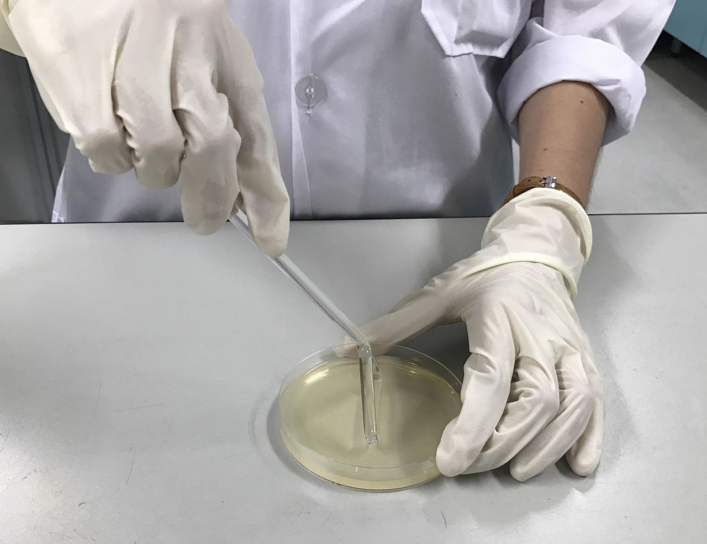

[Back to the main page](../index.md)  
[Back to the VMT index page](./00_vmt_index.md)  

# Veilige Microbiologische Technieken (Safe Microbiological Techniques)

---

## Experiment 3: Determination of number of cultivable micro-organisms (= germ count) in Yakult.

Techniques: 
- Medium preparation, sterile pipetting, plate pouring, gram staining  
- Mix/pour plate method, streak plate method or spread plate method

The germ count is the number of cultivable micro-organisms in a product. The germ count can be determined in a number of ways. In this experiment, we’ll use the mix or pour plate method and the streak plate or spread plate method. As we do not know how many cultivable micro-organisms are in our product, we’ll create a dilution series. These dilutions are created such that at least one of the dilutions contains 30 - 300 (mix or pour plate method) and that at least one of the dilutions contains 300 - 3000 (streak or spread plate method) micro-organisms per ml. Before the experiment can commence, the medium must be prepared.  

### Preparatory questions  
1. How many cultivable micro-organisms do you expect to encounter in 1 ml of Yakult?  
2. Which micro-organisms do you expect to encounter in Yakult?  
3. What do you expect to see in the gram stain of that micro-organism?  
4. Under which category will the micro-organisms in Yakult come – 1, 2, 3 or 4? And why (see guide: handboekggoHanze_student.pdf on Bb)?  

Note that this experiment comprises several parts – preparation of media, plate pouring, dilution series, streak and mixing method and gram staining. Include a complete flowchart in your action plan that shows the links between all of these parts.

### Media preparation 
Fully composed powder-form media, which are available commercially, are widely used. In this case, it is enough for the powder to be dissolved in water (in the prescribed quantities). In other cases, the medium must be prepared by weighing each component individually (on the upper weigher) and adding water up to the requisite quantity.
The medium is usually prepared in infusion flasks. These are glass flasks with a metal cap and a rubber seal. The infusion flasks should firstly be filled with a large quantity of water. The weighed powder should then be poured in as far as possible and dissolved, before the flask is filled to the required volume. The solution must then be left to stand for around fifteen minutes to allow the agar to swell, followed by sterilisation with the aid of an autoclave. The cap must be screwed on until the flask is fully sealed, then turned back a half turn to allow the air that is released during boiling to escape. After sterilisation, the cap must be immediately tightened as soon as the autoclave is opened and the agar distributed by swirling the flask around horizontally. The hot liquid is put to one side in an oven at 55°C and can be poured.   
You do not need to do the above as flasks of medium will be available for you in the 55°C oven.  

### Plate pouring 
Culture media are poured into sterile plastic petri dishes. In order to prevent condensation in the cap, the medium is always poured after it has been cooled to around 55°C in an oven at 55°C following sterilisation. See [this movie](https://www.youtube.com/watch?v=TQqPQSzRtcA) as an example.  
To prevent infection from the air, always work within 15 cm of a brightly burning flame so that the air is forced upwards. The cap should be lifted as little as possible during pouring as moisture is often pressed out when agar coagulates. To obtain isolated colonies, the surface of the agar must be dry. After inoculation, the dish must, therefore, be turned over.  
In is a good idea to place the dishes upside down in the incubator to prevent condensed water vapour from the culture medium from dripping onto the agar. Condensation can be a source of contamination.  

#### Execution
Pour several NA (nutrient agar) plates. The NA agar will be ready for you in 100 ml flasks in the 55°C oven.  
-Swirl the flask of medium before pouring to ensure that the agar is thoroughly mixed with the rest of the medium (agar has the tendency to settle if the medium is left to stand for a lengthy period of time).
-Pour five or six plates within 15 cm of a burning flame so that each petri dish contains around 15 - 20 ml of nutrient agar. 
Do not wait for too long before pouring as coagulated agar will not pour.  

- Immediately after pouring, use one of these plates for experiment-4: Contamination through condensation. To this end, seal the culture medium with a cap so that plenty of condensation can form in the cap.  
- Allow the other poured culture media to coagulate next to the brightly burning flame.  
- Once they have coagulated, seal them with the caps and dry the plates upside down in a 55°C oven or by allowing the culture media to stand next to the open flame for a lengthy period of time.  

### Dilution series
#### Execution
A new sterile pipette must be used each time when preparing the dilution series (Figure 3.2). Make sure to homogenise well before pipetting. All actions must be carried out within 15 cm of a brightly burning flame. The following are the steps for each sterile pipette action:  
- Take the pipette in your dominant hand (our example uses the right hand)  
- Take the tube from which you wish to take liquid with the left hand  
- Remove the cap from the tube with the little finger of the right hand  
- Briefly run the neck of the tube through the flame twice  
- Take the liquid/culture from the tube with the pipette  
- Flame the neck of the tube in the flame twice again and seal the tube with the cap  
- Put the tube back in the rack  
- Take the tube with the next medium in the left hand  
- Remove the cap (right little finger)  
- Flame the neck of the tube in the flame as outlined above  
- Pipette the culture into the medium  
- Flame the tube again and seal with the cap  

See [this movie](https://www.youtube.com/watch?v=bRadiLXkqoU) for a brief overview of the inoculation of bacteria in liquid culture.  

Prepare a dilution series from an undiluted sample (Yakult) as follows:  

Dilution series:  
- Fill six sterile test tubes with 9 ml of physiological salt (exactly).  
- From an undiluted sample (= Yakult), pipette 1 ml into a test tube, completely sterile, in which there are 9 ml of physiological saline solution (dilution $10^{-1}$ =10x).  
- From dilution $10^{-1}$, pipette 1 ml into a test tube, completely sterile, in which there are 9 ml of physiological saline solution
(dilution $10^{-2}$ =100x).  
- From dilution $10^{-2}$, pipette 1 ml into a test tube, completely sterile, in which there are 9 ml of physiological saline solution
(dilution $10^{-3}$ =1000x).  
- Continue doing this until you reach a dilution of $10^{-6}$ (=1,000,000x)  

- Using dilutions $10^{-3}$ to $10^{-6}$, create a mix plate (3.3.4) and a spread plate (3.3.5).  

### Mix or pour plate method

#### Execution
- Pipette 1 ml of the dilution being analysed into sterile petri dishes (without culture medium).
- Add around 15 ml of liquid NA medium cooled to 45°C to each petri dish.  
- Mix carefully by swirling the plate around three times in a clockwise direction, followed by three times in the opposite direction.  
- Leave to coagulate next to the flame.  
- Incubate the plates upside down for two days in the incubator at 37°C.  
- Count the colonies on the plates, with the number of colonies between 30 and 300.  

### Streak or spread plate method

#### Execution  
- Pipette 0.1 ml of the dilution being analysed onto the previously poured NA culture media.  
- Use a sterile Drigalski spatula (Figure 3.3) to spread the agar evenly until all liquid has been absorbed into the culture medium.  
- Incubate the plates upside down for two days in the incubator at 37°C.  
- Count the colonies on the plates, with the number of colonies between 30 and 300.  

#### Use a Drigalski spatula
Reusable metal Drigalski spatulas (cell spreader) are used for this experiment. Between spatulas of different culture media, the Drigalski spatula must be disinfected with 70% ethanol and run through the flame. A number of safety aspects must be borne in mind here:  
- Do not place the beaker of ethanol or Drigalski spatula too close to the flame of the Bunsen burner.  
- Briefly run the Drigalski spatula with ethanol through the flame and allow the ethanol to evaporate/burn next to the flame. Keeping the Drigalski spatula in the flame for too long will cause it to become too hot.  
- Never place the Drigalski spatula back in the ethanol if it still burning.  

*
Use of a cell spreader. Source: https://en.wikipedia.org/wiki/Cell_spreader#/media/File:Uses_of_a_cell_spreader.jpg
*

>Assignment:  
Create a table with the number of colonies from the pour method and mix method for the different dilutions.
Calculate the germ count.

---

[Back to the main page](../index.md)  
[Back to the VMT index page](./00_vmt_index.md)  

    
