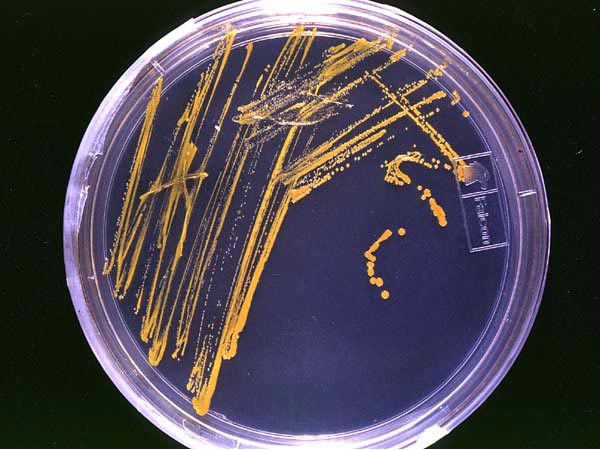



[Back to the main page](../index.md)  
[Back to the VMT index page](./00_vmt_index.md)  

# Veilige Microbiologische Technieken (Safe Microbiological Techniques)

---

## Experiment 8: Axenic cultivation

‘Everything is everywhere, but the environment selects’  
Accumulation is used to isolate certain micro-organisms. Accumulation consists of incubation of the material from which the micro-organism needs to be isolated in such an environment that cultivation conditions are ideal for the micro-organism being isolated and are not ideal for the other micro-organisms present. The rapid growth of the micro-organism being isolated will cause the other organisms to be supplanted.  

Isolation of bacteria from mixed cultures.  
When multiple bacteria occur in a liquid culture, they can be separated from one another. Selective accumulation is important in this, followed by streaking. 
The objective of streaking is to obtain loose colonies. Streaking of micro-organisms should always take place within 15 cm of a brightly burning Bunsen burner flame. Bacteria can be transferred from the bouillon to the NA agar with a cooled and sterile inoculation loop. Take as few bacteria as possible with the loop and streak them over the culture medium. Use the entire culture medium in such a way that concentration of bacteria gradually decreases. To this end, make sure to flame the inoculation loop between steps 1, 2, 3 and (if applicable) 4. This will cause loose colonies to form on the NA agar after incubation at 37°C. A loose colony originates from a single bacterium. Once you have carried out streaking of a single loose colony three times, you will have a pure culture.  

*
An axenic culture. Source: https://en.wikipedia.org/wiki/Axenic
*

#### Preparatory questions:
1. What is the basic form of the E. coli and Bacillus subtilis bacteria?  
2. What gram character do the E. coli and Bacillus subtilis bacteria have?  
3. At what point is it recommended that you check the purity of a GMO bacteria strain (see paragraph 6.5 in the guide: handboekggoHanze_student.pdf on Bb)?  

#### Execution:
Day 1  
- Using a properly flamed inoculation loop, take a drop of mixture culture.  
- Using the streaking technique, streak the drop onto an NA culture medium.  
- Incubate overnight at a temperature of 37°C  

Day 2  
- Assess the growth on the culture medium and describe the colony morphologies  
- Streak two different colonies each onto a fresh NA culture medium using the streaking technique  
- Incubate overnight at a temperature of 37°C  

Day 3  
- Assess the growth on the culture media  
- Create a gram preparation of both types of colony  
- Assess the gram staining  

#### Question:  
What can go wrong when streaking a bacteria colony from one fixed medium to another?

>Assignment:  
Take a photograph of your incubated culture medium.
Create a gram stain of one of the loose colonies. Then, take a photograph or make a drawing.

---

[Back to the main page](../index.md)  
[Back to the VMT index page](./00_vmt_index.md)  

