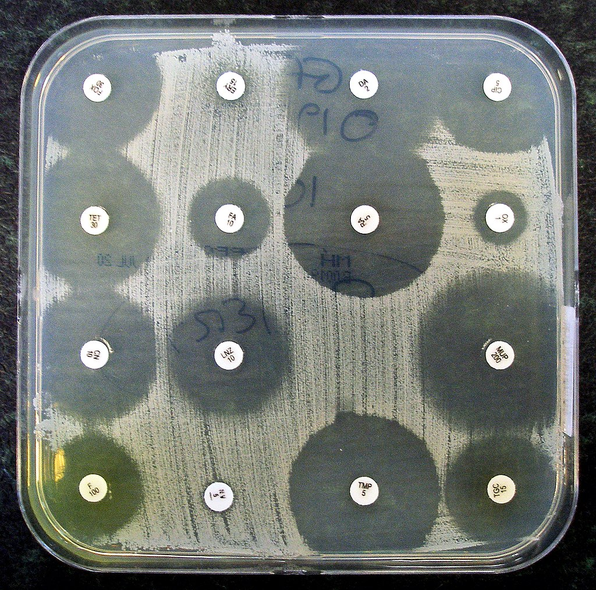

[Back to the main page](../index.md)  
[Back to the VMT index page](./00_vmt_index.md)  

# Veilige Microbiologische Technieken (Safe Microbiological Techniques)

---

## Experiment 9: Antibiotic Sensitivity Test

>Note that this experiment involves working with antibiotics. If you are allergic to antibiotics in any way, you must always report this to the lecturers in the laboratory and make sure that you carry an EpiPen if you need to.  
	
Antibiotics and/or chemotherapeutics are generally used to effectively combat diseases caused by micro-organisms. When working systematically, you firstly isolate the causative micro-organisms and then determine the antibiotics and chemotherapeutics that the particular micro-organism is sensitive to.
By placing tablets containing different antibiotics on a suitable agar medium (in which the micro-organism being tested is suspended), growth inhibition zones can occur after incubation (Figure 3.6). These are clear areas around the tablets containing antibiotic to which the micro-organism is sensitive (agar diffusion method). The remainder of the medium will become turbid through growth. The diameter of the zone is a measure of the sensitivity.  

*
A sensitivity test. Source: https://en.wikipedia.org/wiki/Antibiotic_sensitivity_testing#/media/File:Antibiotic_sensitivity_test.jpg
*

See the picture above for the result of a sensitivity test. By placing tablets containing different antibiotics on a suitable agar medium (in which the micro-organism being tested is suspended), growth inhibition zones can occur after incubation. The diameter of the zone is a measure of the sensitivity of the micro-organism to the antibiotics.

##### Preparatory questions  
1. Describe the mode of action for the antibiotics used (how do the antibiotics inhibit growth of the bacteria)?  
2. For the antibiotics used, find out whether the application is specific for gram-negative and/or gram-positive bacteria.  

#### Execution
- Select a bacteria colony from a blood agar plate from experiment-2. Create a gram stain of this colony.  
- Create a moderately turbid suspension of this isolated colony in 2 ml of sterile physiological salt.  
- Mix this 2 ml suspension in a petri dish with 15 ml of liquid nutrient agar at 45°C.  
- Once the agar has coagulated, use sterile tweezers to place a few tablets (four – teracylin, streptomycin, amoxicillin and ampicillin) on the plate. Ensure that the tablets make good contact with the culture medium (press lightly).  
- Place the plate in the refrigerator for one hour to ensure better diffusion.  
- Then, incubate for one day at 37°C.  

>Assignment:  
Measure the diameters of the growth inhibition zones and take a photograph of the plate with its growth inhibition zones. Include the result of the gram staining. Are your results in line with your expectations?

---

[Back to the main page](../index.md)  
[Back to the VMT index page](./00_vmt_index.md)  

    
