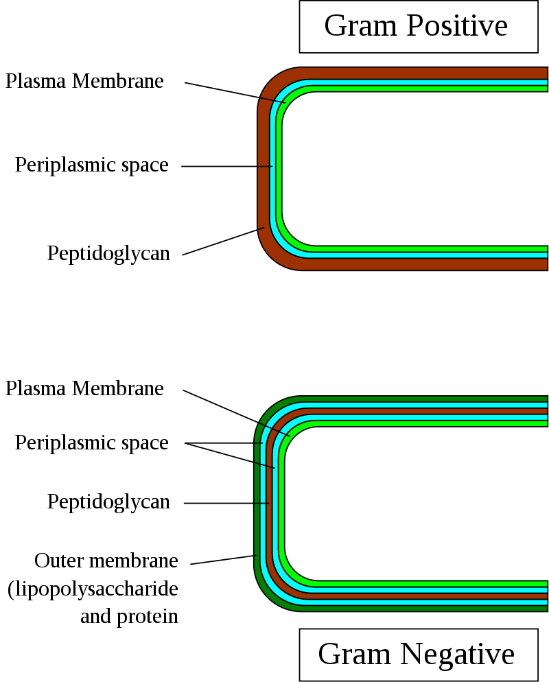
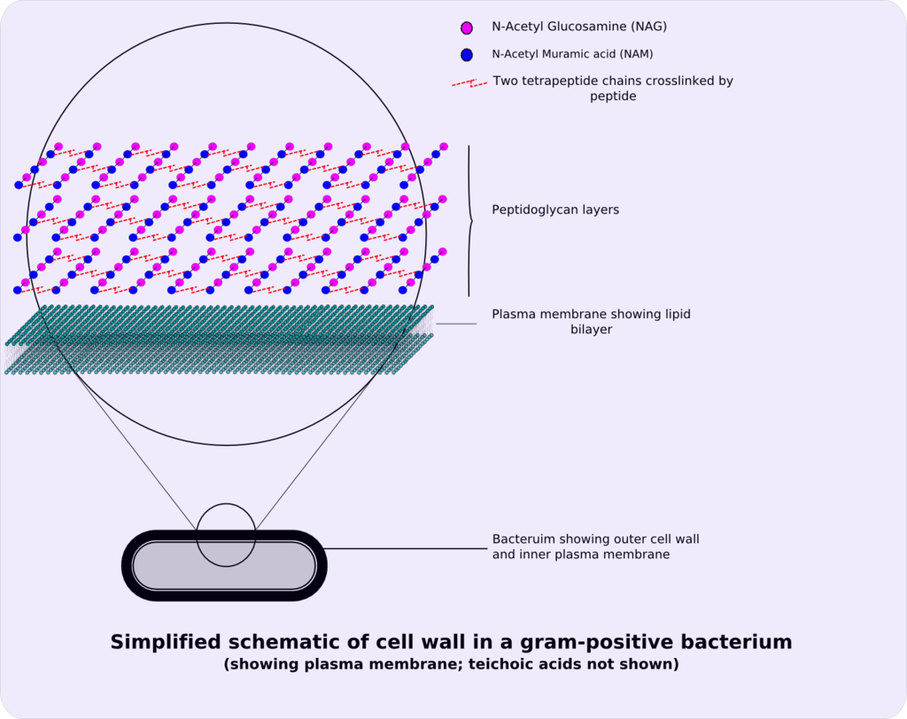
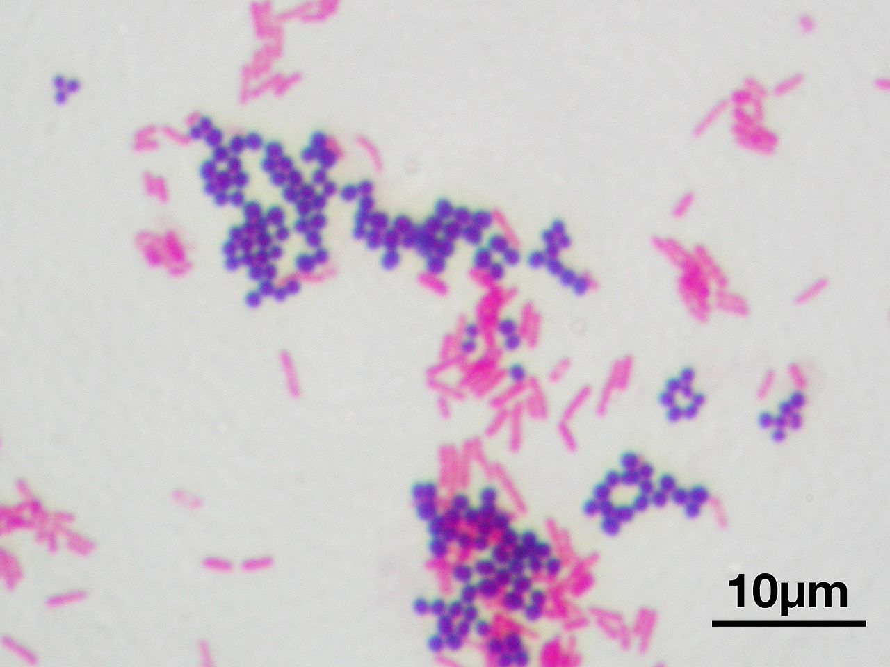



[Back to the main page](../index.md)  
[Back to the VMT index page](./00_vmt_index.md)  

# Veilige Microbiologische Technieken (Safe Microbiological Techniques)

---

## Experiment 10: Gram staining

Gram staining is often used to classify micro-organisms into groups. By staining, the bacteria can be divided into gram-positive and gram-negative bacteria.
The cells are stained with a crystal violet iodine complex, bleached with alcohol and post-stained with aqueous fuchsin or safranin. In the case of gram-positive bacteria, the crystal violet iodine complex is not washed away by the alcohol – these cells turn blue/purple. Gram-negative cells lose this colour due to the alcohol; by post-staining with safranin, they will turn red/pink. The difference between gram-positive and gram-negative bacteria is in the composition of the cell wall. 

Many layers of mucopeptide are found in gram-positive cell walls, with multiple peptide cross-links. Teichonic acids are embedded in gram-positive cell walls. 

*
Difference between Gram-positive and Gram-negative cell membranes and cell walls. Source: https://en.wikipedia.org/wiki/Gram-positive_bacteria#/media/File:Gram-Cell-wall.svg
*

There is only one layer of mucopeptide in gram-negative cell walls, with very few cross-links. The cell wall of a gram-negative cell is, therefore, more vulnerable than that of a gram-positive cell. The outside of the mucopeptide has an ‘outer membrane’, a layer comprising phosphilipids, proteins and lipopolysaccharide. The lipopolysaccharide part is toxic and is known as endotoxin, responsible for fever and headaches. The endotoxin is highly heat stable and can withstand heat better than the bacteria themselves, thus can also be found in sterilised glassware. This can be a problem when preparing infusion fluids, which must be specially prepared in endotoxin-free (pyrogen-free) glassware. Thanks to the presence of the outer membrane, gram-negative bacteria are less sensitive to penicillin than gram-positive counterparts. 

*
Structure of the Gram-positive cell wall. Source: https://en.wikipedia.org/wiki/Gram-positive_bacteria#/media/File:Gram-positive_cellwall-schematic.png
* 

 

*
Gram stain of mixed *Staphylococcus aureus* (gram-positive cocci, in purple) and *Escherichia coli* (gram-negative bacilli, in red). Source: https://en.wikipedia.org/wiki/Gram_stain#/media/File:Gram_stain_01.jpg
*

#### Execution:
Depending on the starting material, the bacteria are placed on a grease-free microscope slide and fixed in place.

a. Colony material is placed on a grease-free microscope slide with a drop of 10% formalin using an inoculation loop.  
- Suspend the colony material in the formalin over an area approximately the size of a one Euro coin; the suspension must not be too thick, but slightly turbid.  
- Dry the preparation in the air; if necessary, place it on a heat plate at a maximum temperature of 50°C.  

b. A culture in liquid medium is streaked directly onto a grease-free microscope slide  
- Add a small drop to the microscope slide  
- Distribute the culture over the slide by streaking it over an area approximately the size of a one Euro coin  
- Dry the preparation in the air; if necessary, place it on a heat plate at a maximum temperature of 50°C.  

The dried preparation is passed through the gram series.  

- Tray 1:	5 minutes fixation in 96% ethanol  
- Tray 2:	1 minute in a filtered, aqueous crystal violet solution  
- Tray 3:	Tap water, rinse the preparation thoroughly and allow to drip drain (otherwise the iodine solution will become diluted)  
- Tray 4:	1 minute in iodine solution (lugol)  
- Tray 5:	1 minute in 99% ethanol  
- Tray 6:	Tap water, rinse the preparation thoroughly and allow to drip drain (otherwise the alkaline fuchsin solution will become diluted)  
- Tray 7:	1 minute in alkaline fuchsin solution  
- Tray 8:	Tap water, rinse thoroughly  

- Dry the preparation between filter paper  
- Observe the preparation with a 100x lens (oil immersion lens)  

> During the SMT course, each student must create at least four gram preparations, assess them and describe them in the logbook in relation to the corresponding experiment. For some experiments, it is clearly stated that gram staining must be carried out.  

---

[Back to the main page](../index.md)  
[Back to the VMT index page](./00_vmt_index.md)  

