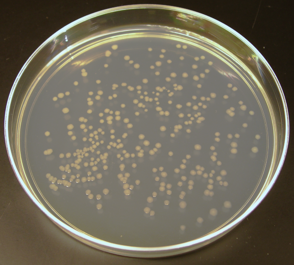
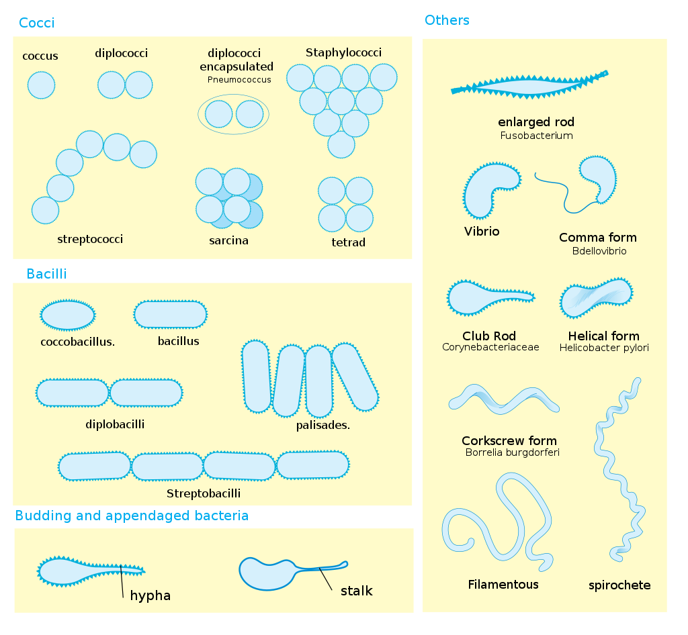

[Back to the main page](../index.md)

# Veilige Microbiologische Technieken (Safe Microbiological Techniques)

---

## Learning outcomes
- Learning to work safely with bacteria according to Dutch legislation laws.

---

# Safe Microbiological Techniques (SMT)

## 1. Theory 

### 1.1. An introduction to SMT
Sterile working (or aseptic working) is the name given to procedures used when working with cell cultures/micro-organisms. It often refers to the techniques used for all cell cultures. In this course, you will learn the basic techniques needed when working with micro-organisms. The concept of Safe Microbiological Techniques has two main objectives:  

- To prevent contamination of cultures in the laboratory by external sources, e.g. the skin, clothing or the environment (air).
- To prevent microbial contamination of laboratory personnel (in this case, this includes students) and the environment.

>All microbial cultures must be classified as contaminated material. If work is being carried out with cell cultures, SMT must be applied at all times.

Caution is required is because:
- There is always the possibility of unknowingly isolating a hazardous, pathogenic bacterium from a relatively harmless cell culture or sample.
- Some individuals are much more susceptible to certain micro-organisms than others and not everyone who is exposed to a particular micro-organism will become ill.  
- Laboratory cultures often contain large quantities of micro-organisms. Such large quantities are often much more hazardous than smaller quantities.  
- Micro-organisms sometimes undergo spontaneous mutations, giving them different properties.  

The most common risk when working with micro-organisms is the risk of penetration via the skin. It is essential that all cuts and wounds are covered with a plaster or that gloves are worn.

### 1.2. SMT work area
When SMT is applied, the layout and work area of the laboratory must satisfy ML-II requirements. When working to these requirements, the following layout and work instructions are important.  

#### Layout instructions:  

**Work area**
a. The work area must comprise a permanent structure where the work surfaces, floors, walls and doors are finished with a non-absorbent material and where the work surfaces are resistant to water, acids, bases, solvents, disinfectants and disinfectant reagents, and are easy to clean;  

b. The work area must be accessed through a lockable door:  
- With an indication that the area is an ML-II area;
- With the biohazard symbol;  
- With the names and telephone numbers of at least one person responsible for the area and the name and telephone number of the biological safety officer;  

c. It must not be possible to open windows in the work area.  

**Equipment**  
d. An autoclave must be available in the building;  
e. A wash basin and soap dispenser must be located close to the exits to the work area, where both the tap and the dispenser can be operated without having to use the hands;  
f. There must be a coat stand in the work area for work clothing;  
g. There must be a safety cabinet of class-II in the work area.  

**Miscellaneous**  
h. Equipment must be in good condition.  

#### Work instructions:

**General**  
a. The work area must be kept clean and tidy;  
b. Eating, drinking, smoking, the presence of eating and drinking utensils, applying cosmetics and storing food and drink in the work area must be prohibited;  
c. Pipetting by mouth must prohibited;  
d. The presence of vermin must be excluded;  
e. Access to the work area must be locked if no personnel are in the work area;  
f. Access to the work area must be prohibited to unauthorised personnel;  
g. Work clothing must be disinfected or sterilised before it is washed;  
h. Personal possessions, including clothing that is not being worn, must be stored outside of the work area;  
i. Following written approval from the biological safety officer, the work area may be used for solely ML-I activities in accordance with the instructions specified under 4.1.1.1 or solely for activities involving non-genetically-modified organisms. This must be indicated on the access door. Employees concerned must be informed of this in advance;  
j. Following contamination, contaminated surfaces must be disinfected immediately.  

**During work**  
k. The doors to the work area must be closed whilst work is being carried out;  
l. Work that may produce aerosols must be carried out in a safety cabinet of class II;  
m. Wrist watches and jewellery on the hands and arms must be prohibited;  
n. Appropriate protective clothing must be worn. This clothing must be left behind in the work area once work is complete.  

**Terminating work**  
o. All workbench surfaces must be disinfected once work is complete and at the end of every working day;  
p. Hands must be washed with soap before leaving the work area.  

Waste and contaminated material (see also Appendix 5)  
q. All biological waste must be collected in a shatterproof, leak-proof container that can be closed and must be inactivated before disposal;  
r. Material that has been in contact with genetically-modified organisms must be inactivated or disinfected before it is washed, reused or disposed of as waste.  

**Miscellaneous**  
s. Animals and plants, modified and unmodified, that are not part of an experiment must not be present in the work area;  
t. The accommodation of animals and plants in the work area must be prohibited;  
u. In the event that work is being carried out with a bioreactor:
- It must have an effective capacity that does not exceed 100 l and a hydrophobic absolute filter in the air outlet of the bioreactor, or equivalent equipment;  
- The bioreactor must be constructed such that the spread of genetically-modified organisms is severely restricted;  
- Sampling of the bioreactor, addition of material to the bioreactor and the transfer of material to another system must be separated such that the formation or spread of aerosols and the contamination of external surfaces are prevented;  
- The contents of the bioreactor may only be discharged once any genetically-modified organisms that may be present have been inactivated in accordance with a validated method;  

v. All work involving animals and plants must be carried out in a safety cabinet of class II;  
w. Gloves must be worn when working with animals;  
x. In the event that work is simultaneously carried out with genetically-modified organisms classified at level ML-I or work is being carried out with non-genetically-modified organisms, the ML-II work instructions must be observed.  

### 1.3. Microbiology

#### Introduction
Microbiology is the science concerned with the study of the structure and life functions of micro-organisms that can only be viewed with the aid of an (electron) microscope. Fungi, which can sometimes grow into microscopically visible structures, are also considered to be micro-organisms.  
Generally speaking, the following groups are considered to be micro-organisms:  

 - Protozoa
 - Single-cell algae
 - Viruses
 - Fungi, including yeasts
 - Bacteria

In this practical exercise, we will only consider the latter two groups (fungi and bacteria). Both groups are found naturally, in or on animals, in or on plants, in the ground, in water and in the air. They are either feared as pathogenic or are organisms that cause decay, or are sought-after as life forms that can cause useful chemical compounds.

#### Bacteria

**Bacteria cell wall**  
Bacteria are prokaryotic cells with a size of 0.3 to 10 µm. Based on the structure of the cell wall, we can divide bacteria into two clearly defined groups. The difference in cell wall structure can be demonstrated with the gram staining procedure, with the groups being named gram-positive or gram-negative (see also p. 21).
Gram-positive bacteria have a thick wall and no outer membrane, while gram-negative bacteria have a fairly thin wall surrounded by an outer membrane.  
Due to the presence of the outer membrane, gram-negative bacteria are generally less sensitive to antibiotics than gram-positive bacteria. The outer membrane also contains substances that can be highly toxic if they enter the human blood stream. These toxic substances cause a general feeling of illness, fever, nausea, vomiting, shock and, in high concentrations, fatality (e.g. typhoid, paratyphoid).  

**Capsule**  
Some bacteria secrete large quantities of substances into their environment during growth. These substances, typically polysaccharides, may exist as an amorphous loose layer (mucus layer) or as a solid layer (capsule) around the cell. On a solid culture medium, a large mucilaginous colony often indicates the presence of a capsule or mucus layer. This capsule protects the bacteria from immune cells and disinfectants.

**Endospores**  
With bacteria of the genera Bacillus and Clostridium, a new cell can form inside the cell, known as an endospore.
It is formed by the invagination of a cytoplasmic membrane, whereby the DNA and part of the cytoplasm are separated from the rest. The spore is then surrounded by a solid wall that contains waxy substances and has low permeability to water.
These spores are resistant to heat, drought, chemicals (dissolved in water) and UV rays and can survive for lengthy periods in unfavourable conditions.

**Bacteria morphology**  
Looked at from a morphological perspective, there is little variation within bacteria. We can distinguish four main forms:

1. The coccus is a spherical cell  
a)Loose cocci  
b)Streptococci. Streptococci are cocci in chains. All streptococci (including diplococci) belong to the genus Streptococcus.  
c)Staphylococci are cocci in random groups (like bunches of grapes). All staphylococci belong to the genus Staphylococcus.  

2. The rod is a cylindrical cell. Rods can have different forms, which can vary from a short rod (virtually spherical) to very long and thread-like. In the case of cocci, we need to look closely at the arrangement of the cells in respect of one another. With rods, the shape of the cell needs to be very precisely described.  

3. The spiral is a spiral-shaped cell. The shape can be a spiral with a number of windings or just one part of a winding. The latter can be compared with an arc-shaped rod, in which case we refer to it as a vibrio.  

4. The spirochete is a thin, corkscrew-like flexible thread.  

Almost all cocci, with a few pathogenic exceptions, are gram-positive. The rods can be both gram-positive (lactic acid bacteria and spore-forming bacteria) and gram-negative (pathogenic intestinal bacteria and anaerobic soil bacteria).  

*
Bacteria display a large diversity of cell morphologies and arrangements. Source: https://en.wikipedia.org/wiki/Bacterial_cellular_morphologies#/media/File:Bacterial_morphology_diagram.svg
*

**Bacteria colony characteristics**
On a favourable culture medium, a single bacteria cell can grow into a macroscopically visible heap of cells. This is known as a colony. If the colony is the result of the growth of a single cell, it is a miniature pure culture and the characteristics of the colony are often essential when it comes to identifying a certain bacterium.
During the practical exercise, the colony characteristics must be described in detail, in addition to the microscopic observations, as otherwise, it will be impossible to reliably determine the bacteria or yeast. The following diagram may be used for a complete description.

|Item|Description|
|:---|:----------|
|Size:|In mm|
|Horizontal colony section|round, oval, lobed|
|Verical colony section|spherical, flat, pressed-in|
|The edge of a colony| smooth, frayed, hairy|
|The colour	of a colony|This can vary, state also shiny, matte or slimy|
|Gram character:|State the percentage of gram-positive cells|
|Cell form:|The form must be described as accurately as possible.|

#### Fungi
Under a microscope, fungi are viewed as long threads (hyphae).  Fungi are multi-cell organisms, but sometimes lack separating walls (septa), such that multiple nuclei are visible in a single cell. The hyphae are typically branched and form a network, the mycelium, which give fungi a woolly appearance once grown. Single-cell fungi are called yeasts.  

Spores are formed on or in the mycelium, which exist for both sexual and asexual reproduction. In favourable conditions, these spores can continue to grow into hyphae or into a mycelium.  

As mycelium can contain vast amounts of spores and as they are usually coloured, they may determine the colour of a fungus. Fungal threads may also, however, contain a pigment that determines the colour. The spores are often formed on special parts of the mycelium. The formation of these structures is extremely important when it comes to determining fungi.  

Yeasts are fungi that no longer have the ability to form a mycelium and have become single-celled. They are also distinguished by:
-Asexual reproduction through bud formation rather than spore formation.
-The ability to execute a number of chemical conversions that are not common to fungi, particularly the fermentation of sugars into ethanol and carbon dioxide.  

Yeasts are principally classified according to their physiological characteristics, namely the (non-)fermentation or (non-)assimilation of sugars, including glucose, fructose, lactose and maltose, or of polyalcohols, including mannitol and sorbitol.  

## 1.4. SMT objectives

SMT objective: safe work with micro-organisms, GMOs (genetically-modified organisms) and cell lines.  

Rhino viruses, methicillin-resistant Staphylococcus aureus (MRSA), Severe Acute Respiratory Syndrome (SARS virus), multi-resistant Mycobacterium tuberculosis and Human Immunodeficiency Virus (HIV) are examples of biological agents that can cause disease, ranging from a simple cold to the fatal Acquired Immunodeficiency Syndrome (AIDS). When genetically-modified micro-organisms are used in laboratories, it is essential that they are not released into the environment so as to minimise the risk to human health.
Biological agents and GMOs are each divided into four classes of risk; each class has a different approach representing a certain level of risk management.  

>The basic principle when it comes to risk management at all levels is to work according to the rules of Safe Microbiological Techniques (SMT).    

It has been endeavoured to provide the SMT ‘just in time’. These are short experiments designed to demonstrate the consequences of certain actions being performed incorrectly and correctly.  
They also demonstrate the consequences of careless work. The experiments are designed to raise your awareness of the risks involved when working with microbiological material.  

---

## 1.5. Logbook

>Before every experiment, indicate the objective (consider the SMT objective), the approach (how and when), and your expectation. At the end of the experiment, indicate your conclusion/discussion.  

Do not write an extended theory for every experiment. Provide a brief explanation on what your expectation is based on. For the latter, you can use the answers to the preparatory questions. For this expectation, you should make use of literature.  

For SMT, it is essential to log carefully and clearly so that, in the event of an incident, the type of bacteria involved can be easily traced. It is also important to record how the bacteria were incubated overnight – i.e. the temperature, in a shaking oven or regular oven.  

## 1.6. Assessment

Completion of the SMT course will be confirmed by a nationally recognised SMT certificate. To receive this, you must satisfy the requirements. These are shown on the assessment form (summarised; logbook, attitude, actions and test passed).  

The test comprises open questions. The material for the test comprises:
- The theory from this practical guide
- The guide (which can be used for the test)
- The film entitled ‘Exactly as it should be’
If the test is not passed during the regular course, one opportunity to resit will be available (scheduled).  

In view of the importance of obtaining the certificate, a retake of the entire course will be arranged in the practical catch-up week at the end of the academic year.  

---

## 2. SMT programme

### Day 1: (Start) 

1.SMT film entitled ‘Exactly as it should be’.  
2.Discussion about film and SMT programme.  

#### Start:  
3.SMT-1: Disinfection of surfaces  
4.SMT-2: Influence of washing and disinfection on skin flora  
5.SMT-3: Determination of a number of cultivable micro-organisms (dilution series, medium preparation, pour plates)  
6.SMT-4: Condensation contamination  
7.SMT-5: Air sedimentation. TIP: Use first!  
8.SMT-7 Use and effect of hot inoculation loops  
9.SMT-8 Streaking  

### Day 2: (Continuation)

#### Completion:
1.Assessment of SMT-1: no/little/lots of growth? Which disinfectant is best (compared to the control)?  
2.Assessment of SMT-2: count and describe the colonies – are the results in line with the expectations?   
3.Assessment of SMT-4: condensation contamination.  

#### Start:
4.SMT-6: Incorrect flaming with quantity of solid culture  
5.SMT-9: Sensitivity test  

#### Continuation:  
6.SMT-7: Use and effect of hot inoculation loops  
7.SMT-8 Assess streaking and continue pure cultivation  

(Gram staining: at own discretion)  

### Day 3: (Results)

#### Completion:
1.SMT-3: Count mix and spread plates with between 30 and 300 micro-organisms.  
How many micro-organisms did the original product contain?  
2.SMT-5: Assessment of air sedimentation. Count and describe the colonies.  
3.SMT-6: incorrect flaming with quantity of solid culture.  
4.SMT-7 Use and effect of hot inoculation loops.  
5.SMT-8 Assessment of streaking.  
6.SMT-9: Assessment of sensitivity test.  
7.SMT debrief.  
8.Complete SMT test.  
9.Clean up all cultures and materials  
10.Complete logbook  

Gram staining of: total of min. four different colonies  

Collect all plastic waste in autoclave bags and ask the lecturer for assistance with autoclaving. All glassware that has been in contact with micro-organisms must also be autoclaved. No glassware should be placed in the bags. Glassware should be placed in the glass container once any micro-organisms present have been inactivated.  

---

## 3. Experiments

### 3.1. SMT-1: Disinfection of surfaces  

Every practical session must start and end with disinfection of the bench surface using 70% ethanol Would it not be better to use Amochlor or green soap?  
The disinfectant effect of different disinfectant solutions is compared.  

#### Execution
Disinfect three tiles thoroughly with 70% ethanol. Once the ethanol has evaporated, apply 0.1 ml of E. coli culture to the tiles using a Pasteur pipette.  
Then, apply 0.5 ml of Amochlor to one tile using a Gilson pipette and 0.5 ml of green soap to the second tile followed by an excess of ethanol to the third tile. The suspensions must be applied to the tiles separately from one another. The liquids are then mixed on the tiles with three sterile cotton applicators. Mix and apply tile by tile, otherwise there won’t be enough time.  

Solutions to be tested:	 
1. Amochlor 
2. Green soap (diluted 1:100)
3. Ethanol 70%

- Moisten a sterile cotton applicator with nutrient both (= liquid medium) and press out any abundant liquid.  
- Using the moistened sterile cotton applicator, take a sample as quickly as possible at 0 min. (= t0 immediately after mixing disinfectant and E. coli), after 2 min. (= t1), after 8 min. (= t2) and after 16 min. (= t3).  
- Transfer the cotton applicator to a culture tube with nutrient both.  
- Inoculate a tube with a cotton applicator moistened with nutrient broth that has not been in contact with the culture (= sterility control)  
- Inoculate a tube with a cotton applicator with E. coli cells from the culture (= growth control).  
- Inoculate overnight at a temperature of 37°C and assess for growth.  

#### Preparatory questions

1. What is the benefit of the two controls?  
2. How many tubes of nutrient both are required for this experiment (practical preparation)?  
3. If there is a spillage in a GMO (genetically-modified organism) area, which disinfectant can be used to disinfect the bench (search in this guide:  handboekggoHanze_student.pdf on Bb)?  

>Assignment: Create a table with the results achieved. Specify your conclusion at the end.

### 3.2. SMT-2: Influence of washing and disinfection on skin flora

Once you have finished your experiment or leave the SMT area for another reason, you must wash your hands. For an understanding of the presence of bacteria on your hands and to remove them in the most effective way possible, proceed as follows:  

#### Execution
-	Take a blood plate and divide it into six sections on the bottom using a felt-tip pen. On the culture medium, press carefully with the left index finger into compartment 1.  

-	Then, wash your hands quickly with water and regular soap, rinse well with plenty of running water, allow your hands to air dry and press into compartment 2.  

-	Then, brush the finger vigorously for two minutes with plenty of water and soap, rinse well with water and allow to air dry. Press the finger into compartment 3.  

-	Now, hold the finger in a container of betadine soap for 30 seconds. After quickly rinsing the betadine soap off with running water, air dry the finger and press it into compartment 4.  

-	Compartment 5: press the finger into compartment 5 30 minutes after pressing it in to compartment 4. You can continue working as usual during these 30 minutes.  

-	Compartment 6: make an impression with another finger by following the same method as for compartment 2, but this time use a disinfectant soap. Note that the disinfectant soap, which is ethanol-based, should be used without any water and instead be rubbed dry onto the hands/fingers.  

Incubate overnight at a temperature of 37°C.  

#### Preparatory questions
1.	Consult the literature for the difference between transient and resident skin flora.  
2.	When plating the skin flora on blood agar, there will, in some cases, be colonies that exhibit alpha, beta or gamma haemolysis. How does this look on a blood agar plate and what causes this appearance?  
3.	Under the guidelines (guide page 20: handboekggoHanze_student.pdf on Bb), how should you treat your hands if they have become contaminated while working?  

Create a gram stain of the colony that you will use for SMT-9 (see 3.3.6 for the gram staining; see SMT-9 for further instructions).  

#### Assignment:
Document your results using photographs and a table. In the table, describe the numbers of colonies, the colour and the form. Take a photograph or draw a picture of the bacteria after gram staining. Specify your conclusion at the end.  

### 3.3. SMT-3: Determination of number of cultivable micro-organisms (= germ count) in Yakult.

Techniques: 
- Medium preparation, sterile pipetting, plate pouring, gram staining  
- Mix/pour plate method, streak plate method or spread plate method

The germ count is the number of cultivable micro-organisms in a product. The germ count can be determined in a number of ways. In this experiment, we’ll use the mix or pour plate method and the streak plate or spread plate method. As we do not know how many cultivable micro-organisms are in our product, we’ll create a dilution series. These dilutions are created such that at least one of the dilutions contains 30 - 300 (mix or pour plate method) and that at least one of the dilutions contains 300 - 3000 (streak or spread plate method) micro-organisms per ml. Before the experiment can commence, the medium must be prepared.  

#### Preparatory questions  
1. How many cultivable micro-organisms do you expect to encounter in 1 ml of Yakult?  
2. Which micro-organisms do you expect to encounter in Yakult?  
3. What do you expect to see in the gram stain of that micro-organism?  
4. Under which category will the micro-organisms in Yakult come – 1, 2, 3 or 4? And why (see guide: handboekggoHanze_student.pdf on Bb)?  

Note that this experiment comprises several parts – preparation of media, plate pouring, dilution series, streak and mixing method and gram staining. Include a complete flowchart in your action plan that shows the links between all of these parts.

#### 3.3.1 Media preparation 
Fully composed powder-form media, which are available commercially, are widely used. In this case, it is enough for the powder to be dissolved in water (in the prescribed quantities). In other cases, the medium must be prepared by weighing each component individually (on the upper weigher) and adding water up to the requisite quantity.
The medium is usually prepared in infusion flasks. These are glass flasks with a metal cap and a rubber seal. The infusion flasks should firstly be filled with a large quantity of water. The weighed powder should then be poured in as far as possible and dissolved, before the flask is filled to the required volume. The solution must then be left to stand for around fifteen minutes to allow the agar to swell, followed by sterilisation with the aid of an autoclave. The cap must be screwed on until the flask is fully sealed, then turned back a half turn to allow the air that is released during boiling to escape. After sterilisation, the cap must be immediately tightened as soon as the autoclave is opened and the agar distributed by swirling the flask around horizontally. The hot liquid is put to one side in an oven at 55°C and can be poured.   
You do not need to do the above as flasks of medium will be available for you in the 55°C oven.  

#### 3.3.2 Plate pouring 
Culture media are poured into sterile plastic petri dishes. In order to prevent condensation in the cap, the medium is always poured after it has been cooled to around 55°C in an oven at 55°C following sterilisation. See [this movie](https://www.youtube.com/watch?v=TQqPQSzRtcA) as an example.  
To prevent infection from the air, always work within 15 cm of a brightly burning flame so that the air is forced upwards. The cap should be lifted as little as possible during pouring as moisture is often pressed out when agar coagulates. To obtain isolated colonies, the surface of the agar must be dry. After inoculation, the dish must, therefore, be turned over.  
In is a good idea to place the dishes upside down in the incubator to prevent condensed water vapour from the culture medium from dripping onto the agar. Condensation can be a source of contamination.  

#### Execution
Pour several NA (nutrient agar) plates. The NA agar will be ready for you in 100 ml flasks in the 55°C oven.  
-Swirl the flask of medium before pouring to ensure that the agar is thoroughly mixed with the rest of the medium (agar has the tendency to settle if the medium is left to stand for a lengthy period of time).
-Pour five or six plates within 15 cm of a burning flame so that each petri dish contains around 15 - 20 ml of nutrient agar. 
Do not wait for too long before pouring as coagulated agar will not pour.  

- Immediately after pouring, use one of these plates for 3.4 SMT-4: Contamination through condensation. To this end, seal the culture medium with a cap so that plenty of condensation can form in the cap.  
- Allow the other poured culture media to coagulate next to the brightly burning flame.  
- Once they have coagulated, seal them with the caps and dry the plates upside down in a 55°C oven or by allowing the culture media to stand next to the open flame for a lengthy period of time.  

#### 3.3.3. Dilution series
#### Execution
A new sterile pipette must be used each time when preparing the dilution series (Figure 3.2). Make sure to homogenise well before pipetting. All actions must be carried out within 15 cm of a brightly burning flame. The following are the steps for each sterile pipette action:  
- Take the pipette in your dominant hand (our example uses the right hand)  
- Take the tube from which you wish to take liquid with the left hand  
- Remove the cap from the tube with the little finger of the right hand  
- Briefly run the neck of the tube through the flame twice  
- Take the liquid/culture from the tube with the pipette  
- Flame the neck of the tube in the flame twice again and seal the tube with the cap  
- Put the tube back in the rack  
- Take the tube with the next medium in the left hand  
- Remove the cap (right little finger)  
- Flame the neck of the tube in the flame as outlined above  
- Pipette the culture into the medium  
- Flame the tube again and seal with the cap  

See [this movie](https://www.youtube.com/watch?v=bRadiLXkqoU) for a brief overview of the inoculation of bacteria in liquid culture.  

Prepare a dilution series from an undiluted sample (Yakult) as follows:  

Dilution series:  
- Fill six sterile test tubes with 9 ml of physiological salt (exactly).  

- From an undiluted sample (= Yakult), pipette 1 ml into a test tube, completely sterile, in which there are 9 ml of physiological saline solution (dilution $10^{-1}$ =10x).  

- From dilution $10^{-1}$, pipette 1 ml into a test tube, completely sterile, in which there are 9 ml of physiological saline solution
(dilution $10^{-2}$ =100x).  
 
- From dilution $10^{-2}$, pipette 1 ml into a test tube, completely sterile, in which there are 9 ml of physiological saline solution
(dilution $10^{-3}$ =1000x).  
- Continue doing this until you reach a dilution of $10^{-6}$ (=1,000,000x)  

- Using dilutions $10^{-3}$ to $10^{-6}$, create a mix plate (3.3.4) and a spread plate (3.3.5).  

#### 3.3.4. Mix or pour plate method

#### Execution
- Pipette 1 ml of the dilution being analysed into sterile petri dishes (without culture medium).
- Add around 15 ml of liquid NA medium cooled to 45°C to each petri dish.  
- Mix carefully by swirling the plate around three times in a clockwise direction, followed by three times in the opposite direction.  
- Leave to coagulate next to the flame.  
- Incubate the plates upside down for two days in the incubator at 37°C.  
- Count the colonies on the plates, with the number of colonies between 30 and 300.  

#### 3.3.5. Streak or spread plate method

#### Execution  
- Pipette 0.1 ml of the dilution being analysed onto the previously poured NA culture media (3.3.2).  
- Use a sterile Drigalski spatula (Figure 3.3) to spread the agar evenly until all liquid has been absorbed into the culture medium.  
- Incubate the plates upside down for two days in the incubator at 37°C.  
- Count the colonies on the plates, with the number of colonies between 30 and 300.  

#### Use a Drigalski spatula
Reusable metal Drigalski spatulas (cell spreader) are used for this experiment. Between spatulas of different culture media, the Drigalski spatula must be disinfected with 70% ethanol and run through the flame. A number of safety aspects must be borne in mind here:  
- Do not place the beaker of ethanol or Drigalski spatula too close to the flame of the Bunsen burner.  
- Briefly run the Drigalski spatula with ethanol through the flame and allow the ethanol to evaporate/burn next to the flame. Keeping the Drigalski spatula in the flame for too long will cause it to become too hot.  
- Never place the Drigalski spatula back in the ethanol if it still burning.  

*
Use of a cell spreader. Source: https://en.wikipedia.org/wiki/Cell_spreader#/media/File:Uses_of_a_cell_spreader.jpg
*

>Assignment:
Create a table with the number of colonies from the pour method and mix method for the different dilutions.
Calculate the germ count.

--- 

[Back to the main page](../index.md)

    
