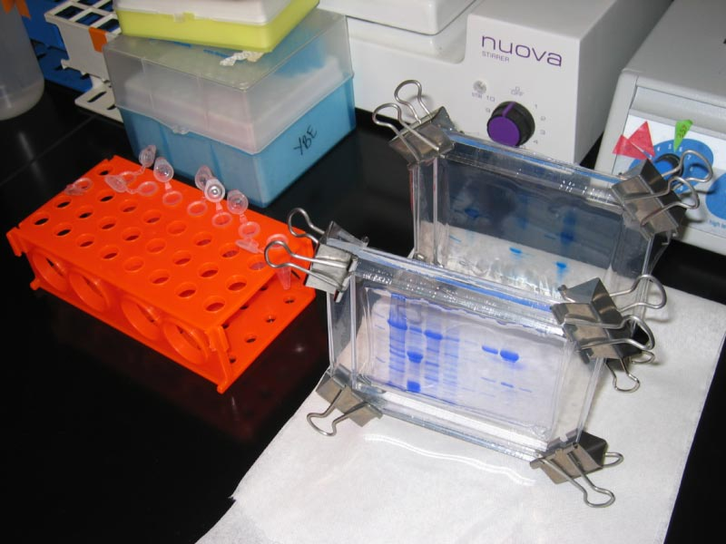
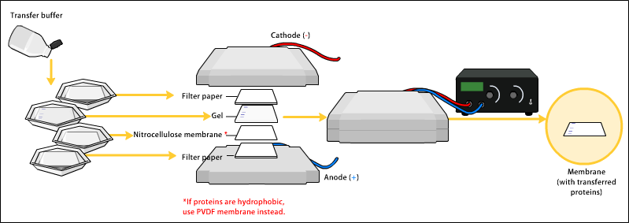
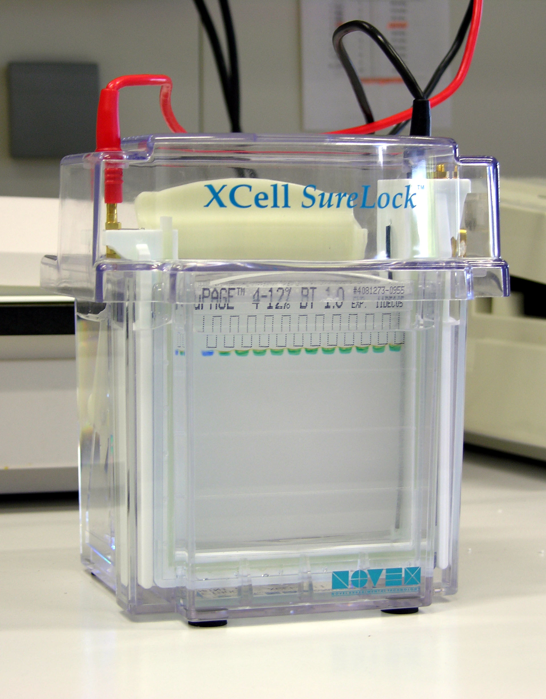

[Back to the main page](../index.md)

# Western Blot Analysis of GFP-SKL in peroxisomes of *Hansenula polymorpha*

---

## Learning outcomes
- Concentrating proteins using TCA-precipitation.
- Electrophoresis of proteins using SDS-PAGE.
- Western blotting of proteins.
- Detection of GFP-SKL using a GFP antibody.
- Creating publication figures of the data.

---

## Introduction

### Background experiment
Peroxisomes are cell organelles in which biochemical processes take place in which toxic hydrogen peroxide is formed and immediately further processed into harmless products. Since peroxisomes, like all organelles, are surrounded by a membrane, the highly reactive hydrogen peroxide cannot come into contact with other cell components, meaning these are protected from the oxidative processes caused by hydrogen peroxide. It is vital that we have a good understanding of the formation and breakdown of peroxisomes in the cell, since peroxisomes play a part in the onset of serious diseases, such as the Zellweger syndrome. Peroxisomes serve an important purpose in the human body in the processing of ‘very long chain fatty acids’ and ‘branched chain fatty acids’. The Zellweger syndrome (also known as the cerebrohepatorenal syndrome) is a congenital disorder causing no or very few functional peroxisomes to be present in the patient’s cells. The disorder results in impaired neuronal migration and impaired development of the brain. It also often presents with axonal hypomyelination. The disorder is incurable, and patients do not live to be older than a year old. Another reason why researchers are interested in the processes that cause the breakdown and formation of the organelle is because in some moulds peroxisomes are involved in the final step of the synthesis of penicillin. 

In the yeast *Hansenula polymorpha*, peroxisomes are quite prominent in the cells under certain circumstances. The cells are easy to view under an electron microscope and, if marked with GFP, under a fluorescence microscope. For this reason, *H. polymorpha* is often used as a model organism allowing us to study the synthesis and breakdown of peroxisomes. If we can learn to understand these mechanisms of *H. polymorpha*, we will also learn more about the mechanism of other eukaryotes, for example in other moulds, and inside the human body. 

With *H. polymorpha*, peroxisomes are involved in growth on methanol. If methanol is the only source of carbon the cell has at its disposal, a large number of peroxisomes will form in every cell. The alcohol oxidase enzyme is present in every peroxisome and is involved in the use of methanol. Peroxisomes also contain the catalase enzyme, which breaks down the hydrogen peroxide formed by alcohol oxidase to harmless molecules (Figure 1). 

The reaction pattern is as follows: 

Oxidation half-reaction:
$CH_3OH + H_2O → CO_2 + 6H^+ + 6e^-$

Reduction half-reaction:
$O_2 + 4H^+ + 4e^- → 2H_2O$

Total reaction:
$2CH_3OH + 3O_2 → 2CO_2 + 4H_2O$

In the cell, this reaction involves several steps. First methanol is broken down to methanal (Figure 1). This reaction is catalysed by alcohol oxidase. Highly reactive hydrogen peroxide is released in the progress. Catalase causes hydrogen peroxide to be converted into water and hydrogen. Methanal is converted into carbon dioxide and water by oxygen.

*Figure 1: The biochemical processes that take place inside the peroxisome in circumstances where methanol is the only source of carbon. Methanol is converted into methanal by alcohol oxidase. The hydrogen peroxide formed by oxygen in the process is at once converted into harmless water and oxygen through catalase. Methanal is converted into carbon dioxide and water by oxygen.*

During this practical course, you will work with a *Hansenula polymorpha* strain, which has been modified in such a way that the cells will express GFP-SKL. The SKL signal is a so-called peroxisomal import signal: a C-terminal amino acid sequence (serine, lysine, leucine). This is recognised by the cell’s system as something that belongs to a protein that needs to enter the peroxisome. In other words, these peroxisomes will be visible in the cells in fluorescence microscopy. The GFP-SKL will be behind a gene that normally serves as an alcohol oxidase promoter. Alcohol oxidase is strongly expressed when grown on methanol. The gene is hardly expressed, or not at all, in cells growing on glucose. The same is true here for GFP-SKL. 

The purpose of your experiment is to study peroxisome biogenesis. To start with, you will be given two frozen samples taken from 2 ml cultures of *H. polymorpha*. The first sample is from a culture cultivated overnight in a medium in which methanol was the only source of carbon (doubling time: 4 hours). The second sample is from a culture cultivated for 6 hours in a medium in which glucose was the only source of carbon (doubling time: 1.2 hours). 

You will use two methods to determine whether the peroxisomes are indeed formed when grown on methanol: visual inspection by means of fluorescence microscopy and a western blot analysis of the GFP-SKL protein (which is peroxisomal in this strain).

### Background information on SDS-PAGE:
Proteins are charged macromolecules, meaning they can be separated based on charge and molecular weight. Proteins are typically separated by means of a polyacrylamide (PAA) gel. PolyAcrylamide Gel Electrophoresis is also referred to as ‘PAGE’. 

Before the proteins can be placed on gel, they must first be isolated from the *H. polymorpha* samples. This is effected by means of TCA precipitation. The high concentration of TCA causes the cells to be lysated. As a result, their contents are released. The proteins precipitate due to their low pH, after which they are washed with ice-cold acetone. The proteins are then dissolved in a Laemmli buffer.

The Laemmli buffer system is a buffer system in which the buffer contains SDS. In this system proteins are denatured by heating the sample in a buffer containing SDS and a reducing agent such as ß-mercaptoethanol. This results in polypeptides with a uniform charge-to-mass ratio, proportional to the molecular weight. The proteins are then separated based on molecular weight and the charge of the molecule. As a result, the system is highly suited to the calculation of molecular weight. 

*Figure 2. Equipment making up Bio-Rad’s SDS-PAGE system.*

We will use Bio-Rad’s protein gel electrophoresis (SDS‐PAGE) system (Figure 2) to demonstrate how the protein composition of the cell changes in response to glucose induction. Use the eight samples collected during the experiment for this.

You can use the different acrylamide percentages in the gel. Large proteins will separate better on a low-percentage gel, whereas small proteins will separate better on a high-percentage gel. Consult LabFAQs or another source to determine which percentage gel is most suited for the protein of your choosing. Discuss with your lab partner which percentage of acrylamide seems most fit for purpose and decide accordingly. Be careful: unpolymerised acrylamide is a carcinogenic and neurotoxic substance! 

SDS-PAGE gels consist of two layers and are poured and run vertically. The bottom layer is poured first, and the top layer is not poured until the bottom layer has polymerised. The bottom layer consists of ‘running gel’, also referred to as ‘separation gel’ or ‘resolving gel’. Proteins are separated based on size in this part of the gel. The top layer is called the ‘stacking gel’. Proteins will accumulate at the junction of the stacking and separation gels, so that they can all get started on the ‘separation gel’ at the same time. Slots are created in the ‘stacking gel’. The samples can then be transferred to these slots.

### Background information on Coomassie staining:
Coomassie staining is a simple, non-specific staining method that turns all proteins bright blue. The detection limit of this staining method is between 0.1 and 1.0 μg protein. We will use Bio-Rad’s Bio-Safe Coomassie stain, which does not pose a hazard to the environment.

### Background information on western blot and Ponceau S staining:
The western blot technique allows us to transfer proteins from a PAGE gel to a membrane (Figure 3). This may be important if antibodies are to be used in a next step to demonstrate the presence of the proteins. The proteins in the gel are pulled from the gel by running different voltages and are then transferred to the membrane. Due to hydrophobic and electrostatic interactions, the proteins will stick to the membrane. In this experiment we will use a Roche PVDF membrane. After blotting, we can check whether the proteins have been transferred to the membrane by staining the proteins with Ponceau S. This involves placing the membrane in this solution for a brief time, and then removing the background with water. The stain will not affect the other procedures to be performed after the western blot.

*Figure 3. Bio-Rad blot set-up (Electrophoretic Transfer Cell mini-trans-blot, Bio-Rad).*

### Background information on antibody detection:
After blotting, all the proteins contained in the gel will be on the membrane. A ‘block’ must be performed before the proteins can be detected by means of specific antibodies. Not all parts of the membrane will be covered with proteins. In order to prevent non-specific binding of the antibody, all empty spots must be filled (‘blocked’) with a protein that does not react to the antibody to be used. Often we will use BSA or ‘skimmed milk’ for this purpose. After the ‘block’ has been performed, the membrane holding the bound proteins will be incubated with the first antibody. 

In our case, this will be a mouse anti GPF IgG (= primary antibody) (Figure 4). This is an antibody against GFP, created in a mouse. This antibody only recognises GFP and will bind to this. The second antibody (secondary antibody) comes with the alkaline phosphatase (AP) enzyme. This secondary antibody, goat anti-mouse IgG, recognises IgG antibodies obtained from the mouse, and therefore also recognises the mouse-anti-GFP IgG primary antibody. So now we have GFP linked with mouse-anti-GFP IgG and goat anti-mouse IgG linked with the alkaline phosphatase enzyme on the membrane. We will then add substrate to the blot. The alkaline phosphatase enzyme will convert the substrate, forming a reddish-purple-coloured substance in the process, which will be visible in those places where GFP is present.

*Figure 4. Protein detection by means of specific antibodies.*

### Things to do before the experiment:
- Record the measures you will take to ensure safe handling of all the hazardous substances (e.g. TCA, acrylamide, DTT) in your logbook before embarking on the experiment.
- Before you get started on the experiment, place Bio-Rad’s Bio-Ice cooling units, filled with water, in the freezer (−20°C).
- Make sure you always know which side of your blot the proteins are on, and also make sure that your blot remains moist at all times. Work in a 50 ml Greiner tube where possible.

## Protocol

**Step 1: Wash and distribute the samples**

Spin the two samples in an Eppendorf centrifuge, then remove the supernatant. Add 1 ml PBS to the pellets, resuspend and spin again (1 minute at maximum speed) Perform this procedure twice. Now that you have washed the samples twice, resuspend the pellets in 200 µl PBS. 

**Step 2: TCA precipitation**

The proteins can now be isolated from the samples. Do so by using a strong TCA solution. Show your lecturer that you have looked up the safety measures for using TCA before embarking on this protocol.

Published by: McCammon MT, McNew JA, Willy PJ, Goodman JM (1994) *J Cell Biol* 124:915-925

You will need the following:  
- 25% (w/v) trichloroacetic acid (ready for use)
- 80% (v/v) acetone in water (–20 oC) (ready for use)
- 1% (w/v) SDS/0.1 N NaOH (ready for use)
- 2x SDS sample buffer to which 5% DTT must be added (the buffer is ready for use; you must add the DTT yourself)

Method:  
1. Add equal amounts (200 µl) of 25% TCA solution to your samples and mix.
2. Incubate on ice for at least 30 minutes.
3. Centrifuge at 14,000 rpm at 4°C for 15 minutes and remove the supernatant. 
4. Wash the precipitate twice with 500 μl cold 80% acetone, centrifuge for 5 minutes at a time, at 14,000 rpm at 4°C.
5. Gently remove the supernatant and allow the pellet to air-dry, or alternatively, use a SpeedVac.
6. Dissolve the pellet in 50 μl water. Vortex. 
7. Perform a Lowry assay, which will allow you to load equal amounts of protein on your gels.

**Step 3: SDS-PAGE, prepare two gels:**

Building the system into which you will pour the gel (Figure 5):

1. Find a short glass plate and a slightly longer one. The long glass plate will feature two ‘spacers’, which will determine the thickness of the gel layer. Set them to 0.75 mm.
2. Place the two plates into the casting system, with the short plate facing forward. Make sure that both plates are at the same level at the bottom.
3. Secure the glass plates by sliding the clamps into place. 
4. Place the glass plates into the casting system. The clamp at the top of the system presses the glass plate onto the grey rubber strips, thus preventing leakage. Optional: test the system for leakage by filling it will water or ethanol. Find a comb that goes with your system, to create slots later. Please note that your comb must be 0.75 mm thick.

*Figure 5. Constructing the Bio-Rad gel-casting system.*

The thickness of the gel layer is determined by the width of the spacers. We will use a gel layer 0.75 mm thick.

Determine which percentage gel you wish to prepare and calculate the amounts needed in the table below. All the solutions you will need will be ready for use in the cold room. Make sure you prepare two gels: one gel to be used for the western blot, and one control gel, which will undergo Coomassie staining. 

*Figure 6. Gel formulation.*

1. Ready for use: Stacking gel buffer: 0.5 M Tris‐HCl, pH 6.8= 6 gram Tris base, 60 ml Millipore water, use 6M HCI to ensure the mix has a pH of 6.8, then adjust volume to 100 ml with Millipore water. Store at 4°C.

2. Ready for use: Separation gel buffer:1.5 M Tris-HCl, pH 8.8 = 27.83 gram Trisbase, 80 ml Millipore water, use 6M HCI to ensure the mix has a pH of 8.8, then adjust volume to 150 ml with Millipore water. Store at 4°C.

**Preparing and pouring the separation and stacking gels:**

1. Prepare the separation gel solution by adding all the reagents (see Table 1), except for the 10% APS and TEMED. Please note: TEMED is a foul-smelling solution. Do not keep this bottle open any longer than strictly necessary and be sure to work under the fume hood.
2. Make sure that you have all the pipettes required (including tips) ready at hand before continuing. Also check that there is water-saturated isobutanol on hand.
3. Add 50 µl 10% (w/v) APS (to be prepared fresh every day) and 5 µl TEMED (for 10 ml gel) and mix thoroughly but gently (prevent the formation of air bubbles). The addition of the 10% APS and TEMED will cause the gel to polymerise. Fill the gel chamber to approximately 2 mm under the green line. 
4. Using a pipette, carefully transfer a thin layer of water-saturated isobutanol directly above the gel to prevent the gel from drying out. 
5. Allow the gel to polymerise for 45 minutes to 1 hour. Carefully remove all the isobutanol using a piece of filter paper. 
6. Prepare the stacking gel solution by adding all the reagents (see Table 1), except for the 10% APS and TEMED. 
7. Add 50 µl 10% APS and 10 µl TEMED (for 10 ml gel) and mix gently (prevent the formation of air bubbles). Fill the gel chamber to the top of the short glass plate.
8. Place the comb inside the gel. Make sure there are no air bubbles at the bottom of the slots, because the gel will not polymerise in those spots.
9. Allow the gel to polymerise for 45 minutes to 1 hour. 
10. The gels are now ready for use.
11. Thoroughly rinse the casting frame and stand with demineralised water.

---

[Back to the main page](../index.md)

    
