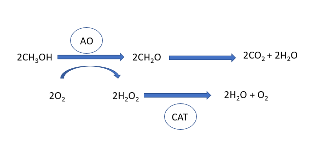



[Back to the main page](../index.md)

# Western Blot Analysis of GFP-SKL in peroxisomes of *Hansenula polymorpha*

---

*Source: Own material. Licence: CC BY-SA*

## Learning outcomes
- Concentrating proteins using TCA-precipitation.
- Electrophoresis of proteins using SDS-PAGE.
- Western blotting of proteins.
- Detection of GFP-SKL using a GFP antibody.
- Creating publication figures of the data.

---

## Introduction

### Background experiment
Peroxisomes are cell organelles in which biochemical processes take place in which toxic hydrogen peroxide is formed and immediately further processed into harmless products. Since peroxisomes, like all organelles, are surrounded by a membrane, the highly reactive hydrogen peroxide cannot come into contact with other cell components, meaning these are protected from the oxidative processes caused by hydrogen peroxide. It is vital that we have a good understanding of the formation and breakdown of peroxisomes in the cell, since peroxisomes play a part in the onset of serious diseases, such as the Zellweger syndrome. Peroxisomes serve an important purpose in the human body in the processing of ‘very long chain fatty acids’ and ‘branched chain fatty acids’. The Zellweger syndrome (also known as the cerebrohepatorenal syndrome) is a congenital disorder causing no or very few functional peroxisomes to be present in the patient’s cells. The disorder results in impaired neuronal migration and impaired development of the brain. It also often presents with axonal hypomyelination. The disorder is incurable, and patients do not live to be older than a year old. Another reason why researchers are interested in the processes that cause the breakdown and formation of the organelle is because in some fungi peroxisomes are involved in the final step of the synthesis of penicillin. 

In the yeast *Hansenula polymorpha*, peroxisomes are quite prominent in the cells under certain circumstances. The peroxisomes are easy to view under an electron microscope and, if marked with GFP, under a fluorescence microscope. For this reason, *H. polymorpha* is often used as a model organism allowing us to study the synthesis and breakdown of peroxisomes. If we can learn to understand these mechanisms of *H. polymorpha*, we will also learn more about the mechanism of other eukaryotes, for example in other fungi, and inside the human body. 

With *H. polymorpha*, peroxisomes are involved in growth on methanol. If methanol is the only source of carbon the cell has at its disposal, a large number of peroxisomes will form in every cell. The alcohol oxidase enzyme is present in every peroxisome and is involved in the use of methanol. Peroxisomes also contain the catalase enzyme, which breaks down the hydrogen peroxide formed by alcohol oxidase to harmless molecules (Figure 1). 

The reaction pattern is as follows: 

Oxidation half-reaction:  
$CH_3OH + H_2O → CO_2 + 6H^+ + 6e^-$  

Reduction half-reaction:  
$O_2 + 4H^+ + 4e^- → 2H_2O$  

Total reaction:  
$2CH_3OH + 3O_2 → 2CO_2 + 4H_2O$  

In the cell, this reaction involves several steps. First methanol is broken down to methanal (Figure 1). This reaction is catalysed by alcohol oxidase. Highly reactive hydrogen peroxide is released in the progress. Catalase causes hydrogen peroxide to be converted into water and hydrogen. Methanal is converted into carbon dioxide and water by oxygen.

*Figure 1: The biochemical processes that take place inside the peroxisome in circumstances where methanol is the only source of carbon. Methanol is converted into methanal by alcohol oxidase. The hydrogen peroxide formed by oxygen in the process is at once converted into harmless water and oxygen through catalase. Methanal is converted into carbon dioxide and water by oxygen. Own work. CC BY-SA*

During this practical course, you will work with a *Hansenula polymorpha* strain, which has been modified in such a way that the cells will express GFP-SKL. The SKL signal is a so-called peroxisomal import signal: a C-terminal amino acid sequence (serine, lysine, leucine). This is recognised by the cell’s system as something that belongs to a protein that needs to enter the peroxisome. In other words, the peroxisomes will be visible in the cells by fluorescence microscopy. The GFP-SKL is placed behind the alcohol oxidase promoter. Alcohol oxidase is strongly expressed when the cells are grown on methanol. The gene is hardly expressed, or not at all, in cells growing on glucose. The same is true here for GFP-SKL. 

The purpose of your experiment is to study peroxisome biogenesis. To start with, you will be given two frozen samples taken from 2 ml cultures of *H. polymorpha*. The first sample is from a culture cultivated overnight in a medium in which methanol was the only source of carbon (doubling time: 4 hours). The second sample is from a culture cultivated for 6 hours in a medium in which glucose was the only source of carbon (doubling time: 1.2 hours). 

You will use two methods to determine whether the peroxisomes are indeed formed when grown on methanol: visual inspection by means of fluorescence microscopy and a western blot analysis of the GFP-SKL protein (which is, as mentioned before, peroxisomal).

### Background information on SDS-PAGE:

Proteins are charged macromolecules, meaning they can be separated based on charge and molecular weight. Proteins are typically separated by means of a polyacrylamide (PAA) gel. PolyAcrylamide Gel Electrophoresis is also referred to as ‘PAGE’. 

Before the proteins can be placed on gel, they must first be isolated from the *H. polymorpha* samples. This is effected by means of TCA precipitation. The high concentration of TCA causes the cells to be lysated. As a result, their contents are released. The proteins precipitate due to the low pH, after which they are washed with ice-cold acetone. The proteins are then dissolved in a Laemmli buffer.

The Laemmli buffer system is a buffer system in which the buffer contains SDS. In this system proteins are denatured by heating the sample in a buffer containing SDS and a reducing agent such as ß-mercaptoethanol. This results in polypeptides with a uniform charge-to-mass ratio, proportional to the molecular weight. The proteins are then separated based on molecular weight and the charge of the molecule (figure 2). As a result, the system is highly suited to the calculation of molecular weight. 

*Figure 2. Two SDS gels after completed separation of the samples and staining in a drying frame. Source: https://en.wikipedia.org/wiki/SDS-PAGE#/media/File:Gel_Blue_Coomassie.jpg*

We will use Bio-Rad’s protein gel electrophoresis (SDS‐PAGE) system to demonstrate how the protein composition of the cell changes in response to methanol induction. We will use the two samples collected during the experiment for this.

It is possible to use different acrylamide percentages in a PAA gel. Large proteins will separate better on a low-percentage gel, whereas small proteins will separate better on a high-percentage gel. Consult LabFAQs or another source to determine which percentage gel is most suited for the protein of your choosing. Discuss with your lab partner which percentage of acrylamide seems most fit for purpose and decide accordingly. Be careful while pooring the gel: unpolymerised acrylamide is a carcinogenic and neurotoxic substance! 

SDS-PAGE gels consist of two layers and are poured and run vertically. The bottom layer is poured first, and the top layer is not poured until the bottom layer has polymerised. The bottom layer consists of ‘running gel’, also referred to as ‘separation gel’ or ‘resolving gel’. Proteins are separated based on size in this part of the gel. The top layer is called the ‘stacking gel’. Proteins will accumulate at the junction of the stacking and separation gels, so that they can all get started on the ‘separation gel’ at the same time. Slots are created in the ‘stacking gel’. The samples are transferred to these slots.

### Background information on Coomassie staining:
Coomassie staining is a simple, non-specific staining method that turns all proteins bright blue. The detection limit of this staining method is between 0.1 and 1.0 μg protein. We will use Bio-Safe Coomassie stain, which does not pose a hazard to the environment.

### Background information on western blot and Ponceau S staining:
The Western blot technique allows us to transfer proteins from a PAGE gel to a membrane (Figure 3 and 4). This is important if antibodies are to be used in a next step to demonstrate the presence of the proteins. The proteins in the gel are pulled from the gel by running different voltages and are in this way transferred to the membrane. Due to hydrophobic and electrostatic interactions, the proteins will stick to the membrane. In this experiment we will use a Roche PVDF membrane. After blotting, we can check whether the proteins have been transferred to the membrane by staining the proteins with Ponceau S. This involves placing the membrane in this solution for a brief time, and then removing the background with water. The stain will not affect the  procedures to be performed after the Western blot.

*Figure 3. Wet blot set-up. Source: https://commons.wikimedia.org/wiki/File:Western_blot_wet_transfer_system_Criterion-06.jpg*

*Figure 4. Overview of blotting. Source: https://en.wikipedia.org/wiki/Western_blot#/media/File:Western_blot_transfer.png*

### Background information on antibody detection:
After blotting, all the proteins contained in the gel will be on the membrane. A ‘block’ must be performed before the proteins can be detected by means of specific antibodies. Not all parts of the membrane will be covered with proteins. In order to prevent non-specific binding of the antibody, all empty spots must be filled (‘blocked’) with a protein that does not react to the antibody to be used. Often we will use BSA or ‘skimmed milk’ for this purpose. After the ‘block’ has been performed, the membrane holding the bound proteins will be incubated with the first antibody. 

In our case, this will be a mouse anti GPF IgG (= primary antibody) (Figure 5). This is an antibody against GFP, created in mouse cells. This antibody only recognises GFP and will bind to this. The second antibody (secondary antibody) comes with the alkaline phosphatase (AP) enzyme. This secondary antibody, goat anti-mouse IgG, recognises IgG antibodies obtained from mouse cells, and therefore also recognises the mouse-anti-GFP IgG primary antibody. So now we have GFP linked with mouse-anti-GFP IgG and goat anti-mouse IgG linked with the alkaline phosphatase enzyme on the membrane. We will then add substrate to the blot. The alkaline phosphatase enzyme will convert the substrate, forming a reddish-purple-coloured substance in the process, which will be visible in those places where GFP is present.

*Figure 5. Protein detection by means of specific antibodies. Source: https://commons.wikimedia.org/wiki/File:Western_Blotting.png*

### Things to do before the experiment:
- Record the measures you will take to ensure safe handling of all the hazardous substances (e.g. TCA, acrylamide, DTT) in your logbook before embarking on the experiment.
- Before you get started on the experiment, place Bio-Ice cooling units, filled with water, in the freezer (−20°C).
- Make sure you always know which side of your blot the proteins are on, and also make sure that your blot remains moist at all times. Work in a 50 ml Greiner tube where possible.

## Protocol

### Step 1: Wash and distribute the samples

Dillute the glycerol samples once with PBS. Spin the two samples in an Eppendorf centrifuge, then remove the supernatant. Add 1 ml PBS to the pellets, resuspend and spin again (1 minute at maximum speed) Perform this procedure twice. Now that you have washed the samples, resuspend the pellets in 200 µl PBS. 

### Step 2: TCA precipitation

The proteins can now be isolated from the samples. Do so by using a strong TCA solution. Show your lecturer that you have looked up the safety measures for using TCA before embarking on this protocol.

Published by: McCammon MT, McNew JA, Willy PJ, Goodman JM (1994) *J Cell Biol* 124:915-925

You will need the following:  
- 25% (w/v) trichloroacetic acid (ready for use)
- 80% (v/v) acetone in water (–20 °C) (ready for use)
- 1% (w/v) SDS/0.1 N NaOH (ready for use)
- 2x SDS sample buffer to which 5% DTT must be added (the buffer is ready for use; you must add the DTT yourself)

Method:  
1. Add equal amounts (200 µl) of 25% TCA solution to your samples and mix.
2. Incubate on ice for at least 30 minutes.
3. Centrifuge at 14,000 rpm at 4°C for 15 minutes and remove the supernatant. 
4. Wash the precipitate twice with 500 μl cold 80% acetone, centrifuge for 5 minutes at a time, at 14,000 rpm at 4°C. It may be a bit harder to dissolve the pellet after the second wash. 
5. Gently remove the supernatant and allow the pellet to air-dry, or alternatively, use a SpeedVac.
6. Dissolve the pellet in 50 μl water. Vortex. 
7. Perform a Lowry assay, which will allow you to load equal amounts of protein on your gels.

### Step 3: SDS-PAGE, prepare two gels:

Building the system into which you will pour the gel:  

[See this movie](https://www.youtube.com/watch?v=EDi_n_0NiF4)

1. Use a short glass plate and a slightly longer one. Make sure that the plates are clean. The long glass plate will feature two ‘spacers’, which will determine the thickness of the gel layer. Use 0.75 mm.
2. Place the two plates into the casting frame, with the short plate facing forward. Important: make sure that both plates are at the same level at the bottom.
3. Secure the glass plates. 
4. Place the casting frame, containing the glass plates, into the casting stand. The clamp at the top of the system presses the glass plate onto the grey rubber strips, thus preventing leakage. Optional: test the system for leakage by filling it with ethanol. 
5. Find a comb that goes with your system, to create slots later. Please note that your comb must be 0.75 mm thick.

The thickness of the gel layer is determined by the width of the spacers. We will use a gel layer 0.75 mm thick.

Determine which percentage gel you wish to prepare and calculate the amounts needed in the table below. All the solutions you will need will be ready for use in the cold room. Make sure you prepare two gels: one gel to be used for the western blot, and one control gel, which will undergo Coomassie staining. 

|Type          |Percentage (%)|MQ |30% acrylamide/Bis (ml)|Gel buffer (ml)|10% (w/v) SDS (ml)|
|--------------|--------------|---|-----------------------|---------------|------------------|
|Stacking gel  |4             |6.1|1.3                    |2.5 (stacking) |0.1               |
|Separation gel|?             |?  |?                      |? (running)    |?                 |

- Ready for use: Stacking gel buffer: 0.5 M Tris‐HCl, pH 6.8 (= 6 grams of Tris-base in 60 ml Millipore water, use 6M HCI to ensure the mix has a pH of 6.8, then adjust volume to 100 ml with Millipore water. Store at 4°C.)

- Ready for use: Separation gel buffer:1.5 M Tris-HCl, pH 8.8 (= 27.83 grams of Tris-base, 80 ml Millipore water, use 6M HCI to ensure the mix has a pH of 8.8, then adjust volume to 150 ml with Millipore water. Store at 4°C.)

#### Preparing and pouring the separation and stacking gels:

1. Prepare the separation gel solution by adding all the reagents (see Table 1), except for the 10% APS and TEMED. Please note: TEMED is a foul-smelling solution. Do not keep this bottle open any longer than strictly necessary and be sure to work under the fume hood.
2. Make sure that you have all the pipettes required (including tips) ready at hand before continuing. Also check that there is water-saturated isobutanol on hand.
3. Add 50 µl 10% (w/v) APS (to be prepared fresh every day) and 5 µl TEMED (for 10 ml gel) and mix thoroughly but gently (prevent the formation of air bubbles). The addition of the 10% APS and TEMED will cause the gel to polymerise. Fill the gel chamber to approximately 2 mm under the green line. 
4. Using a pipette, carefully transfer a thin layer of water-saturated isobutanol directly above the gel to prevent the gel from drying out. 
5. Allow the gel to polymerise for 45 minutes to 1 hour. Carefully remove all the isobutanol using a piece of filter paper. 
6. Prepare the stacking gel solution by adding all the reagents together (see Table 1), except for the 10% APS and TEMED. 
7. Add 50 µl 10% APS and 10 µl TEMED (for 10 ml gel) and mix gently (prevent the formation of air bubbles). Fill the gel chamber to the top of the short glass plate.
8. Place the comb inside the gel. Make sure there are no air bubbles at the bottom of the slots, because the gel will not polymerise in those spots.
9. Allow the gel to polymerise for 45 minutes to 1 hour. 
10. The gels are now ready for use.
11. Thoroughly rinse the casting frame and stand with demineralised water.

#### Place the gels inside the mini-tank:

1. Place two gel cassette sandwiches into the electrode assembly, with the short glass plates facing inwards.
2. Place the electrode assembly, containing the two gel cassette sandwiches into the clamping frame. 
3. Place the entire installation into the mini-tank of the Mini-PROTEAN 3 electrophoresis unit.
4. Completely fill the inner chamber with running buffer. 
5. Fill the mini-tank (the outer chamber) with 200-500 ml running buffer (see the indicator on the tank used).
6. If necessary, the slots can be cleansed by injecting buffer into them.
7. Check whether you can clearly see the slots. If not,  mark them with sample buffer. Sometimes the slots will be more readily visible against a dark background. Ask your lecturer for their preferred method.

*Figure 6. Electrophoresis chamber after a few minutes of electrophoresis. Source: https://en.wikipedia.org/wiki/SDS-PAGE#/media/File:Gelelektrophoreseapparatur.jpg*

#### Loading samples into the slots

1. Draw up a loading schedule that clearly indicates what you are going to transfer to which slot. Make sure you transfer the protein samples in a logical order.
2. Using a P20 pipette, load equal amounts (see Lowry) of sample into the slots. Place the tip of your pipette above the slot. Load the samples slowly, so that you can actually see the samples fall into the slots. 
3. Do not forget to place a marker (7 µl, dual colour marker) on your gel, which will allow you to determine the sizes of the protein bands later. This marker contains the following band sizes: 10, 15, 20, 25, 37, 50, 75, 100, 150 and 250 kD.
4. Place the lid on the mini-tank. Secure the lid so as to prevent disorientation. 
5. Run on 200 Volt. The electrophoresis procedure is completed once the pre-stained marker is properly separated and once the blue front has run off the gel completely or nearly completely. This will take about one hour. Keep a close eye on the area where the protein you are seeking to detect is located. 

### Step 4: Coomassie staining

One of the two gels will be stained with Bio-Safe Coomassie stain (BC). The other gel will be used for the Western blot and specific detection by means of antibodies. 

1. Wash the gel 3 x 5 minutes in approximately 200 ml Millipore water. 
2. Remove all the water and add Bio-Safe Coomassie stain, making sure that the gel is submerged completely. 
3. Shake gently and incubate the gel in the stain overnight (at least one hour at room temperature).
4. The following day: 
5. Wash the gel 3 x 10 minutes in approximately 200 ml Millipore water (BC can be reused).
6.	The gel can now be scanned between two sheets, using the ChemiDoc. If the results are clear, a GSM photo may suffice.

>Please note: Residual SDS in the gel will cause increased background staining. Washing very thoroughly will remove the background.

### Step 5: Western blot (wear gloves!)

Use the other gel to perform the Western blot. Blot the gel in transfer buffer A (5x concentrate: 72.9 gram glycine and 20 g Tris). You will find this 5x buffer ready made. Dilute it to a 1x concentrate. One litre per tank will suffice.

1. Cut one piece of PVDF membrane and two pieces of 3mm Whatman filter paper to the size of the gel. For now, leave the protective foil around the membrane.
2. Place the gel, the filter paper and the fibre pads in the transfer buffer for 5 minutes. 
3. Briefly (1 to 3 seconds) place the membrane (without the protective foil) in methanol (do this under the fume hood, and dispose of waste as prescribed).
4. Place the membrane in the transfer buffer and leave it there for 2 to 3 minutes.
5. Prepare the gel sandwich. 
6. Place the cassette, with the grey side facing down, on a clean and dry surface.
7. Place a fibre pad saturated with transfer buffer on the grey side of the cassette.
8. Place the filter paper on top of the fibre pad.
9. Place the gel on top of the filter paper. (Make sure there are no air bubbles! If there are, use a glass rod to remove them.)
10. Place the membrane on the gel.
11. Place a piece of filter paper on top of the membrane.
12. Complete the sandwich with a fibre pad saturated with transfer buffer.
13. Carefully close the cassette (make sure the gel-and-filter-paper sandwich does not shift).
14. Use the white slider to lock the sandwich.
15. Place the Bio-Ice cooling unit into the buffer tank and fill the tank with 1x concentrate transfer buffer.
16. If you are using the system in tandem with another pair, make sure your gels are the same thickness and both sandwiches have the right orientation. Remember: the proteins are negetively loaded and will transfer to the positive pole. This means that the membrane should be on the positive pole.
17. Place the lid on the buffer tank and connect to the power supply.
18. Blot at 100 mA for 1 hour. Or alternatively, blot at 30 volt overnight. Discuss this with your lecturer!
19. After the blotting procedure: place the Bio-Ice cooling unit (with fresh water) in the freezer.

### Step 6: Antibody detection and staining reaction

These are the solutions you will need; you must prepare these yourself.

-	PBS wash solution:
  Phosphate-buffered saline (1x PBS), can be found in the lab as a 1x, 5x of 10x concentrate solution.
  

-	PBST wash solution:
  You can prepare this solution by adding 0.1% Tween-20 (v/v) to the 1x PBS solution you have already prepared. 

-	5% blocking solution:
  5% (w/v) skim milk powder in PBST

-	Primary antibody solution (reuse up to 10 times!):
  1:5000 in PBST with 3% BSA (ready for use). Please note: After use you must place the diluted solution in the freezer to allow reuse.

-	AP-labelled secondary antibody solution 
  1:5000 (find on the internet and/or ask the lecturer whether this dilution ratio is correct) in PBST/5% skim milk (calculate the amount of antibody yourself, have the answer checked, then add). Make sure the tube containing the antibodies is on ice at all times!

-	Detection solution
  Just before use, add 200 μl of the NBT/BCIP stock solution to 10 ml 0.1 M Tris-HCl, pH 9.5 (20°C), 0.1 M NaCl, 0.05 M $MgCl_2$. 

Procedure:

1. After blotting, place the gel in the Bio-Safe Coomassie stain and gently agitate until the end of the day. Then wash with Millipore water for 10 minutes and perform a scan.
2. Stain the blot with Ponceau S to determine whether the proteins are present and if there are any air bubbles (and if so, where). Perform a scan or take a photo.
3. Wash the blot in 10 ml PBST in a 50 ml Greiner tube for 5 minutes by gently rotating it on a platform rotator at room temperature. Decant the wash buffer and repeat the washing step twice. 
4. One student in each lab experiment group: Transfer 1 µl of purified GFP, the primary antibody and the secondary antibody, respectively, to a corner of the blot. Circle the spots with a pencil. Perform this step at the lecturer’s desk and at the same time have your antibody dilution calculations checked. Make sure that the blot remains moist at all times!
5. Place the blot in 7 ml 5% blocking solution. Use the same 50 ml Greiner tube every time. Rotate on a platform rotator at room temperature for 45 minutes.
6. Decant the 5% blocking solution and add 7 ml primary antibody solution. Rotate on a platform rotator at room temperature for 60 minutes.
7. Decant the primary antibody solution into a container suited for antibody reuse. Wash the membrane in 10 ml PBST for 2 x 5 minutes and 1 x 10 minutes. During each wash, rotate it on a platform rotator at room temperature.
8. Decant the wash buffer and add 7 ml AP-labeled secondary antibody solution. Rotate on a platform rotator at room temperature for 30 minutes.
9. Decant the AP-labeled secondary antibody solution down the sink and add 10 ml PBST. Wash the membrane in 10 ml PBST for 2 x 5 minutes and in 10 ml PBS for 2 x 5 minutes. During each wash, rotate the tube on a platform rotator at room temperature.
10. Remove the membrane from the PBS and drain it (do not allow it to dry out!). Submerge your blot in freshly prepared detection solution.
11. Incubate for 5 to 15 minutes, until you are happy with the result.
12. Stop the staining reaction by giving the blot a good rinse with tap water.
13. Do not forget to discuss all your results with your lecturer. This is part of your assessment.

## After the experiment:

This experiment will yield a large number of results, such as a Coomassie-stained gel, a Ponceau S-stained blot, a Coomassie-stained post-blot gel, a post-detection blot, detection of control samples. Enter all the results in your labjournal. Select those results that are essential to a well-argued conclusion and discussion and provide a clear overview of these results. 

---

[Back to the main page](../index.md)

